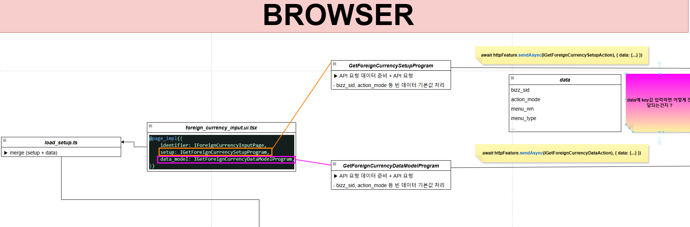
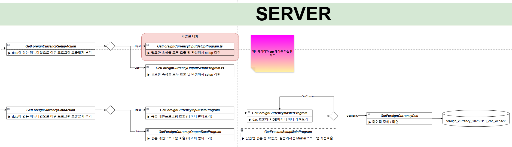

# Daily Retrospective

**작성자**: [최현철]  
**작성일시**: [2025-01-21]

## 1. 오늘 배운 내용 (필수)

### 외화 구현과제 흐름정리 - setup / data api 흐름 정리

브라우저단 SetupProgram은 API요청하기 위해 데이터 사전준비? 및 API 호출역할만
하드코딩으로 데이터 넘기는 것도 해당 로직에서 처리
추후에는 화면단에서 정보를 잘 내려줄것

GetDataAction : 메뉴타입을 분기로 어떤 프로그램을 호출할지
GetInputDatAction : 공통 메인프로그램을 호출해서 데이터 받아오기
(GetExecuteSetupMainProgram) : 공통쓰지 않고 곧바로 마스터 프로그램 호출하도록 구현
GetMasterProgram : Dac 호출

### 5.0 이해도 과제 (보완작성필요)

1. 5.0 소스에서 동일 refer_type의 서로 다른 유효성 체크 요구사항을 어떤 방식으로 처리해야되는지 설명하시오.

2. 삭제여부에 따른 Fn 표시로직을 현재 로직 구조로 어디에 위치시켜야 되는지와 이유를 설명하시오.

3. 신규 입력 화면, 수정조회 화면 진입시 외화코드 목록 정보를 화면에 내리기 위헤서, 해당 refer_type_geneartor의 호출위치는 어디여야 되는지와 이유를 설명하시오.

4. 현재 저장소 설정 (업무설정)이 적용되지 않은 샘플 외화코드 소스에서 저장소 설정 (업무설정) 정보의 역할을 어떻게 처리하고 있는지 작성하시오.

5. 재고-판매입력을 담당하는 인원이 개발해야되는 번호들을 선택하고, 선택된 이유와 선택안한 이유를 간단하게 설명하시오.

   - bizz_type 명세

   - 업무명세

   - input 명세

   - object 명세

   - 판매저장 유효성 체크 속성 resolver 구현

   - 판매저장 program 구현

   - 판매저장 dac 구현 (상단, 하단)

6. 견적조회와 판매조회를 inventory_list.tsx로 구현할수 있을지 설명하시오. 추가로, 재고-견적입력 / 회계-매출입력을 common_input.tsx 페이지로 구현할 수 있을지 설명하시오.

7. ...

## 2. 동기에게 도움 받은 내용 (필수)

성범책임님께서 수정조회 시 화면에 데이터가 내려오지 않는 문제에 대해서 도움을 주셨습니다. - data_model을 배열로 감싸지 않아서 발생한 문제
성범책임님께서 제가 해결하지 못한 성철님의 문제를 해결해주셨습니다. - 브라우저단의 프로그램의 return이 빈객체를 리턴하는 문제
민준님께서 제너레이터, 어트리뷰트에 대한 흐름을 설명해주셔서 이해할 수 있었습니다.

---

### 3. 위 두 주제 중 미처 해결 못한 과제. 앞으로 공부해볼 내용.

1. 액션리졸버 이후 과정
2. 제너레이터, 속성, 벨리데이터 등의 흐름

---

## 5. 제안하고 싶은 내용

공지한 교육과정과 다른 과정이 진행될 예정이라면 미리 수정공지해주셨으면 좋겠습니다.
오늘 오후 조회화면 진도나가는줄 알았는데, 과제2 work가 전달되어 당황스러웠습니다.
