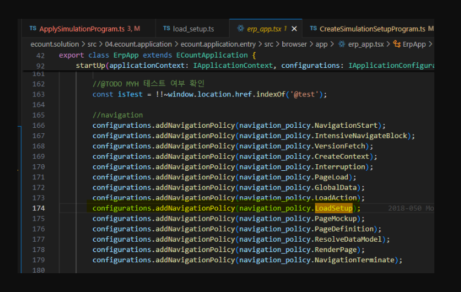

# Daily Retrospective

**작성자**: [김승준]  
**작성일시**: [2025-01-22]

## 1. 오늘 배운 내용 (필수)

### list 조회 화면을 구현

1. setup api , data api (화면 그리기)

2. 신규버튼 클릭후 신규 저장

3. 외화코드/외화명 링크 클릭후 수정 저장

4. 신규, 수정 화면 별 버튼 필터 적용

## 2. 동기에게 도움 받은 내용 (필수)

-   **연아님**과 동병상련으로 대화를 나누며 마음의 위안을 받았습니다. 연아님 화이팅입니다.

-   **주원님**과 디버그를 같이 진행하며 오류를 찾아냈습니다. 혼자서는 실수하게 되는 부분을 같이 찾아주셔서 감사합니다.

-   **강민님**과 국밥을 먹었습니다. 개발부분과 개인적인 얘기를 나누며 즐거웠습니다.

-   **성철님**께서 초콜릿을 제공해주셨습니다. 당충전!

---

## 3. 개발 기술적으로 성장한 점 (선택)

### 1. 교육 과정 상 배운 내용이 아닌 개인적 호기심을 해결하기 위해 추가 공부한 내용

-   setup api와 data api는 같은 데이터 모델을 사용하는데 두개로 나눈 이유는 무엇일까?에 대한 생각을 해봤습니다.

    1. setup은 cache를 사용한다.

        - setup은 일반적으로 사용초기에 고정되고 계속해서 바뀌지 않음. 따라서 cache를 사용하기에 좋음.

    2. setup의 데이터는 적지만, data api 에서 불러오는 데이터 양이 많다.

        - 한번의 호출에서 너무 많은 데이터를 반환하게 되면 서버의 응답시간이 느려질 수 있습니다.
        - api를 분리하면 데이터의 양과 복잡성을 분리해 서버의 처리 부담을 줄일 수 있다.
        - 네트워크 대역폭을 효율적으로 사용할 수 있습니다.

    3. 하나로 구성했을 때의 장점이 많지 않다.

        - 서버 측으로 가는 호출 횟수(트래픽)가 최소화 된다는 장점

    4. 로직을 분리해 관리할 수 있음

        - 각 api가 가지는 특정한 로직을 나눠서 관리할 수 있다.

    5. 병렬처리

        - 클라이언트가 두 API를 병렬로 호출할 수 있어, 전체 처리 시간을 단축할 수 있습니다. <br>화면 구성과 데이터 로딩을 동시에 할 수 있어 응답 시간이 빨라질 수 있습니다.

-   input창에서 action mode가 getModify일 때 PK인 코드 부분을 수정이 가능하게 하는 것을 추가로 수정하였습니다.<br>
    여러가지 api를 비교해 찾았고, 아래와 같이 사용하면 된다는 것을 알았습니다.
    ```ts
    {
        attr_type: EN_ATTR_TYPE.Renderer,
        attr_id: renderer_attrs.editable,
        prop_id: 'foreign_currency$foreign_currency_cd',
        data: false,
    }
    ```
-   load\*setup이 실행되는 시점에 대해 **성준 팀장님**이 `erp_app.tsx 파일에 navigation_policy가 미들웨어로 등록되어 있어서 navigation 시 등록된 미들웨어가 실행되는 방식`이라고 답변해주셨습니다.

    

    해당 부분을 디버깅을 해봤습니다. 처음에는 화면이 바뀔때(캐시되지 않은 화면으로 갈때)마다 해당 소스로 들어간다고 생각했으나, 실제로는 이카운트 페이지에 처음 들어갈때만 실행되었습니다.<br>
    처음에 미들웨어로 등록되면 해당 미들웨어를 호출해서 사용하는 부분은 별개로 존재한다고 이해하면 될 것 같습니다.

### 2. 오늘 직면했던 문제 (개발 환경, 구현)와 해결 방법

list를 조회할 때 데이터모델과 맞추고, 화면과 매칭될 수 있도록 하는 부분이 잘 되지 않았습니다.

**성준팀장님**이 input을 할 때 제공해주신 코드를 참고해 해결했습니다.

`input`

```ts
private _getDataModel(table_model: pg.foreign_currency_20250110_ksj_ecback) {
    const data_model = Object.entries(table_model).reduce((acc, [key, value]) => {
        acc[`foreign_currency$${key}`] = value;
        return acc;
    }, {} as any);
    return data_model;
}
```

`list`

```ts
const length = table_model.length;
const data_model = [];
for (let i = 0; i < length; i++) {
    data_model[i] = Object.entries(table_model[i]).reduce((acc, [key, value]) => {
        acc[`foreign_currency$${key}`] = value;
        return acc;
    }, {} as any);
}
```

# 학습내용

```ts
data_model_definitions: {
head: {
data_model_id: 'head',
attributes: [

                //head에 어떤 정보가 들어가는지

        foreign_currencyXlist: {
    		bizz_id: 'foreign_currency',
    		bizz_sid: 'TB_000000E040114',
    		data_model_id: 'foreign_currencyXlist',
    		object_id: 'list',
            props: [

                // list 부분


            prop_id: 'foreign_currency$foreign_currency_cd',
    				attr_id: 'user_action',
    				attr_type: 'Trigger',
    				data: {
    					identifier: 'IOpenModifyForeignCurrencyUserAction',
    				},
                    // cd를 클릭했을 때 IOpenModifyForeignCurrencyUserAction 이 되도록 trigger

            {
    				prop_id: 'foreign_currency$foreign_currency_cd',
    				attr_id: 'view_type',
    				attr_type: 'Renderer',
    				data: 'ANCHOR', // 링크표시
    			},

                {       /// 밸류에 따라 표시되는 것이 달라짐.
    				prop_id: 'foreign_currency$status_type',
    				attr_id: 'render_items',
    				attr_type: 'Renderer',
    				data: [
    					{
    						value: 'U',
    						label: '미삭제',
    					},
    					{
    						value: 'S',
    						label: '사용중단',
    					},
    					{
    						value: 'D',
    						label: '삭제',
    					},
    				],
    			},
```

```ts
popup_handler.openPopupAsync(
    //popup 창을 띄워준다.
    {
        bizz_sid: request.execution_context.action.bizz_sid,
        identifier: IForeignCurrencyInputPage, // 페이지를 로드한다.
        action_mode: request.payload.action_mode,
        param: {
            // this.execution_context.routeConfig.pageRouteOptions?.param을 통해 확인할 수 있다.
            menu_type: EN_MENU_TYPE.Input,
            foreign_currency_cd: request?.owner?.dmc?.getReferTypeBasedDataModelByIndex(request.owner.data_model_index ?? 0)?.["foreign_currency_cd"], // 배열중에서 내가 클릭한게 뭔지 지정
            action_mode: request.payload.action_mode, // 클릭할때 payload 를 통해 action_mode를 넣어준다.
        },
        reqData: {
            authority_type: EN_AUTHORITY_TYPE.Anonymous,
        },
    }, // 어디로 보낼지, 어떤 데이터를 보낼지...
    {},
    receiveHandler(request) // 위의 함수들이 실행되고 나서 실행되는 promise 함수
);
```
