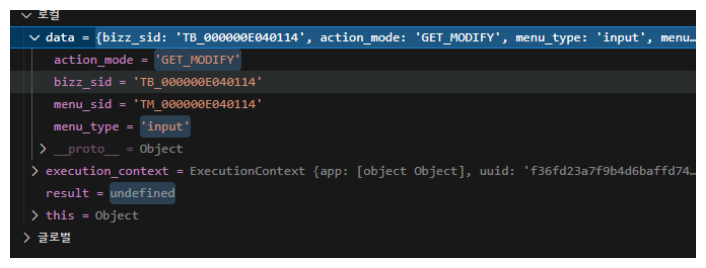
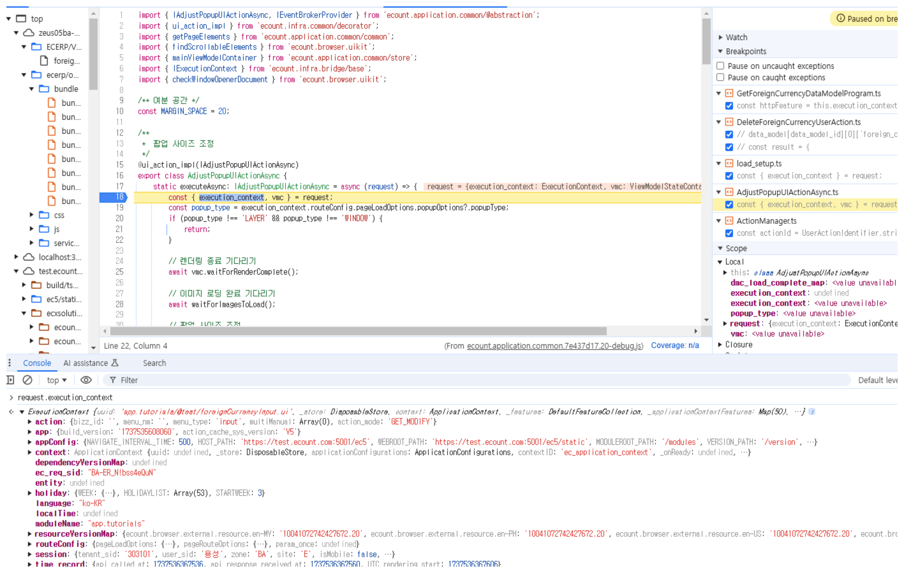
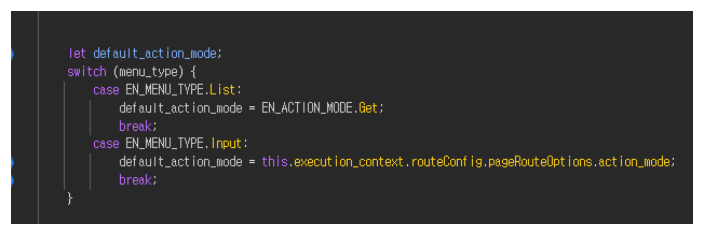
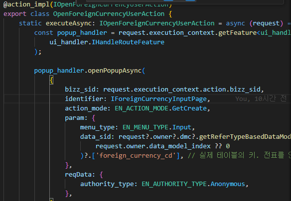
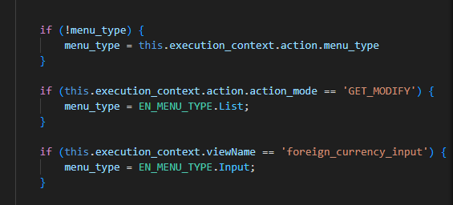

# Daily Retrospective  
**작성자**: [나강민]  
**작성일시**: [2025-01-22]  

## 1. 오늘 배운 내용 (필수)  

### **Setup과 Data API 활용: 오늘의 정리**

오늘은 **Setup과 Data API**를 활용하며 기존에 작성했던 로직을 돌아보고, 구현 과정에서 겪은 문제를 정리했습니다. 특히 API Base를 상속받는 **첫 번째 Depth**에서 가능한 많은 분기 처리를 수행하려고 노력했습니다. 이렇게 함으로써 이후 레이어에서의 중복 작업과 복잡성을 줄이고자 했습니다.

---

### **1. 첫 번째 Depth에서의 분기 처리의 중요성**

API Base 상속 구조에서 **초기 Depth**에서 데이터를 분기 처리하는 이유는 **데이터 핸들링의 어려움**을 줄이기 위함입니다. 

예를 들어, 오늘 작업 중 겪은 문제 중 하나는 `menu_type`과 `action_mode`가 의도와 다르게 초기화되는 상황이었습니다. 아래는 문제 상황을 설명합니다:

#### **문제 1: 잘못된 `menu_type`과 `action_mode` 초기값**
- `list.tsx` 파일을 실행했음에도 **`menu_type`**이 `list`가 아닌 `input`으로 초기화되어, 의도한 리스트 화면이 출력되지 않았습니다.
- 이 문제는 로직의 문제라기보다는 **빌드 과정이나 데이터 흐름 중 간헐적으로 발생하는 초기화 문제**로 보였습니다.

---

### **2. 디버깅 과정과 주요 문제점**

아래는 디버깅 과정에서 확인한 주요 문제와 관련 스크린샷입니다.

#### **1) 초기 데이터 상태 (`menu_type` 및 `action_mode`)**




- 위 이미지는 테스트 코드 동작 시 초기값인 `action_mode`와 `menu_type`을 확인한 화면입니다.  
  - **원래 기대 값:** `menu_type`이 `list`로 초기화.
  - **실제 값:** `menu_type`이 `input`으로 설정되어 리스트 화면이 출력되지 않음.
  
- **문제 분석:**  
  - 로직 상에는 문제없었으나, 초기 값이 잘못 설정되며 `execution_context` 값을 따라가 디버깅해야 했습니다.
  - 특정 시점에서 **데이터가 의도와 다르게 초기화되거나 유실되는 문제**가 있음을 확인했습니다.

---

#### **2) `execution_context`와 데이터 매핑 문제**


- **`execution_context` 디버깅 과정:**  
  - 초기 `action_mode`와 `menu_type`은 정상적으로 나뉘어 들어오지만, 특정 시점에 매핑이 사라지는 문제가 발생했습니다.
  - 매핑이 사라지는 경우, 데이터를 바인딩해도 실행되지 않으며 **매개변수(`param`)로 강제로 데이터를 전달**해야만 해결되는 경우도 있었습니다.

---

#### **3) 잘못된 코드 위치에서의 데이터 처리**



- 위 이미지는 코드 위치가 잘못되어 데이터 처리에 실패한 경우를 보여줍니다.
  - **문제:** 데이터 매핑이 올바른 위치에서 처리되지 않음.
  - **해결 방법:** `action_mode`를 명시적으로 `param`으로 전달하여 로직이 정상적으로 동작하도록 수정.

---

### **3. 결론: 분기 처리와 로직 구조의 중요성**

위와 같은 문제를 겪으며 **Action 단에서의 분기 처리**가 얼마나 중요한지 다시 한 번 느꼈습니다.  

1. **Action 단에서의 분기 처리**:
   - 초기 Depth에서 분기를 명확히 처리하지 않으면, 이후 Program 및 DAC에서 발생하는 문제를 디버깅하기 어렵습니다.
   - 특히, `execution_context` 값의 초기화가 잘못되거나 누락될 경우, 문제를 추적하기가 더 힘들어집니다.

2. **Feature와 Program의 역할 분리**:
   - **Feature**: Action 단에서 처리하기 어려운 세부 로직이나 데이터 자원(Resource) 처리를 담당.
   - **Program**: 실제 비즈니스 로직과 데이터 핸들링을 처리.
   - 각 레이어의 반복적인 Master Program과 DAC들은 **데이터 핸들링** 및 **파생 정보 처리**의 효율성을 위해 설계된 구조임을 다시금 확인했습니다.

3. **초기 구조 설계의 중요성**:
   - 초기 Action 단에서의 로직 처리가 명확하지 않다면, 이후 레이어의 로직이 복잡해지고 디버깅과 유지보수가 어려워집니다.
   - 반복되는 문제를 줄이고 안정적인 데이터 처리를 위해서는 **초기 설계 단계에서 분기 로직을 최대한 단순화**해야 합니다.

---

### **4. 느낀 점**

이번 작업을 통해 **프레임워크의 구조와 데이터 흐름을 제대로 파악하는 것의 중요성**을 배웠습니다. 

- **구조 이해와 디버깅 능력**:  
  프레임워크와 로직 구조를 충분히 이해하지 못하면 단순한 문제도 쉽게 해결하지 못할 수 있습니다. Action 단에서 로직을 분기 처리하는 것이 이후의 문제를 줄이는 핵심임을 확인했습니다.

- **효율적인 데이터 핸들링**:  
  데이터 매핑과 초기화 문제를 방지하려면 **분기 처리와 데이터 전달 방식을 명확히 설계**해야 합니다. 특히, Program과 Feature 간 역할을 잘 나누어 사용해야 문제를 최소화할 수 있습니다.  

앞으로는 설계 단계에서 초기 분기 로직을 명확히 하고, Program과 Feature를 효율적으로 활용하여 안정적인 로직을 구현할 수 있도록 노력하겠습니다.


## 2. 동기에게 도움 받은 내용 (필수)
현철님 : 오늘도 저를 항상 구원해주셨습니다. 감사합니다. 말로 표현하기도 힘들정도로 항상 감사해요

건호님 : 오늘 자기도 바쁜 상황에서 제가 모르는 부분을 많이 도와주셨습니다. 감사해요

주현님 : 앞에서 자신이 겪은 문제사항을 알려주시면서 길잡이 역할을 많이 해주셨습니다. 감사합니다. 

승준님 : 오늘 개발하면서 모르는 부분들이 굉장히 많았습니다. 데이터 핸들링하면서 겪었던 모든  순간들을 논리적으로 물어보지 못했음에도 캐치하여 알려주셔서 감사합니다. 


성철님 : 오늘 아침에 일찍 왔는데 생각치도 못한 엄청나고 멋진 초콜릿을 주셔서 진짜 너무 힘들때 먹었습니다. 근데 하나를 더 주셔서 퇴근할 수 있는 힘을 주셨습니다. 감사합니다.  


민준님 : spread operator를 가르쳐주지 않으셨더라면 그냥 눈물만 났을 듯 했습니다. 감사합니다. 


성재님 : 오늘 저랑 같은 오류를 발견하고 같이 문제를 해결해주셔서 감사했습니다. 그래도 같이 했는데 저는 안돼고 성재님만 되시는건 부러웠어요 


---
 
## 3. 개발 기술적으로 성장한 점 (선택)


### 1. 교육 과정 상 배운 내용이 아닌 개인적 호기심을 해결하기 위해 추가 공부한 내용

datamodelid를 통해 데이터를 이제 화면에 뿌려야 하는 상황에서 배열안에 배열로 리턴하는 상황이 생겼습니다. dto를 inventory의 데이터를 가져와서 처리하다보니 dac을 이미 다 구성하고 데이터를 가져오는 상황에서 일단 배열을 한겹 벗겨야 겠다 생각했습니다. 그래서 함수를 만들다가 좋은 방법이 있을 거 같다는 생각이 들어 찾아보니 아래와 같은 전개 연산자를 알게 되었습니다. 

코드에서 사용된 `...`는 JavaScript와 TypeScript에서 **Spread Operator**(전개 연산자)를 의미합니다. 이 연산자는 배열이나 객체의 요소를 개별적으로 전개(spread)하여 다른 배열이나 객체에 추가하거나, 함수 호출 시 매개변수로 전달하는 데 사용됩니다.

---

### **문맥에서의 의미**
```typescript
setup.data_model[input_data_model_id] = [
    ...ProgramBuilder.create<any, pg.foreign_currency_20250110_nkm_ecback[]>(
        IGetListForeignCurrencyMasterProgram,
        this.execution_context
    ).execute(dto),
];
```

위 코드에서 `...`은 `ProgramBuilder.create(...).execute(dto)`가 반환하는 배열의 요소를 펼쳐서 **새로운 배열**에 추가하는 역할을 합니다.

1. **`ProgramBuilder.create(...).execute(dto)`의 반환값**:
   - 이 메서드가 실행되면 **`pg.foreign_currency_20250110_nkm_ecback[]`** 타입의 배열이 반환됩니다.

2. **Spread Operator의 역할**:
   - `...`은 이 배열의 각 요소를 개별적으로 전개하여 **새로운 배열에 추가**합니다.
   - 결과적으로 `setup.data_model[input_data_model_id]`에는 `execute(dto)`의 반환값 배열의 요소들이 전개된 형태로 저장됩니다.

3. **새 배열 생성**:
   - `[ ...ProgramBuilder.create(...).execute(dto) ]`는 반환된 배열을 그대로 복사하여 새 배열을 생성합니다.
   - 이는 반환된 배열을 수정하지 않고, **불변성을 유지**하면서 새로운 배열을 생성하는 안전한 방식입니다.

---

### **예시로 이해하기**
#### **Spread Operator 사용 전**
```typescript
const arr = [1, 2, 3];
const newArr = [arr]; // 배열 자체가 하나의 요소로 추가됨
console.log(newArr); // Output: [[1, 2, 3]]
```

#### **Spread Operator 사용 후**
```typescript
const arr = [1, 2, 3];
const newArr = [...arr]; // 배열의 요소들이 개별적으로 전개되어 추가됨
console.log(newArr); // Output: [1, 2, 3]
```

---

### **이 코드에서 Spread Operator의 필요성**
- **새로운 배열 생성**: `execute(dto)`가 반환하는 배열을 그대로 `setup.data_model[input_data_model_id]`에 저장하되, 반환된 배열을 직접 수정하지 않도록 새로운 배열을 생성.
- **불변성 유지**: Spread Operator를 사용함으로써 원래의 배열이 변경되지 않으며, 안전하게 데이터 모델에 저장 가능.

위 코드에서 `...`는 `ProgramBuilder.create(...).execute(dto)`의 반환값인 배열의 요소를 전개하여 `setup.data_model[input_data_model_id]`에 새 배열로 저장하는 역할을 합니다. 이는 반환된 배열을 수정하지 않고 안전하게 새로운 배열을 생성하기 위한 방식으로 사용되었습니다.


### 3. 위 두 주제 중 미처 해결 못한 과제. 앞으로 공부해볼 내용.

---


오늘 테스트 코드를 실행시켰을 때 저만 list가 아닌 input으로 처리가 되어서 execution은 과연 어디서부터 시작되는가를 알아봤지만 결국 파일단위로 list와 input을 맨처음 view_name을 통해 만들어 주는 것 같다. 라는 결론으로만 맞췄습니다. 내일은 setup이 어떻게 구성되고 @test와 view_name이 무슨 역할을 하는지 payload의 존재 의의와 비슷한 느낌이기 때문에 더 알아보고 싶습니다. 

또한 DTO 부분과 Dac부분을 조금 더 생각해보고 싶습니다. 


