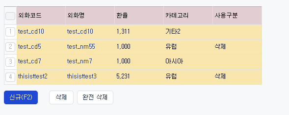
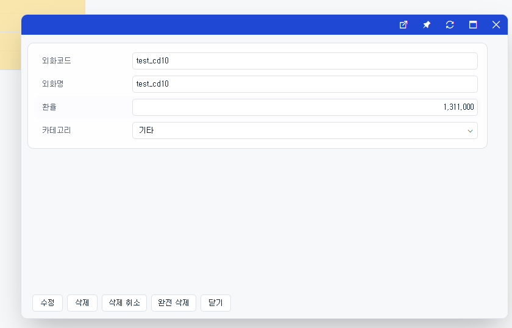
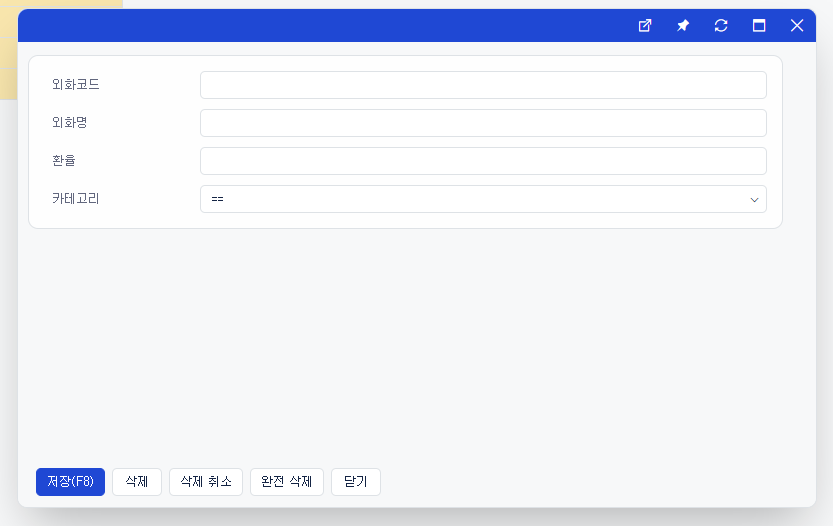
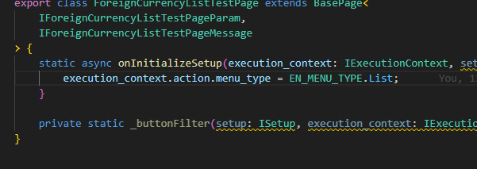
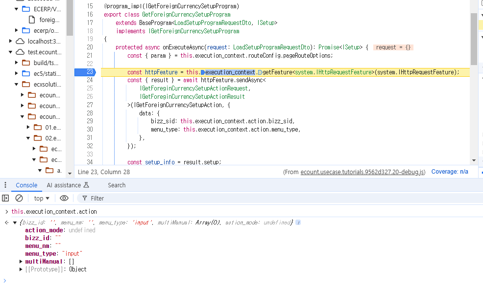

# Daily Retrospective  
**작성자**: [박성재]  
**작성일시**: [2025-01-22]  

## 1. 오늘 배운 내용 (필수)  
- 다건 조회 구현 실습

<br/>

## 다건 조회 구현 실습
오늘은 드디어 실습 마지막 단계인 다건 조회를 구현하는 시간을 가졌습니다. 총 4가지 구현 사항이 있었습니다.

1. 리스트 화면 그리기
2. 신규버튼 OR 클릭 후 외화코드/외화명 링크 클릭 시 팝업 띄우기
3. 신규, 수정화면 별 버튼 필터 적용

개발 진행사항을 차례대로 살펴보겠습니다.

## 1. 리스트 화면 그리기

### foreign_currency_list.ui.tsx

```typescript
@page_impl({
	identifier: IForeignCurrencyListTestPage,
	setup: IGetForeignCurrencySetupProgram,
	data_model: IGetForeignCurrencyDataModelProgram,
})
export class ForeignCurrencyListTestPage extends BasePage<
	IForeignCurrencyListTestPageParam,
	IForeignCurrencyListTestPageMessage
> {
	static async onInitializeSetup(execution_context: IExecutionContext, setup: ISetup) {
		execution_context.action.menu_type = EN_MENU_TYPE.List;
	}

	private static _buttonFilter(setup: ISetup, execution_context: IExecutionContext) {}
}
```
- 최초 리스트 화면 진입을 위한 테스트 UI 페이지입니다. 최대한 간단하게 구현해봤습니다.
- 단건 조회 때와 마찬가지로 `Setup API`와 `Data API`를 호출하여 Setup 정보를 완성하고 화면에 그려내게됩니다.
- `Setup Program`과 `DataModel Program`은 단건조회 때 구현했던 파일을 재활용했습니다.
- 흐름이 비슷하므로 `Setup Api`와 `Data Api`를 묶어서 설명해보겠습니다.

<br/>

### Setup/DataModel Program

```typescript
@program_impl(IGetForeignCurrencySetupProgram)
export class GetForeignCurrencySetupProgram
	extends BaseProgram<LoadSetupProgramRequestDto, ISetup>
	implements IGetForeignCurrencySetupProgram
{
	protected async onExecuteAsync(request: LoadSetupProgramRequestDto): Promise<ISetup> {
		const { param } = this.execution_context.routeConfig.pageRouteOptions;

		const httpFeature = this.execution_context.getFeature<system.IHttpRequestFeature>(system.IHttpRequestFeature);
		const { result } = await httpFeature.sendAsync<
			IGetForeginCurrencySetupActionRequest,
			IGetForeginCurrencySetupActionResult
		>(IGetForeignCurrencySetupAction, {
			data: {
				bizz_sid: this.execution_context.action.bizz_sid,
				menu_type: this.execution_context.action.menu_type,
			},
		});

		const setup_info = result.setup;

		if (param?.menu_attributes) {
			setup_info.menu.attributes.push(...param.menu_attributes);
		}

		return {
			menu: setup_info.menu,
			data_model: setup_info.data_model as IDataModelMapper | IArrayDataModelMapper,
			data_model_definitions: setup_info.data_model_definitions,
			view_container: setup_info.view_container,
			tenant: setup_info.tenant,
			user: setup_info.user,
			bizz: setup_info.bizz,
			function: [],
		};
	}
}


@program_impl(IGetForeignCurrencyDataModelProgram)
export class GetForeignCurrencyDataModelProgram
	extends BaseProgram<LoadDataModelProgramRequestDto, Partial<ISetup>>
	implements IGetForeignCurrencyDataModelProgram
{
	protected async onExecuteAsync(request: LoadDataModelProgramRequestDto): Promise<Partial<ISetup>> {
		// this.execution_context.action.action_mode = EN_ACTION_MODE.GetModify;
		// this.execution_context.action.bizz_id = '';
		// this.execution_context.action.menu_type = EN_MENU_TYPE.Input;

		const httpFeature = this.execution_context.getFeature<system.IHttpRequestFeature>(system.IHttpRequestFeature);
		const { result } = await httpFeature.sendAsync<
			IGetForeignCurrencyDataModelProgramRequest,
			IForeignCurrencySetupResultDto
		>(IGetForeignCurrencyDataAction, {
			data: {
				currency_cd: request.pageRouteOptions?.param?.data_sid,
				bizz_sid: 'TB_000000E040114',
				menu_type: this.execution_context.action.menu_type,
				action_mode: this.execution_context.action.action_mode,
			},
		});

		return result;
	}
}
```
- 단건조회 때 구현했던 `Setup/DataModel Program`을 그대로 재활용했습니다.
- `Action`으로 `Setup` 정보를 채워주도록 요청하고 있습니다.

<br/>

### Setup/Data Action

```typescript
export default class GetForeignCurrencySetupAction
	extends ApiActionBase<IGetForeginCurrencySetupActionRequest, IGetForeginCurrencySetupActionResult>
	implements IGetForeignCurrencySetupAction
{
	executeSync(
		context: IExecutionContext,
		request: IGetForeginCurrencySetupActionRequest
	): IGetForeginCurrencySetupActionResult {
		const menu_type = request.menu_type;
		const response = {} as IGetForeginCurrencySetupActionResult;

		switch (menu_type) {
			case EN_MENU_TYPE.Input:
				{
					const program = ProgramBuilder.create<IForeignCurrencySetupRequestDto, ISetup>(
						IGetForeignCurrencyInputSetupProgram,
						context
					);
					response.setup = program.execute({ bizz_sid: '' });
				}
				break;
			case EN_MENU_TYPE.List:
				{
					const program = ProgramBuilder.create<void, ISetup>(IGetForeignCurrencyListSetupProgram, context);
					response.setup = program.execute();
				}
				break;
			default: {
				break;
			}
		}

		return response;
	}
}


export default class GetForeignCurrencyDataAction
	extends ApiActionBase<IGetForeignCurrencyDataModelProgramRequest, IForeignCurrencySetupResultDto>
	implements IGetForeignCurrencyDataAction
{
	executeSync(
		execution_context: IExecutionContext,
		data: IGetForeignCurrencyDataModelProgramRequest
	): IForeignCurrencySetupResultDto {
		let result = {} as IForeignCurrencySetupResultDto;

		const menu_type = data.menu_type;

		switch (menu_type) {
			case EN_MENU_TYPE.Input:
				{
					const program = ProgramBuilder.create<
						IGetForeignCurrencyDataModelProgramRequest,
						IForeignCurrencySetupResultDto
					>(IGetForeignCurrencyInputDataProgram, execution_context);

					result = program.execute(data);
				}
				break;
			case EN_MENU_TYPE.List:
				{
					const program = ProgramBuilder.create<void, IForeignCurrencySetupResultDto>(
						IGetForeignCurrencyListDataProgram,
						execution_context
					);

					result = program.execute();
				}
				break;
		}

		return result;
	}
}
```
- 단건조회 때 구현했던 `Action` 클래스를 재활용했습니다.
- `menu_type` 별로 분기처리하여 각각 하위 프로그램에 Setup 및 데이터 조회 책임을 위임하고 있습니다.

<br/>

### List Setup/Data Program

```typescript
@program_impl(IGetForeignCurrencyListSetupProgram)
export class GetForeignCurrencyListSetupProgram
	extends BaseProgram<void, ISetup>
	implements IGetForeignCurrencyListSetupProgram
{
	constructor(execution_context: IExecutionContext) {
		super(execution_context);
	}

	protected onExecute(dto: void): ISetup {
		return list_setup;
	}
}


@program_impl(IGetForeignCurrencyListDataProgram)
export class GetForeignCurrencyListDataProgram
	extends BaseProgram<void, IForeignCurrencySetupResultDto>
	implements IGetForeignCurrencyListDataProgram
{
	constructor(execution_context: IExecutionContext) {
		super(execution_context);
	}

	protected onExecute(dto: void): IForeignCurrencySetupResultDto {
		const setup = this._getSetupBase();

		const program = ProgramBuilder.create<void, IGetForeignCurrencyDataModelProgramResult[]>(
			IGetForeignCurrencyListMasterProgram,
			this.execution_context
		);

		const data_model = program.execute();

		const input_data_model_id = this.execution_context.bizz_mgr.getBizzDataModelId(
			this.execution_context,
			this.execution_context.action.bizz_sid,
			EN_MENU_TYPE.List
		);

		setup.data_model[input_data_model_id] = data_model;

		return setup as IForeignCurrencySetupResultDto;
	}

	private _getSetupBase(): ISetup {
		return {
			tenant: {} as ITenant,
			user: {} as IUser,
			bizz: {} as IBizz,
			menu: { attributes: [] } as IMenu,
			function: [] as IFunction[],
			view_container: [] as IViewContainer[],
			data_model: {} as IDataModelMapper,
			data_model_definitions: {} as IDataModelDefinitionMapper,
		};
	}
}
```
- `Setup`의 경우 채워주는 로직이 복잡하므로 정적인 파일로 바로 내보내주었습니다.
- `Data`의 경우 하위의 `Master Program`을 통해 DB에서 데이터를 조회해 응답을 반환하고 있습니다.

<br/>

### ListMasterProgram

```typescript
@program_impl(IGetForeignCurrencyListMasterProgram)
export class GetForeignCurrencyListMasterProgram
	extends BaseProgram<void, IGetForeignCurrencyListDataProgram[]>
	implements IGetForeignCurrencyListMasterProgram
{
	@_transaction(TransactionOption.Required)
	protected onExecute(dto: void): IGetForeignCurrencyListDataProgram[] {
		const dac = DacCommandBuilder.create(GetForeignCurrencyListDac, this.execution_context);
		const table_model_list = dac.execute();

		return this._getDataModel(table_model_list);
	}

	private _getDataModel(
		table_model_list: pg.foreign_currency_20250110_psj_ecback[]
	): IGetForeignCurrencyListDataProgram[] {
		const result = [] as IGetForeignCurrencyListDataProgram[];
		for (const table_model of table_model_list) {
			const after = Object.entries(table_model).reduce((acc, [key, value]) => {
				acc[`foreign_currency$${key}`] = value;
				return acc;
			}, {} as any);
			result.push(after);
		}

		return result;
	}
}
```
- `Dac`을 통해 DB에서 데이터를 바로 조회해서 내보내고 있습니다.
- 단건 조회 로직과 거의 같습니다.
- 사실 이 `Master Program`을 추가해주는 것이 맞는것인가 아직 잘 확신이 서지 않습니다.
- DB를 조회하기 전에 조건 처리나 응답값을 변환해주는 로직 등이 달라질 수 있기 때문에 분리하는 것이 맞나?? 라는 생각정도로 하고있습니다.

<br/>

### GetForeignCurrencyListDac

```typescript
export class GetForeignCurrencyListDac extends ESqlDacCommand<void, IGetForeignCurrencyDataModelProgramResult[]> {
	constructor(execution_context: IExecutionContext) {
		super(execution_context, DbConnectionId.PG.BASE);
	}

	protected generateESql(data: void): $Statement {
		const esql = $ESql
			.from<pg.foreign_currency_20250110_psj_ecback>(pg.foreign_currency_20250110_psj_ecback, (opt) => {
				opt.alterCheckColumnRule(ENUM_CONDITION_LEVEL.HIGH, (t) => [t.tenant_sid]);
			})
			.select((ef, t) => ef._all())
			.where((ef, t) => ef._equal(t.tenant_sid, this.execution_context.session.tenant_sid));

		return esql;
	}

	protected onExecute(db: $Database, esql: $Statement): IGetForeignCurrencyDataModelProgramResult[] {
		return db.expressionSql(GetForeignCurrencyListDac, esql).query()
			.data as IGetForeignCurrencyDataModelProgramResult[];
	}
}
```
- 모든 항목을 조회하고 있으며, 여러개를 조회해야하기 때문에 실행문으로 `query`를 처음 사용해봤습니다.
- 여러개의 데이터가 잘 조회되는 것을 확인할 수 있었습니다.

### 결과



데이터들이 잘 조회되고 있습니다.

<br/>

## 2. 신규버튼 클릭 후 신규 저장
신규 버튼을 클릭하면 발생되는 `User Action`과 코드값과 이름을 클릭하면 발생되는 `User Action`을 각각 생성해야 했습니다. 하지만 거의 동일한 작업을 해당 `User Action`에서 한다고 판단되어 저는 하나의 `User Action`으로 구현하기로 했습니다.

### IOpenModifyForeignCurrencyUserAction
```typescript
export interface IForeignCurrencyActionRequestDto {
	action_mode?: EN_ACTION_MODE;
}

export const IOpenModifyForeignCurrencyUserAction = new UserActionIdentifier('IOpenModifyForeignCurrencyUserAction');
export type IOpenModifyForeignCurrencyUserAction = IUserActionExecutor<IForeignCurrencyActionRequestDto, void>;
```
- 하나의 `User Action`에서 처리하려면 요청 값으로 `Action Mode` 값을 받아와야했습니다.
- 이에 따라 요청 Dto의 인터페이스의 타입을 위와 같이 `action_mode`를 추가하여 받을 수 있도록 하였습니다.

<br/>

### OpenModifyForeignCurrencyUserAction
```typescript
@action_impl(IOpenModifyForeignCurrencyUserAction)
export class OpenModifyForeignCurrencyUserAction {
	static executeAsync: IOpenModifyForeignCurrencyUserAction = async (request) => {
		const popup_handler = request.execution_context.getFeature<ui_handler.IHandleRouteFeature>(
			ui_handler.IHandleRouteFeature
		);

		popup_handler.openPopupAsync(
			{
				bizz_sid: request.execution_context.action.bizz_sid,
				identifier: IForeignCurrencyInputPage,
				action_mode: request.payload.action_mode,
				param: {
					menu_type: EN_MENU_TYPE.Input,
					data_sid: request?.owner?.dmc?.getReferTypeBasedDataModelByIndex(
						request.owner.data_model_index ?? 0
					)?.['foreign_currency_cd'],
				},
				reqData: {
					authority_type: EN_AUTHORITY_TYPE.Anonymous,
				},
			},
			{},
			receiveHandler(request)
		);
	};
}
```
- 팝업을 띄우는 로직을 구현하고 있습니다.
- 특히 수정조회이면 `action_mode`가 `Get_Modify`가 되고, `data_sid` 값을 요청으로부터 알 수 있으므로 이를
하위 프로그램에 내려주면 수정 조회로 동작시키는 것이 가능합니다.
- 반대로 신규조회이면 `action_mode`가 `Get_Create`가 되고 `data_sid`를 빈값으로 보내면 신규 조회로 동작시킬 수 있습니다.

<br/>

### setup 정보

```typescript
// ...
{
    prop_id: 'new',
    attr_id: 'user_action',
    attr_type: 'Trigger',
    data: {
        identifier: 'IOpenModifyForeignCurrencyUserAction',
        payload: { action_mode: EN_ACTION_MODE.GetCreate },
    },
},
{
    prop_id: 'foreign_currency$foreign_currency_cd',
    attr_id: 'user_action',
    attr_type: 'Trigger',
    data: {
        identifier: 'IOpenModifyForeignCurrencyUserAction',
        payload: { action_mode: EN_ACTION_MODE.GetModify },
    },
},
{
    prop_id: 'foreign_currency$foreign_currency_cd',
    attr_id: 'view_type',
    attr_type: 'Renderer',
    data: 'ANCHOR',
},
{
    prop_id: 'foreign_currency$foreign_currency_nm',
    attr_id: 'view_type',
    attr_type: 'Renderer',
    data: 'ANCHOR',
},
{
    prop_id: 'foreign_currency$foreign_currency_nm',
    attr_id: 'user_action',
    attr_type: 'Trigger',
    data: {
        identifier: 'IOpenModifyForeignCurrencyUserAction',
        payload: { action_mode: EN_ACTION_MODE.GetModify },
    },
},

```
- `setup` 정보 중, `attr_type`이 `Trigger`에 해당하는 속성에 `UserAction`을 할당해줍니다.
- 그리고 함께 `data` 프로퍼티를 넘겨주면 해당 `User Action`에서 `request` 정보로 활용할 수 있게됩니다.
- 또한 `ANCHOR`에 해당하는 `view_type` 속성을 `foreign_currency_cd`에도 추가하여 강조 UI를 추가해주었습니다.

### 결과





조회가 분기처리되어 잘 나타나고 있습니다. 또한 해당 팝업에서 신규 저장, 수정 저장도 잘되는 것을 확인했습니다.

<br/>

## 3. 신규, 수정화면 별 버튼 필터 적용
바로 위의 결과 화면을 보면 수정화면에는 저장버튼이 사라진 것을 알 수 있습니다. 해당 처리는 아래의 순서로 진행했습니다.

### foreign_currency_input.tsx

```typescript
@page_impl({
	identifier: IForeignCurrencyInputPage,
	setup: IGetForeignCurrencySetupProgram,
	data_model: IGetForeignCurrencyDataModelProgram,
})
export class ForeignCurrencyInputPage extends BasePage<
	IForeignCurrencyInputPageParam,
	IForeignCurrencyInputPageMessage
> {
	static async onInitalizeSetup(execution_context: IExecutionContext, setup: ISetup) {
		// 속성과 데이터를 통해 조작해야 되는경우
		// ex) 진행상태가 xxx일 때 특정 버튼이 안보여야 됨.
		// 캐싱으로 인해, 전체데이터를 내리고 필터링 해야 되는경우
		// ex) 버튼의 표시여부가 action_mode에 따라 달라짐
		this._buttonFilter(setup, execution_context);
	}

	private static _buttonFilter(setup: ISetup, execution_context: IExecutionContext) {
		const action_mode = execution_context.action.action_mode;
		const refer_type_by_refer_type = this._getTargetReferTypeByActionMode(action_mode as EN_ACTION_MODE);

		this._buttonFilterByReferType(setup, 'footer_toolbar', refer_type_by_refer_type);
	}

	private static _buttonFilterByReferType(setup: ISetup, target: string, delete_target_refer_types: string[]) {
		if (_.vIsEmpty(delete_target_refer_types)) {
			return;
		}

		delete_target_refer_types.forEach((refer_type) => {
			const prop = setup.data_model_definitions[target].props.find((x) => _.vIsEquals(x.refer_type, refer_type));

			if (_.vIsEmpty(prop)) {
				return;
			}

			const attr = setup.data_model_definitions[target].attributes?.find(
				(x) => _.vIsEquals(x.prop_id, prop?.prop_id) && _.vIsEquals(x.attr_id, renderer_attrs.display_state)
			);

			if (_.vIsEmpty(attr)) {
				setup.data_model_definitions[target].attributes?.push({
					attr_type: EN_ATTR_TYPE.Renderer,
					attr_id: renderer_attrs.display_state,
					prop_id: prop?.prop_id as string,
					data: false,
				});
			}
		});
	}

	private static _getTargetReferTypeByActionMode(action_mode: EN_ACTION_MODE): string[] {
		switch (action_mode) {
			case EN_ACTION_MODE.GetCreate:
				return ['modify'];
			case EN_ACTION_MODE.GetModify:
				return ['save'];
		}

		return ['modify'];

		// return [];
	}
}
```
UI를 그려내게될 때 `Setup` 정보를 사용하게되는데, `display_state` 속성을 `false`로 줌으로써 

`EN_ACTION_MODE`를 기준으로 수정 및 저장 버튼을 보이지 않도록 처리하였습니다.

## 후기
다건 조회까지 스스로 모두 구현해보았습니다. 이번 실습에서는 처음으로 팀장님께 질문을 하지않은 채로 구현해보았는데,
이전까지 경험을 토대로 문제가 생기면 스스로 해결해보려고 노력해보았습니다.

원하는 요구사항들을 구현해보면서 `Setup` 정보를 어떻게 추가하면 `UI`가 동적으로 어떻게 바뀌고 반영이 되는지 느껴볼 수 있는 시간이었습니다.
또한 Dto들에 항목들이 왜존재하는지, 공통화를 위해 기존로직에서 DTO를 왜 이렇게 쓰고 있었는지 보다 체감할 수 있었습니다.

<br/>

## 2. 동기에게 도움 받은 내용 (필수)

#### 민준님, 승준님
오늘도 중간중간 실습을 진행하는데 소통하며 도움을 받았습니다.

---

## 3. 개발 기술적으로 성장한 점 (선택)
아래의 3가지 주제 중 하나를 선택하여 작성합니다.

### 2. Test Ui 페이지가 비정상적으로 동작되던 문제

실습을 처음 진행할 때, `foreign_currency_list_test.ui.tsx`를 만들어서 리스트 조회 페이지를 구성하고자 시도했습니다.



위처럼 UI 레벨에서 `menu_type`을 지정하여 하위의 `Program`에서 넘겨받아 사용하고 싶었습니다. 하지만 아래처럼 `execute_context`에 지정해준 항목들 가진 상태로 UI를 그려주지 않고 디폴트 값들로 지정되고 있는 현상이 존재했습니다.



<br/>

빌드 문제인가 싶어서 수십번 빌드해보았으나 여전했습니다. 추측하기로는 제가 실행하는 `list ui 테스트 페이지`를 실행시키는 것이 아니라, 이전에 실행했었던 `input ui 테스트 페이지`를 실행하거나 디폴트로 지정된 어떤 ui를 그려내고 있는 것으로 생각되었습니다.

그리고 잘 되는 다른 분의 파일을 비교해본 결과 파일 이름의 네이밍 방식이 달랐습니다.
저의 경우 테스트 파일 이름이 `foreign_currency_list_test.ui.tsx`이었지만 잘 되시는 분의 파일 이름은 `foreign_currency_list.ui.tsx` 이었습니다.

UI를 그릴 파일이름을 파싱할 때 `_` 가 많으면 제대로 인식하지 못하는건가?? 라는 추측이 들었고, `_test` 를 뺀 상태로 파일 이름을 변경하고, 빌드를 다시하여 실행시켜봤습니다.

#### [ 해결 ]
파일이름을 변경하니 해결되었습니다. 해당 문제는 테스트 UI를 그려낼 때 파일이름 파싱문제가 맞는 것으로 생각되고 있습니다. 하지만 동기분들 중, 강민님의 경우 파일이름을 변경해보아도 문제해결이 되지 않고 있어 정확한 원인파악은 어려운 상황입니다.

또한 저의 기존에 존재하던 단건 조회시 작성했던 `foreign_currency_input_test.ui.tsx` 파일을 실행 시 동일한 문제가 발생하고 있습니다. 해당 파일은 파일이름을 변경해도 문제가 해결되지 않고 있습니다.
테스트 UI 그려내는 로직에 무엇인가 문제가 존재하는 것으로 파악되고 있습니다.
