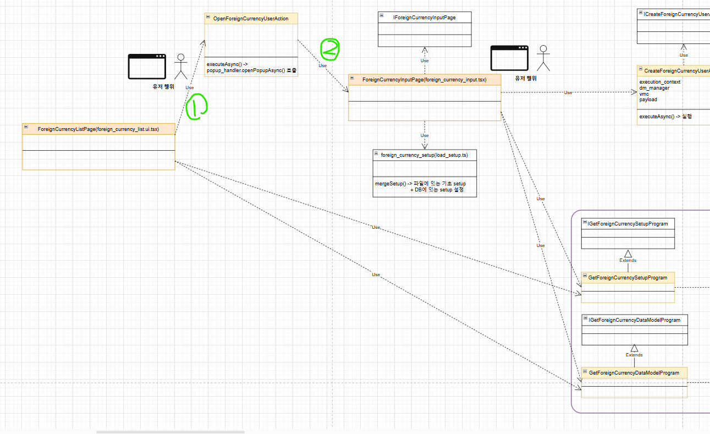

# Daily Retrospective

**작성자**: [박주현]  
**작성일시**: [2025-01-22]

# 1. 오늘 배운 내용

## 1️⃣ 신규 조회와 수정 조회를 이젠 팝업창에서 가능하게 구현했습니다.

기존에는 바로 외화코드 input 페이지에서 신규조회와 수정조회가 일어나게 했습니다. 이젠 리스트 조회에서 신규 버튼 클릭 또는 cd, nm 을 클릭시에 input 페이지가 팝업으로 나타나게 했습니다.



기존엔 위 그림에서 오른쪽의 입력 화면으로 바로 시작했지만, 이번 실습엔 왼쪽의 리스트 화면에서 1번과 2번과정을 거쳐 입력화면이 나타나게 됩니다. `OpenForeignCurrencyUserAction` 에서 새로운 팝업창을 뜨게 하기 위해선 아래 로직처럼 openPopupAsync() 함수를 사용합니다.
openPopupAsync() 함수 내에 띄울 팝업창을 identifier로 명시해주고, 필요한 데이터들을 param 안에 필드로 넣어주게 됩니다.

입력 페이지에선 Setup api 과 Data api 넣어둔 request를 사용하게 됩니다.

```ts
popup_handler.openPopupAsync(
  {
    bizz_sid: request.execution_context.action.bizz_sid,
    identifier: IForeignCurrencyInputPage,
    param: {
      action_mode: request.execution_context.action.action_mode,
      menu_type: request.execution_context.action.menu_type,
      data_sid: request?.owner?.dmc?.getReferTypeBasedDataModelByIndex(
        request.owner.data_model_index ?? 0
      )?.["foreign_currency_cd"],
      payload: request.payload,
    },
    reqData: {
      authority_type: EN_AUTHORITY_TYPE.Anonymous,
    },
  },
  {},
  receiveHandler(request)
);
```

## 1️⃣ load_setup 에서 setup api 와 data api 의 request 차이

민준님과의 대화로 해당 개념을 공부하게 됐습니다.

```ts
/** setup 로드 */
async function loadSetup(
  setup: ISetup,
  request: INavigationRequest,
  routeOptions: IPageDescriptionRouteOptions
): Promise<ISetup | null> {
  const { execution_context } = request;
  const setup_option = getSetupOption(routeOptions);

  if (!(setup_option instanceof ProgramIdentifier)) {
    if (typeof setup_option === "function") {
      // @page_impl()의 setup에 함수를 넣을때
      const loadedSetup = await setup_option(
        execution_context as IExecutionContext
      );
      return loadedSetup;
    } else {
      return setup_option;
    }
    return null;
  }

  const program = await ProgramBuilder.createAsync<
    LoadSetupProgramRequestDto,
    ISetup
  >(setup_option, execution_context as IExecutionContext);

  return await program?.executeAsync({});
}

/** data_model 로드 */
async function loadDataModel(
  setup: ISetup,
  request: INavigationRequest,
  routeOptions: IPageDescriptionRouteOptions
): Promise<ISetup | null> {
  const data_model_option = getDataModelOption(routeOptions);
  if (!data_model_option) {
    return null;
  }

  const { execution_context, pageRouteOptions, pageLoadOptions } = request;
  let loadedSetup: ISetup;
  if (typeof data_model_option === "function") {
    // @page_impl()의 data_model에 함수를 넣을때
    loadedSetup = await data_model_option(
      execution_context as IExecutionContext
    );
  } else {
    const program = await ProgramBuilder.createAsync<any, ISetup>(
      data_model_option,
      execution_context as IExecutionContext
    );
    loadedSetup = await program?.executeAsync({
      pageRouteOptions,
      pageLoadOptions,
    });
  }

  return loadedSetup;
}
```

위는 `load_set.ts` 의 일부분 로직입니다. 여기서 executeAsync() 함수를 주목해야합니다. setup 로드의 경우 request 에 빈객체{} 를 넣어주게 되고, data_model 로드에서는 pageRouteOptions, pageLoadOptions 을 request로 넣어주게 됩니다. 따라서 setup api 에서는 request에서 무언갈 꺼낼 수가 없게 되면 data api 에서는 pageRouteOptions 과 pageLoadOptions 을 활용하여 그 안에서 원하는 필드를 꺼내 쓸 수 있습니다.

생각해보면 당연한 것이, setup은 업무와 메뉴와 액션모드에 따라서 양식만 보내주면 되고, data api 는 넘어온 데이터를 가공하여 어떠한 값을 반환해야하기 때문입니다.

---

# 2. 동기에게 도움 받은 내용

주원님, 도형님, 민준님, 승준님 등 많은 분들께 도움을 받았습니다. 특히나 현철님께는 로직뿐 아니라 구현에 관한 개념관련 질문도 많이 했습니다. 성철님께서 ui 개념을 배웠고, 성재님이 티백을 하나 주셔서 따뜻한 차를 마실 수 있었습니다.

---

# 3. 개발 기술적으로 성장한 점

## 3-2. 오늘 직면했던 문제 (개발 환경, 구현)와 해결 방법

### (1번) 구현 방법에 대한 고민

오늘 `리스트 조회`와 팝업창으로 인한 `신규 조회`, `수정 조회`를 구현하는 것이 실습과제였습니다.
`신규 조회`, `수정 조회` 팝업 창을 띄울라면 `OpenForeignCurrencyUserAction` 을 활용해야했습니다. 주어진 방향성에 대해선 `신규 조회` 에선 `OpenForeignCurrencyUserAction`, `수정 조회` 에선 `OpenModifyForeignCurrencyUserAction` 활용해 구현하는 것이 가이드 라인이었습니다. 그리고 재고 쪽 로직을 보면 조회 기능에서 입력 기능과 다르게 setup, data 프로그램을 input 과 output 으로 나눠 각각 구현했습니다.

저는 이것이 불필요한 파일을 많이 만들고, 공통화 되어 있지 않다고 생각했습니다. 그래서 모든 useraction 과 action, program 들을 공통화해 재사용하고, dac 만 따로 만들어서 처리했습니다.

input 과 output 으로 나눠서 구현하는 방법은 다음과 같은 장단점이 있습니다.

> 장점
>
> (1) 의미가 명확해져 소스파일을 볼 때 편합니다.
>
> (2) 분기처리를 하지 않아도 됩니다.

> 단점
>
> (1) 한 파일 내에서 작업 하지 않으니 소스 파일의 양이 2~3배가 될 수 있습니다.

공통 useraction 과 action, program 을 사용해 구현하는 방법은 다음과 같은 장단점이 있습니다.

> 장점
>
> (1) 한 파일내에서 비슷한 기능들을 한번에 다루니 소스 코드의 중복성을 크게 줄일 수 있습니다.
>
> (2) 공통 처리가 가능합니다.

> 단점
>
> (1) 소스내에 안티패턴 중 하나인 다중 조건문이 생길 가능성이 있습니다.

구현하면서도 하나의 파일에서 각각의 기능을 활용해야하기 때문에 action_mode 와 menu_type 에 따라 분기 처리를 해야했습니다. menu_type은 뷰페이지 이름이나, 컨텍스트에서 가져올 수 있다고 해도, action_mode는 꼭 분기 처리 해줘야 했습니다.

e.g.

```ts
switch (menu_type) {
  case EN_MENU_TYPE.List:
    this.execution_context.action.action_mode = EN_ACTION_MODE.Get;
    break;
  case EN_MENU_TYPE.Input:
    if (payload.action_mode)
      this.execution_context.action.action_mode = payload.action_mode;
    else EN_ACTION_MODE.GetCreate;
    break;
}
```

```ts
switch (action_mode) {
  case EN_ACTION_MODE.GetModify: {
    const program = ProgramBuilder.create<
      GetForeignCurrencySetupRequestDto,
      GetForeignCurrencySetupResultDto
    >(IGetForeignCurrencyMasterProgram, this.execution_context);
    const { data_model } = program.execute(dto);

    const input_data_model_id =
      this.execution_context.bizz_mgr.getBizzDataModelId(
        this.execution_context,
        this.execution_context.action.bizz_sid,
        EN_INPUT_MENU_TYPE.Master
      );

    setup.data_model[input_data_model_id] = [data_model];
    return setup as GetForeignCurrencySetupResultDto;
  }

  case EN_ACTION_MODE.Get: {
    const program = ProgramBuilder.create<
      GetForeignCurrencySetupRequestDto,
      GetForeignCurrencySetupResultDto
    >(IGetForeignCurrencyMasterProgram, this.execution_context);
    const data_model = program.execute(dto);

    const input_data_model_id =
      this.execution_context.bizz_mgr.getBizzDataModelId(
        this.execution_context,
        this.execution_context.action.bizz_sid,
        EN_MENU_TYPE.List
      );

    setup.data_model[input_data_model_id] = data_model;
    return setup as GetForeignCurrencySetupResultDto;
  }

  case EN_ACTION_MODE.GetCreate: {
    return setup as GetForeignCurrencySetupResultDto;
  }

  default: {
    throw new Exception("Exception - ACTION_MODE is Undefined");
  }
}
```

```ts
if (dto.menu_type == EN_MENU_TYPE.Input) return setup;
return list_setup;
```

비슷한 로직을 사용하지만 반환값이 배열이거나, 약간의 차이가 있어서 분기를 나눠줘야하는 차이가 있었습니다.
하지만 input 파일에 비례하게 각각 out 파일은 만든다면 그것 또한 더큰 소스 파일 중복이라 생각해 전자를 채택하게 됐습니다.

### (2번) 조건문 에러

```ts
if (
  this.execution_context.action.action_mode ==
  (EN_ACTION_MODE.GetModify || EN_ACTION_MODE.Get)
) {
}
```

위 코드는 컴파일 에러도 나오지 않았습니다. `this.execution_context.action.action_mode`가 `Get`이기 때문에 참이라서 조건문을 타야합니다. 하지만 get 아니라고 하면서 else 문을 타게 됐습니다.

```ts
const action_mode = dto.action_mode;
		switch (action_mode) {
			case EN_ACTION_MODE.GetModify: {
			}
			case EN_ACTION_MODE.Get: {
			}
```

위와 같이 바꿔주니 작동하게 됐습니다.

전자의 위 코드는 예상과 다르게 작동합니다. 이는 **(EN_ACTION_MODE.GetModify || EN_ACTION_MODE.Get)**의 평가 방식 때문입니다. 이 표현식은 비트 연산이나 논리 연산을 포함하지 않는 단순 값 비교에서 예상치 못한 결과를 초래합니다.

1. (EN_ACTION_MODE.GetModify || EN_ACTION_MODE.Get)의 평가 방식
   || 연산자는 **단락 평가(short-circuit evaluation)**를 사용합니다.
   즉, EN_ACTION_MODE.GetModify가 truthy(거짓이 아닌 값)이면, EN_ACTION_MODE.GetModify를 반환하고 이후 값을 평가하지 않습니다.
   따라서, EN_ACTION_MODE.GetModify || EN_ACTION_MODE.Get는 EN_ACTION_MODE.GetModify 값으로 평가됩니다.

```ts
if (this.execution_context.action.action_mode == EN_ACTION_MODE.GetModify) {
  // 'GetModify'와만 비교
}
```

이렇게 변환되어 비교하게 됩니다. js 의 조건문 truthy, falsy 검사를 학습했는데, 실제로 소스에서 에러를 만나니 배운 내용이 상기됐습니다.

---

# 4. 소프트 스킬면에서 성장한 점

실습을 빠르게 구현하여, 비슷한 에러를 겪거나 어려움을 겪는 동기들에게 도움을 줄 수 있었습니다.
