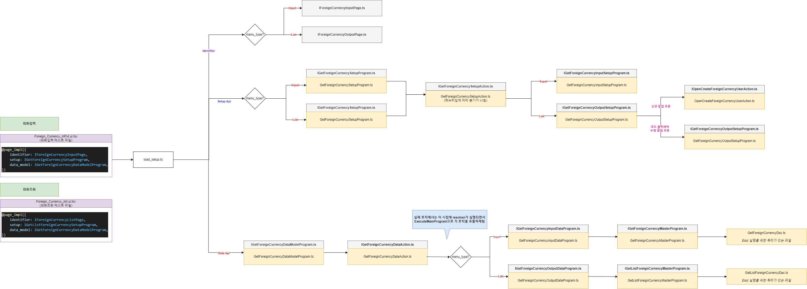

# Daily Retrospective

**작성자**: [설다은]  
**작성일시**: [2025-01-22]

## 1. 오늘 배운 내용 (필수)

오늘은 리스트를 만드는 작업을 했습니다. 

- 리스트조회 setup api / data api 생성
- 신규 버튼 클릭하여 신규화면 팝업에서 신규저장
- 외화코드 클릭하여 수정화면 팝업에서 수정저장
- 액션모드에 맡는 버튼만 필터링하여 렌더링

일단은 흐름을 먼저 도식으로 그리고 차근차근 파일을 만들어 나아가니 한결 수월했습니다. 
 

## 2. 동기에게 도움 받은 내용 (필수)

**지은님, 민준님, 수경님**
오늘도 억까를 당하는 하루였습니다. 
빌드를 여러번 해야지 해결되는 상황도 있었고, '?'하나로 값이 나왔다 안나왔다 하는 경우도 있었습니다. 
이럴때마다 같이 도와주는 동기들이 있어 너무 감사합니다ㅠㅠㅠ 

## 3. 개발 기술적으로 성장한 점 (선택)

### 2. 오늘 직면했던 문제 (개발 환경, 구현)와 해결 방법

`문제상황` : 외화코드목록이 나오다가 특정 파일 수정 후 목록이 나타나지 않는 현상  
`해결방안` : *GetForeignCurrencyDataModelProgram*파일의 data{}부분에 *foreign_currency_cd: request.pageRouteOptions?.param?.data_sid,*을 넣어서 해결했습니다. 민준님이 같이 보고 해결해주셨는데 사실 명확하게 이해하지는 못한 것 같아 내일 다시 공부하려고 합니다.

### 3. 위 두 주제 중 미처 해결 못한 과제. 앞으로 공부해볼 내용.

여전히 흐름을 제대로 잡지 못하고 있는 것 같습니다. 
도식을 그릴 때는 잘 생각나다가도 코딩하는 시점에는 매끄럽게 적용되지 못하는 것 같아 아쉽습니다. 
어디서 오류가 나는지 아는데 그 다음 디버깅 포인트를 찾는것도 아직은 미숙한 것 같아 많이 연습해보려고 합니다. 

## 4. 소프트 스킬면에서 성장한 점 (선택)

내가 궁금한 부분을 이전보다는 조금 더 잘 물어보는 것 같습니다. 
아직도 많이 부족하지만 질문을 '개발적으로 잘'하는 연습을 꾸준히 해야할 것 같습니다. 
