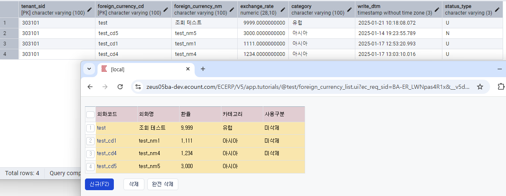

# Daily Retrospective  
**작성자**: [이연아]  
**작성일시**: [2025-01-22]  

## 1. 오늘 배운 내용 (필수)  
### 리스트 조회 화면 구현
### 1. setup api, data api (화면 그리기)

`foreign_currency_list.ui.tsx` - 테스트 실행했을 때 진입점(List 화면) 
```typescript
@page_impl({
	identifier: IForeignCurrencyListDataPage,
	setup: IGetForeignCurrencySetupProgram,
	data_model: IGetForeignCurrencyDataModelProgram,
})
export class ForeignCurrencyListPage extends BasePage<
	IForeignCurrencyListDataPageParam,
	IForeignCurrencyListDataPageMessage
> {
	static async onInitalizeSetup(execution_context: IExecutionContext, setup: ISetup) {
		execution_context.action.menu_type = EN_MENU_TYPE.List;
	}
}
```

#### 1. Set Api
`GetForeignCurrencySetupProgram.ts`
```typescript
let menu_type = request.menu_type;

if (!menu_type) {
	menu_type = this.execution_context.action.menu_type;
}

let default_action_mode;
switch (menu_type) {
	case EN_MENU_TYPE.List:
		default_action_mode = EN_ACTION_MODE.Get;
		break;
	case EN_MENU_TYPE.Input:
		default_action_mode = EN_ACTION_MODE.GetCreate;
		break;
}
```

`GetForeignCurrencySetupAction.ts`
```typescript
let result = {} as GetForeignCurrencySetupResultDto;

switch (request.menu_type) {
	case EN_MENU_TYPE.Input: {
		const program = ProgramBuilder.create<
			GetForeignCurrencySetupRequestDto,
			GetForeignCurrencySetupResultDto
		>(IGetForeignCurrencyInputSetupProgram, context);
		result = program.execute(request);
		break;
	}
	case EN_MENU_TYPE.List: {
		const program = ProgramBuilder.create<
			GetForeignCurrencySetupRequestDto,
			GetForeignCurrencySetupResultDto
		>(IGetForeignCurrencyOutputSetupProgram, context);
		result = program.execute(request);
		break;
	}
}

return result;
```
- 메뉴 타입(List, Input)에 따른 분기 처리

`GetForeignCurrencyOutputSetupProgram.ts`
- 리스트 조회 페이지의 setup 정보 작성

#### 2. Data Api
`GetForeignCurrencyDataModelProgram.ts`
```typescript
let menu_type = request.menu_type;

		if (!menu_type) {
			menu_type = this.execution_context.action.menu_type;
		}

		let default_action_mode;
		switch (menu_type) {
			case EN_MENU_TYPE.List:
				default_action_mode = EN_ACTION_MODE.Get;
				break;
			case EN_MENU_TYPE.Input:
				default_action_mode = EN_ACTION_MODE.GetCreate;
				break;
		}
```

`GetForeignCurrencyDataAction.ts`
```typescript
let result = {} as GetForeignCurrencySetupResultDto;

switch (data.menu_type) {
	case EN_MENU_TYPE.Input: {
		const program = ProgramBuilder.create<
			GetForeignCurrencySetupRequestDto,
			GetForeignCurrencySetupResultDto
		>(IGetForeignCurrencyInputDataProgram, execution_context);
		result = program.execute(data);
		break;
	}
	case EN_MENU_TYPE.List: {
		const program = ProgramBuilder.create<
			GetForeignCurrencySetupRequestDto,
			GetForeignCurrencySetupResultDto
		>(IGetForeignCurrencyOutputDataProgram, execution_context);
		result = program.execute(data);
		break;
	}
}

return result;
```
- setup과 마찬가지로 메뉴 타입(List, Input)에 따른 분기 처리

`GetForeignCurrencyOutputDataProgram.ts`
```typescript
const program = ProgramBuilder.create<GetForeignCurrencySetupRequestDto, GetForeignCurrencySetupResultDto>(
	IGetListForeignCurrencyMasterProgram,
	this.execution_context
);
const data_model = program.execute(dto);

const output_data_model_id = this.execution_context.bizz_mgr.getBizzDataModelId(
	this.execution_context,
	this.execution_context.action.bizz_sid,
	EN_MENU_TYPE.List
);

setup.data_model[output_data_model_id] = data_model;
return setup as GetForeignCurrencySetupResultDto;
```
- 리스트 조회 화면은 입력 화면(신규 저장, 수정 조회)과 다르게 action_mode를 따로 확인할 필요 없이 MasterProgram 호출

`GetListForeignCurrencyMasterProgram.ts`
```typescript
onExecute(dto: foreign_currency.foreign_currency_input): pg.foreign_currency_20250110_lya_ecback[] {
	const table_model = DacCommandBuilder.create(
		GetListForeignCurrencyDac,
		this.execution_context,
		DbConnectionId.PG.BASE
	).execute(dto);

	const data_model = this._getDataModel(table_model);

	return data_model;
}

private _getDataModel(table_model: pg.foreign_currency_20250110_lya_ecback[]): any[] {
	const data_model = [];
	for (let i = 0; i < table_model.length; i++) {
		data_model[i] = Object.entries(table_model[i]).reduce((acc, [key, value]) => {
			acc[`foreign_currency$${key}`] = value;
			return acc;
		}, {} as any);
	}
	return data_model;
}
```
- 반복문 사용해서 배열에 데이터 담기

`GetListForeignCurrencyDac.ts`
- DB에 있는 데이터 목록 가져오기


- DB에 있는 데이터가 잘 불러와져서 화면에 그려지는 것을 확인했습니다.

### 2. 신규 버튼 클릭 후 신규 저장


## 2. 동기에게 도움 받은 내용 (필수)
- 지은님이 점심시간에 커피를 사주셔서 맛있게 먹을 수 있었습니다. 감사합니다!
- 주현님, 수경님, 강민님, 주원님, 지은님, 다은님한테 구현하는 중에 궁금한 점을 묻고 해결할 수 있었습니다. 감사합니다! 
- 오늘도 역시 성철님이 맛있는 저녁을 시켜주셔서 편하고 맛있게 저녁을 먹을 수 있었습니다. 감사합니다! 

---

## 3. 개발 기술적으로 성장한 점 (선택)
### 1. 교육 과정 상 배운 내용이 아닌 개인적 호기심을 해결하기 위해 추가 공부한 내용
### 2. 오늘 직면했던 문제 (개발 환경, 구현)와 해결 방법
### 3. 위 두 주제 중 미처 해결 못한 과제. 앞으로 공부해볼 내용.
오늘 예상했던 것만큼 구현을 완료하지 못했습니다. 구현 초반, 놓치고 있던 부분들이 있어 예상보다 시간이 더 소요되었습니다. 남은 구현 과정에서는 설계를 검토하고, 효율적으로 진행할 계획입니다. 내일 일찍 출근하여 오늘 늦어진 구현 작업을 빠르게 진행하여 예정된 작업이 많이 늦어지지 않도록 진행하겠습니다!!! 

