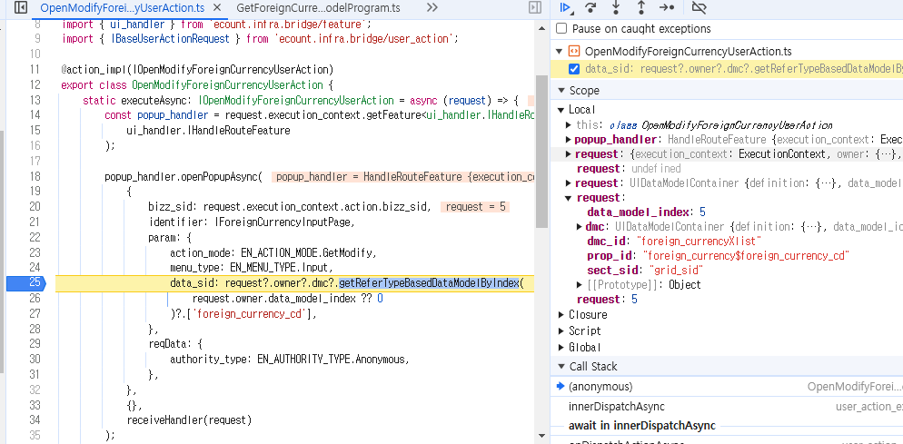

# Daily Retrospective

**작성자**: [이지은]  
**작성일시**: [2025-01-22]

## 1. 오늘 배운 내용 (필수)

### 외화조회(foreign_currency_list) 구현

#### 1. setup api , data api (화면 그리기)

-   GetForeignCurrencyInputSetupProgram / GetForeignCurrencyListSetupProgram (브라우저) -> GetForeignCurrencySetupAction (서버) -> GetForeignCurrencyInputSetupProgram / GetForeignCurrencyOutputSetupProgram (서버)
    -   loadSetup 될 때 request를 전달해주지 않는다. (메뉴 타입을 알 수 없음)
    -   현재 Input과 List를 선택하는 메뉴가 없기 때문에 브라우저 단의 SetupProgram을 분기하여 메뉴 타입을 하드코딩해준다.
-   GetForeignCurrencyDataModelProgram (브라우저) -> GetForeignCurrencyDataAction (서버) -> GetForeignCurrencyInputDataProgram / GetForeignCurrencyOutputDataProgram (서버)

=> 그림으로 대체 예정

#### 2. 신규버튼 클릭후 신규 저장

```ts
import { action_impl } from "ecount.infra.common/decorator";
import { IForeignCurrencyInputPage, IOpenCreateForeignCurrencyUserAction, ISelectListForeignCurrencyUserAction } from "ecount.usecase.tutorials/@abstraction";
import { EN_ACTION_MODE, EN_AUTHORITY_TYPE, EN_MENU_TYPE } from "ecount.fundamental.define/enum";
import { ui_handler } from "ecount.infra.bridge/feature";
import { IBaseUserActionRequest } from "ecount.infra.bridge/user_action";

@action_impl(IOpenCreateForeignCurrencyUserAction)
export class OpenCreateForeignCurrencyUserAction {
	static executeAsync: IOpenCreateForeignCurrencyUserAction = async (request) => {
		const popup_handler = request.execution_context.getFeature<ui_handler.IHandleRouteFeature>(ui_handler.IHandleRouteFeature);

		popup_handler.openPopupAsync(
			{
				bizz_sid: request.execution_context.action.bizz_sid,
				identifier: IForeignCurrencyInputPage,
				param: {
					action_mode: EN_ACTION_MODE.GetModify,
					menu_type: EN_MENU_TYPE.Input,
					data_sid: request?.owner?.dmc?.getReferTypeBasedDataModelByIndex(request.owner.data_model_index ?? 0)?.["foreign_currency_cd"],
				},
				reqData: {
					authority_type: EN_AUTHORITY_TYPE.Anonymous,
				},
			},
			{}
			// receiveHandler(request)
		);
	};
}
```

-   GetCreate로 InputPage를 켜준다.

#### 3. 외화코드/외화명 링크 클릭후 수정 저장

```ts
import { action_impl } from "ecount.infra.common/decorator";
import { IForeignCurrencyInputPage, IOpenModifyForeignCurrencyUserAction, ISelectListForeignCurrencyUserAction } from "ecount.usecase.tutorials/@abstraction";
import { EN_ACTION_MODE, EN_AUTHORITY_TYPE, EN_MENU_TYPE } from "ecount.fundamental.define/enum";
import { ui_handler } from "ecount.infra.bridge/feature";
import { IBaseUserActionRequest } from "ecount.infra.bridge/user_action";

@action_impl(IOpenModifyForeignCurrencyUserAction)
export class OpenModifyForeignCurrencyUserAction {
	static executeAsync: IOpenModifyForeignCurrencyUserAction = async (request) => {
		const popup_handler = request.execution_context.getFeature<ui_handler.IHandleRouteFeature>(ui_handler.IHandleRouteFeature);

		popup_handler.openPopupAsync(
			{
				bizz_sid: request.execution_context.action.bizz_sid,
				identifier: IForeignCurrencyInputPage,
				param: {
					action_mode: EN_ACTION_MODE.GetCreate,
					menu_type: EN_MENU_TYPE.Input,
					data_sid: request?.owner?.dmc?.getReferTypeBasedDataModelByIndex(request.owner.data_model_index ?? 0)?.["foreign_currency_cd"],
				},
				reqData: {
					authority_type: EN_AUTHORITY_TYPE.Anonymous,
				},
			},
			{}
			// receiveHandler(request)
		);
	};
}
```

-   GetModify로 InputPage를 켜준다.
-   현재 구현된 코드에서는 param에 action_mode를 넣어줘야 action_mode가 전달된다.
-   data_sid에 refer_type을 통해 찾아낸 foreign_currency_cd 값이 저장되어 있다. 이 값을 dac에서 data.foreign_currency_cd로 찾아서 where절 조건으로 넣으면 된다.

## 2. 동기에게 도움 받은 내용 (필수)

-   **민준님**: 문제가 생길 때마다 같이 디버깅을 봐주시면서 이해를 도와주십니다. 프로그램 흐름 구조를 워낙 잘 알고 계셔서 덕분에 디버깅을 많이 배운 것 같습니다.

-   **동기분들**: 다이어그램 그리는 꿀팁들을 공유해주셨습니다.

---

## 3. 개발 기술적으로 성장한 점 (선택)

### 2. 오늘 직면했던 문제 (개발 환경, 구현)와 해결 방법

#### GetModify로 변하지 않는 문제

외화코드를 누르면 action mode가 GetModify로 변경되어야 하는데 default 값이 GetCreate로만 전달되는 문제가 있었다. GetModify로 변경되는 코드는 OpenModifyForeignCurrencyUserAction.ts에 있기 때문에 코드를 보다가 어떤 식으로 전달해줘야 할지 감이 잡히지 않았다.

그래서 고민하다 성범 책임님께 여쭤봤을 때 현재 내 코드에서는 param 안에 있는 값들을 바로 받아오고 있기 때문에 param 안에 action mode를 넣어야 GetModify가 서버로 전달될 수 있다고 알려주셨다.

```ts
popup_handler.openPopupAsync(
	{
		bizz_sid: request.execution_context.action.bizz_sid,
		identifier: IForeignCurrencyInputPage,
		param: {
			action_mode: EN_ACTION_MODE.GetModify,
			menu_type: EN_MENU_TYPE.Input,
			data_sid: request?.owner?.dmc?.getReferTypeBasedDataModelByIndex(request.owner.data_model_index ?? 0)?.["foreign_currency_cd"],
		},
		reqData: {
			authority_type: EN_AUTHORITY_TYPE.Anonymous,
		},
	},
	{},
	receiveHandler(request)
);
```

그래서 해당 부분을 수정했다. 그런데 다음 문제로 foreign_currency_cd를 서버에서 어떻게 받아와야 할까 고민했다.



디버깅을 찍어본 결과, data_sid에 foreign_currency_cd에 대한 값이 있었다.

```ts
data: {
    bizz_sid: 'TB_000000E040114',
    menu_type: menu_type,
    action_mode: action_mode,
    foreign_currency_cd: data_sid,
},
```

그래서 GetForeignCurrencyDataModelProgramd에서 DataAction에 전달해주는 data에 data_sid를 추가해줬다.

모든 문제를 해결한 뒤 정상적으로 외화코드 별로 수정조회 화면이 만들어졌다.

### 3. 위 두 주제 중 미처 해결 못한 과제. 앞으로 공부해볼 내용.

#### 외화조회에서 신규 버튼을 눌렀을 때 조회 창으로 연결되는 문제

신규 버튼을 눌러도 입력 창이 아닌 조회창으로 가는 문제가 있었다. 어디서부터 문제인지 찾지 못하겠어서 아연님께 여쭤봤다.

해당 문제는 GetForeignCurrencyDataModelProgram에서 메뉴 타입이 List 또는 Input으로 전달되도록 하드 코딩을 한 부분이 있었는데 이것에 대한 분기처리가 되지 않아서 모든 창이 List로 가고 있는 것이었다.

그래서 DataModelProgram 코드를 하드 코딩이 아닌 request에서 받아온 menu_type을 동적으로 받게 수정했더니 DatModel은 Input으로 보내는 데에 성공했다.

그런데 SetupProgram 또한 Input으로 보내줘야 하는데 List로 보내줘서 아직 문제가 해결되지 않고 있었다. 그래서 SetupProgram을 SetupInputProgram, SetupListProgram으로 나눠서 만들었다. 그리고 각각의 코드에서 Input과 List로 메뉴 타입을 하드 코딩해줬다. 그랬더니 이제 정상작동하도록 됐다.

현재 문제는 해결하긴 했지만 loadSetup을 할 때 request를 받아올 수 없기 때문에 Input, List를 하드 코딩해주면서 SetupProgram(브라우저)은 두 종류였는데 같은 SetupAction으로 이동하고 거기서 다시 각각의 SetupProgram(서버)으로 이동하는 구조가 되었다. 이런 모래시계 구조가 되는게 이상한 상황이다. loadSetup에 대해 다시 생각해보고 문제를 해결해봐야겠다.
