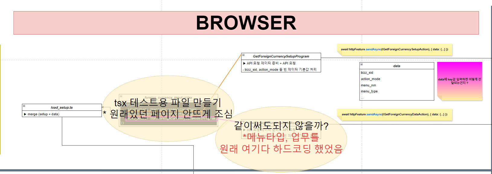
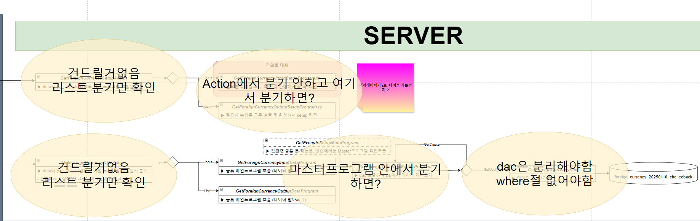

# Daily Retrospective

**작성자**: [최현철]  
**작성일시**: [2025-01-22]

## 1. 오늘 배운 내용 (필수)

### 리스트 조회화면 구현

1. OpenModifyForeignCurrencyUserAction.ts
   
   

- 진입점 조심 / 테스트페이지가 열리도록 presentation에 파일이 있어야함.
- 권한처리 안할거지만 넣어놔야 잘 동작할것임
- 나중에 새로고침할 때 receiveHandler(request)에다가 해야됨(?)

2. 버튼필터링

- UI에서 하는게 요구사항

## 2. 동기에게 도움 받은 내용 (필수)

1. 승준님께서 esql로 조회 시 PK컬럼에 대해서 where절에 조건을 걸어야하는데, alterCheckColumnRule를 통해서 한컬럼만으로도 조회가 가능하다는 것을 잘 설명해주셔서 이해하기 쉬웠습니다.

2. 구현하는 과정에서 주현님이 함꼐 토론해주셔서 견해를 넓힐 수 있었습니다.

3. 민준님이 param에 대한 힌트를 주셔서 수정조회화면 구현을 쉽게할 수 있었습니다.

### 3. 위 두 주제 중 미처 해결 못한 과제. 앞으로 공부해볼 내용.

1. 액션리졸버 이후 과정
2. 제너레이터, 속성, 벨리데이터 등의 흐름

3. ActionMode를 진입점(서버액션)단에서 확정되도록 수정필요 (추가)
4. 브라우저 로직 내 분기문 (if, switch) 정리필요

---

## 5. 제안하고 싶은 내용
