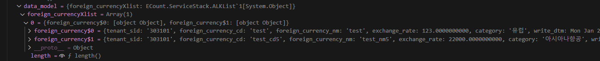

# Daily Retrospective

**작성자**: 허수경

**작성일시**: 2025-01-22(수)

## 1. 오늘 배운 내용 (필수)

- List 조회 및 POPUP 전체적 흐름
- 한번에 신규와 수정 데이터 조회하기
- 다중 데이터 조회하기
- 버튼 필터

### List 조회 및 POPUP 전체적 흐름

---


1. `foreign_currency_list_ui.tsx`

- UI의 테스트를 위한 용도로써 해당 화면으로 중간 페이지의 화면을 테스트할 수 있습니다.
- 이전 단일 조회와 동일하게 `Setup API`와 `Data API`를 통해 화면을 구성합니다.

2. `OpenModifyForeignCurrencyUserAction.ts`

- 리스트 화면에서 신규 및 수정 버튼을 눌렀을 때 처리하기 위한 Action 입니다.
- `param` 정보를 넘겨주며 정보는 아래와 같습니다.:
  - `action_mode`
  - `menu_type`
  - `data_sid`
    - 전표를 구분할 수 있는 유니크한 키
    - 상단과 하단의 데이터가 한 쌍이라는 것을 증명할 수 있는 키
    - `recode_sid`처럼 전표의 키를 조회하는 것과 같습니다.

3. `foreign_currency_input.tsx`

- 리스트 테스트 페이지에서 넘어와 팝업으로 단건 입력 페이지를 띄우는 역할을 합니다.
- 테스트 페이지로부터 연결되어 있는 실제 페이지입니다.

### 한번에 신규와 수정 데이터 조회하기

---

- 신규와 수정 데이터를 구분하여 조회하는 로직을 작성할 때, 신규 데이터는 `foreign_currency_cd` 값이 없고, 수정 데이터는 `foreign_currency_cd` 값이 필요합니다. 이 차이를 기반으로 `if` 문을 사용해 조건을 분리하여 처리합니다.

```ts
protected generateESql(data: foreign_currency.foreign_currency_input): $Statement {
  const esql = $ESql
    .from<pg.foreign_currency_20250110_hsg_ecback>(pg.foreign_currency_20250110_hsg_ecback, (opt) => {
      opt.alterCheckColumnRule(ENUM_CONDITION_LEVEL.HIGH, (t) => [t.tenant_sid]);
    })
    .select((ef, t) => ef._all())
    .where((ef, t) => ef._equal(t.tenant_sid, this.execution_context.session.tenant_sid))

    if(data.foreign_currency_cd) {
      esql.where((ef, t) => ef._equal(t.foreign_currency_cd, data.foreign_currency_cd));
    }

  return esql;
}
```

1. **기본 조회 조건**

   - 테이블 `pg.foreign_currency_20250110_hsg_ecback`에서 데이터를 조회하며, `tenant_sid`를 기반으로 조건을 설정합니다.
   - `alterCheckColumnRule`을 통해 특정 열(`tenant_sid`)에 대한 검증 규칙을 추가합니다.

2. **수정 데이터 조건**

   - `foreign_currency_cd` 값이 있을 경우, 해당 값을 조건으로 추가하여 데이터를 조회합니다.

3. **신규 데이터 조건**
   - `foreign_currency_cd` 값이 없으면 기본 조건만으로 데이터를 조회합니다.

### 다중 데이터 조회하기

---

- 여러 열의 데이터를 조회할 때, 반환 타입으로 배열을 선언하여 다중 데이터를 처리합니다.

```ts
protected onExecute(db: $Database, esql: $Statement): pg.foreign_currency_20250110_hsg_ecback[] {
  const result = db
    .expressionSql(GetForeignCurrencyList2Dac, esql) // SQL 실행
    .query<pg.foreign_currency_20250110_hsg_ecback>(pg.foreign_currency_20250110_hsg_ecback) // 결과 매핑
    .data as pg.foreign_currency_20250110_hsg_ecback[]; // 데이터 배열로 반환

  return result;
}
```

1. **데이터베이스 실행 (`onExecute` 메서드)**

   - `db.expressionSql` 메서드를 사용하여 지정된 SQL 문을 실행합니다. 이 과정에서 `GetForeignCurrencyList2Dac`와 전달받은 `esql`이 SQL 실행에 사용됩니다.
   - 결과 데이터를 `query` 메서드를 통해 원하는 타입으로 매핑합니다.

2. **타입 선언**

   - 반환값의 타입을 `pg.foreign_currency_20250110_hsg_ecback[]`로 지정하여 배열 형태의 데이터임을 명시합니다.

3. **데이터 반환**
   - 최종 조회된 데이터를 `result` 변수에 저장한 뒤 호출자에게 반환합니다.

### 버튼 필터

---

- UI에서는 `setup`(양식) 정보를 모두 불러온 뒤, 속성에 따라 버튼을 필터링하여 화면에 렌더링합니다.

#### `_buttonFilterByReferType` 함수

- 이 함수는 필터링 대상인 `refer_type`을 기반으로 버튼을 제외합니다.
- 함수의 마지막 인자로 삭제할 `refer_type` 배열을 전달합니다.
- 각 버튼 항목이 고유한 `refer_type`을 가지고 있으므로, 해당 정보를 활용해 특정 버튼을 제외할 수 있습니다.

```ts
private static _buttonFilterByReferType(setup: ISetup, target: string, delete_target_refer_types: string[])
```

#### setup - 버튼 속성

아래는 버튼 속성을 보여주는 setup의 일부입니다. 각 버튼은 prop_id와 함께 refer_type을 포함하고 있습니다.

```ts
props: [
  { prop_id: 'new', data_type: $$never, refer_type: 'new' },
  { prop_id: 'save', data_type: $$never, refer_type: 'save' },
  { prop_id: 'modify', data_type: $$never, refer_type: 'modify' },
  { prop_id: 'delete', data_type: $$never, refer_type: 'delete' },
  { prop_id: 'unDelete', data_type: $$never, refer_type: 'unDelete' },
  { prop_id: 'remove', data_type: $$never, refer_type: 'remove' },
  { prop_id: 'close', data_type: $$never, refer_type: 'close' },
],
```

#### `_getTargetReferTypeByActionMode` 함수

- \_getTargetReferTypeByActionMode 함수는 action_mode에 따라 제외할 refer_type 배열을 반환합니다.
- 예를 들어, EN_ACTION_MODE.GetCreate의 경우 'modify', 'delete' 등 여러 refer_type을 필터링 대상으로 지정합니다.

```ts
private static _getTargetReferTypeByActionMode(action_mode: EN_ACTION_MODE): string[] {
  switch (action_mode) {
    case EN_ACTION_MODE.GetCreate:
      return ['modify', 'delete', 'unDelete', 'remove'];
    case EN_ACTION_MODE.GetModify:
      return ['save'];
  }
  return [];
}
```

---

## 2. 동기에게 도움 받은 내용 (필수)

- 다은님께서 전 직장이 있는 경우의 연말정산 방법에 대해 공유해주셨습니다. 실질적인 정보 덕분에 큰 도움을 받았습니다.
- 성철님이 초콜릿을 주셨습니다. 속이 안 좋아 밥을 못먹었는데 초콜릿 덕분에 당 보충을 할 수 있어 큰 도움이 되었습니다.
- 도형님, 다은님, 승준님이 **draw.io**에서 유용한 꿀팁을 알려주셔서 작업이 더 수월해졌습니다.
- 민준님께서 `bizz_manager`와 `dm_manager`의 개념과 동작 방식을 자세히 설명해주셨습니다. 또한 여러 부분에서 많은 도움을 주셔서 항상 감사한 마음입니다.
- 주현님이 `data_model_id`가 잘못 정의된 부분을 발견해주셨습니다. 단건 조회에서는 `master`로 정의되어 있었는데, 다건 조회에서는 `list`로 정의해야 한다는 점을 알려주셔서 문제를 빠르게 해결할 수 있었습니다.
- 아연님이 다건 조회 시 **esql**에서는 `query`를 사용해야 한다는 점을 알려주셔서, 데이터 처리 로직을 개선할 수 있었습니다.

---

## 3. 개발 기술적으로 성장한 점 (선택)

### 1. 교육 과정 상 배운 내용이 아닌 개인적 호기심을 해결하기 위해 추가 공부한 내용

#### Setup API와 Data API 역할 재정리

- **궁금점**

  - Setup API는 속성 정보를 가져오는 역할, Data API는 값을 가져오는 역할로 이해했으나, `generator`를 통해 속성을 설정하는 로직이 DataProgram에 구현되어 있어 혼란스러웠습니다.
  - 제 생각에는 속성 정보는 **SetupProgram**에서 담당하는 것이 더 적절하다고 판단했습니다.

- **확인 과정**
  - 성준 팀장님께 여쭤본 결과, 제가 가진 생각이 맞다는 답변을 받았습니다.
  - 현재 **네이밍과 실제 프로그램의 역할이 일치하지 않는 점**이 문제였습니다.
  - 즉, Setup API는 **정적인 속성 정보만 제공**하고, Data API는 상황에 따라 **동적으로 속성을 생성 및 관리**하는 역할까지 포함하는 것으로 네이밍을 수정해야 한다는 문제점을 발견할 수 있었습니다.

**네이밍과 역할 불일치로 인한 문제**

- **현재 문제점**:

  - 네이밍과 역할이 불일치하여 혼란을 야기합니다.
  - 실제로 Setup API와 Data API의 역할이 중복되거나 명확하지 않은 경우가 있습니다.

- **개선 방안**:
  - Data API의 이름을 상황에 따라 동적인 속성을 처리하는 역할을 반영하도록 수정합니다.
  - 예: `DynamicDataAPI` 등으로 명명하여 역할을 명확히 구분.

#### 추가적인 고민: Setup API에서 실시간 정보를 얻어오고자 할 때

- **문제 상황**:

  - 실시간 정보를 Setup API에서 가져온다면 캐싱 문제로 인해 2가지 선택지가 발생합니다.
  - 두 경우 모두 캐싱 초기화를 해야 하므로 효율적이지 않습니다.

- **가능한 방법**:
  1. **최악의 방법**: 정보를 불러올 때마다 캐싱 초기화를 실행.
     - 매 요청 시 초기화하므로 성능 저하가 심각.
  2. **차악의 방법**: 정보가 변경될 때만 캐싱 초기화를 실행.
     - 성능 저하는 덜하지만, 빈번한 초기화가 필요하면 여전히 비효율적.

### 2. 오늘 직면했던 문제 (개발 환경, 구현)와 해결 방법

#### data_model 렌더링

- 오늘은 리스트 조회를 구현하며, 이전에 구현했던 단건 조회와 달리 **`data_model`을 배열로 전달**해야 했습니다.
- 그러나 `MasterProgram`에서 **`data_model`을 객체로 전달**하여 렌더링되지 않는 문제가 발생했습니다.

**단건 조회 시의 data_model(올바른 경우)**


- `foreign_currencyXmaster`에 **data 객체가 배열 형태로** 담기고 있습니다.

**다건 조회 시의 data_model(올바르지 않은 경우)**


- `foreign_currencyXmaster`가 **배열 속에 객체 형태**로 담겨있어 렌더링되지 않았습니다.

**원인**

- 기존 코드에서는 **`data_model`을 객체로 반환**하고 있었습니다.
- 이를 그대로 `foreign_currencyXmaster`에 대입했기 때문에, **렌더링에 필요한 배열 형태로 전달되지 않은 것**이 문제였습니다.

**해결 방법**

- 기존 코드를 **`data_model`을 배열 형태로 반환**하도록 변경했습니다.

```ts
// 기존 코드
const data_model = Object.entries(table_model).reduce((acc, [key, value]) => {
  acc[`foreign_currency$${key}`] = value;
  return acc;
}, {} as any);
return data_model;

// 수정 코드
const data_model = [];
for (let i = 0; i < table_model.length; i++) {
  data_model[i] = Object.entries(table_model[i]).reduce((acc, [key, value]) => {
    acc[`foreign_currency$${key}`] = value;
    return acc;
  }, {} as any);
}
return data_model;
```
