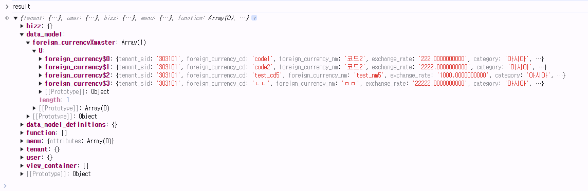

# Daily Retrospective  
**작성자**: [황주원]  
**작성일시**: [2025-01-22]  

## 1. 오늘 배운 내용 (필수)  
### 팝업을 띄우는 방법
- HandleRouteFeature: 팝업을 띄울 수 있는 feature
- 'IForeignCurrencyInputPage'을 구현한 곳인 `ForeignCurrencyInputPage`에서 param으로 넣은 설정 정보를 가져와 설정하고, 데이터를 처리합니다.

```typescript
const popup_handler = request.execution_context.getFeature<ui_handler.IHandleRouteFeature>(
	ui_handler.IHandleRouteFeature
);

popup_handler.openPopupAsync(
	{
		bizz_sid: request.execution_context.action.bizz_sid,
		identifier: IForeignCurrencyInputPage,
		action_mode: request.execution_context.action.action_mode,
		param: {
			menu_type: EN_MENU_TYPE.Input,
			data_sid: request?.owner?.dmc?.getReferTypeBasedDataModelByIndex(
				request.owner.data_model_index ?? 0
			)?.['foreign_currency_cd'],
			action_mode: request.payload.action_mode,
		},
		reqData: {
			authority_type: EN_AUTHORITY_TYPE.Anonymous,
		},
	},
	{},
	receiveHandler(request)
);
```

### 버튼 숨김 처리
`_getTargetReferTypeByActionMode` 메서드에서 해당 action_mode에서 숨김 처리할 값들을 지정한 후, 
```typescript
private static _getTargetReferTypeByActionMode(action_mode: EN_ACTION_MODE): string[] {
	switch (action_mode) {
		case EN_ACTION_MODE.GetCreate:
			return ['modify', 'delete', 'undelete', 'remove'];
		case EN_ACTION_MODE.GetModify:
			return ['save'];
	}
	return [];
}
```
`_buttonFilterByReferType` 메서드에서 삭제할 버튼에 push 해주고 있습니다. 
```typescript
setup.data_model_definitions[target].attributes?.push({
	attr_type: EN_ATTR_TYPE.Renderer,
	attr_id: renderer_attrs.display_state,
	prop_id: prop?.prop_id as string,
	data: false,
});
```


## 2. 동기에게 도움 받은 내용 (필수)
- 지은님께서 커피를 사주셨습니다. 감사합니다!
- 수경님, 연아님, 성철님께서 생활적으로 도움을 많이 주셨습니다. 감사합니다!
- 승준님께서 데이터모델에 대한 의문에 대해 알려주셨습니다. 감사합니다!
- 성철님과 수경님, 도형님과 함께 문제를 해결해 나갈 수 있었습니다. 감사합니다!

---

## 3. 개발 기술적으로 성장한 점 (선택)
### 2. 오늘 직면했던 문제 (개발 환경, 구현)와 해결 방법
#### 데이터 모델 > 0 번째 배열에 전부 저장되는 문제
지금까지는 단건 조회를 했기 때문에 data model 을 할 때 하나의 데이터 모델에 넣어줬었습니다. 

동일한 방식으로 List를 조회할 때 구현하여 발생한 문제였습니다. 


해결 방법으로는, 데이터모델에 테이블모델을 순회하면서 넣는 방식으로 구현할 수 있습니다.

```typescript
const data_model = [];
for (let i = 0; i < table_model.length; i++) {
	data_model[i] = Object.entries(table_model[i]).reduce((acc, [key, value]) => {
		acc[`foreign_currency$${key}`] = value;
		return acc;
	}, {} as any);
}
```

### 3. 위 두 주제 중 미처 해결 못한 과제. 앞으로 공부해볼 내용.
- feature 에 대해 이해가 없어서 언젠간 공부해야지 했던 부분을 알게 되었습니다. 저만의 언어로 정리되도록 더 공부할 예정입니다.
