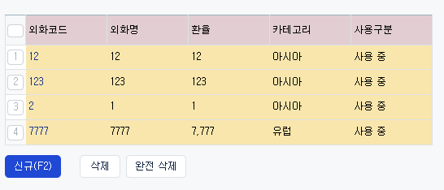
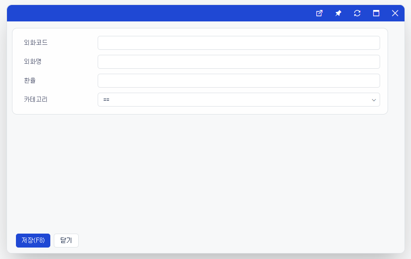
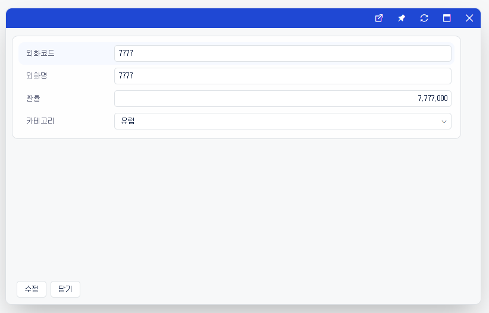

# Daily Retrospective

**작성자**: 고건호
**작성일시**: 2025-01-23

## 1. 오늘 배운 내용 (필수)

- 외화 코드 리스트 구조 복습
- 외화 코드 리스트 리팩토링

### 외화 코드 리스트 구조 복습

오늘 오전 시간에는 어제 구현했던 외화 코드 리스트 조회 기능을 다시 처음부터 복습하는 시간을 가졌습니다.

현재 제가 구현한 외화 코드 리스트 구조는 아래와 같습니다.

#### UI

- `foreign_currency_list.ui.tsx`
  - 경로: `04.ecount.application\VeloxApps\app.tutorials\src\browser\@test\@src.cases\foreign_currency\foreign_currency_list.ui.tsx`
  - 외화 코드 리스트의 UI입니다.
    해당 파일이 진입점이 되어 `F6`을 누르면 아래와 같은 화면이 띄워집니다.
    
    진입점이 리스트 화면이기 때문에 별도의 `UserAction`, `SetupProgram`, `DataModelProgram`은 존재하지 않습니다.
- `foreign_currency_input.tsx`
  - 경로: `04.ecount.application\VeloxApps\app.tutorials\src\browser\presentation\foreign_currency_input.tsx`
  - 외화 코드 `신규 조회`, `수정 조회` 시에 사용되는 UI입니다.
    `신규` 버튼을 클릭하면 아래와 같은 `신규 조회` 화면이 띄워지고,
    
    `외화 코드` 버튼을 클릭하면 아래와 같은 `수정 조회` 화면이 띄워집니다.
    

#### User Action

Browser Layer에서 사용자의 요청을 받아들이는 역할

- `OpenForeignCurrencyUserAction`
  - 경로: `04.ecount.application\VeloxApps\app.tutorials\src\browser\user_action\OpenForeignCurrencyUserAction.ts`
  - Browser Layer에서 동작하는 `UserAction`
    현재 코드: 하나의 `OpenForeignCurrencyUserAction`으로 `신규`와 `수정` 모두 처리
- `IOpenForeignCurrencyUserAction`
  - 경로: `03.ecount.usecase\ecount.usecase.tutorials\src\browser\@abstraction\user_action\IOpenForeignCurrencyUserAction.ts`
  - 현재 코드: `OpenForeignCurrencyUserAction`을 식별하는 데 사용되는 `UserActionIdentifier`로 선언

#### Setup API

화면을 그리는 데 필요한 구성 요소들을 불러오는 역할

- `GetForeignCurrencySetupProgram`
  - 경로: `03.ecount.usecase\ecount.usecase.tutorials\src\browser\program\GetForeignCurrencySetupProgram.ts`
  - 현재 코드: `execution_context.menu_type` 기반으로 분기 처리
    **(리팩토링 필요)**
- `GetForeignCurrencySetupAction`
  - 경로: `04.ecount.application\VeloxApps\app.tutorials\src\server\action\GetForeignCurrencySetupAction.ts`
  - 현재 코드: `data.menu_type` 기반으로 분기 처리
    **(리팩토링 필요)**
- `GetForeignCurrencyInputSetupProgram`
  - 경로: `03.ecount.usecase\ecount.usecase.tutorials\src\server\program\GetForeignCurrencyInputSetupProgram.ts`
  - 현재 코드: `dto.action_mode` 기반으로 반환 데이터 분기 처리
    **(리팩토링 필요)**

#### Data API

화면에 보여줘야 할 데이터들을 DB에서 조회해오는 역할

- `GetForeignCurrencyDataModelProgram`
  - 경로: `03.ecount.usecase\ecount.usecase.tutorials\src\browser\program\GetForeignCurrencyDataModelProgram.ts`
  - 현재 코드: `menu_type`을 기반으로 분기 처리 후, `data_sid`의 데이터 존재 여부로 `action_mode`에 `수정`(`GetModify`), `신규`(`GetCreate`) 할당
    **(리팩토링 필요)**
- `GetForeignCurrencyDataAction`
  - 경로: `04.ecount.application\VeloxApps\app.tutorials\src\server\action\GetForeignCurrencyDataAction.ts`
  - 현재 코드: `data.menu_type` 기반으로 분기 처리
    **(리팩토링 필요)**
- `GetForeignCurrencyInputDataProgram`
  - 경로: `03.ecount.usecase\ecount.usecase.tutorials\src\server\program\GetForeignCurrencyInputDataProgram.ts`
  - 현재 코드: `execution_context.action.action_mode` 기반으로 분기 처리
    **(리팩토링 필요)**

### 외화 코드 리스트 리팩토링

현재 코드에 중복 부분도 많고, 분기 처리가 원활하게 이루어지지 않아 전체적인 코드에 리팩토링이 필요하다고 느꼈습니다.

리팩토링 순서는 아래와 같이 정했습니다.

1. 불필요한 코드 제거
2. 분기 처리 로직 확립
3. `payload` 기반 로직 추가
4. `DTO` 재구성

#### 1. 불필요한 코드 제거

현재 외화 코드 기능 정상 동작에는 필요 없는 코드들이 상당히 많이 있습니다.

우선 동작 여부를 확인하기 위해 대부분의 코드를 주석 처리하고 개발을 진행했는데, 해당 부분부터 정리해야 할 것 같다고 생각했습니다.

- 제거 대상:
  - V3 -> V5 컨버팅 로직
  - `import`된 모듈 중 사용되지 않는 모듈

> 불필요한 코드 제거는 따로 추가 기록을 남기진 않겠습니다.

#### 2. 분기 처리 로직 확립

현재 모듈들 간에 분기 처리 로직이 하나로 통일되어있지 않아 흐름을 이해하기가 어려운 부분이 있다고 느꼈습니다.

특히나 제가 구현한 코드 같은 경우에는 `Dac`을 제외하고는 거의 기존의 코드를 재사용하고 내부에서 분기 처리를 해주고 있기 때문에 더욱 분기 처리 로직을 확립하는 것이 중요하다고 느꼈습니다.

현재 분기 처리가 필요한 부분은 다음과 같습니다.

- **Setup API**

  - `GetForeignCurrencySetupProgram`
  - `GetForeignCurrencySetupAction`
  - `GetForeignCurrencyInputSetupProgram`

- **Data API**

  - `GetForeignCurrencyDataModelProgram`
  - `GetForeignCurrencyDataAction`
  - `GetForeignCurrencyInputDataProgram`

분기 처리는 대부분 `menu_type` 또는 `action_mode`를 기준으로 처리하고 있습니다.

현재 작성된 코드는 특별한 기준 없이 `menu_type`과 `action_mode`를 선정하여 로직을 실행시키는데, 저는 해당 부분을 합리적이고 이치에 맞게 리팩토링 하고 싶었습니다.

##### `GetForeignCurrencySetupProgram` 리팩토링

현재 `GetForeignCurrencySetupProgram`에서 최초 `_init()` 함수가 실행되기 전 `request`에는 로직 실행 흐름 상 필수적으로 필요한 값이 할당되어 있지 않은 상태입니다.

이후 `_init()` 함수가 실행되면서 파라미터로 `request`를 받습니다.

해당 함수 내부에서 아래와 같이 `execution_context`가 가지고 있는 프로퍼티들 중, `routeConfig`의 `pageRouteOptions`에서 `param`을 꺼내서 구조 분해 할당을 해줍니다.

```typescript
// GetForeignCurrencySetupProgram
...

const { data_sid } = this.execution_context.routeConfig.pageRouteOptions?.param || {};

...
```

> 해당 작업을 통해 로직 내에서 필수적으로 확인하고 관리해야 하는 값을 뽑아내는 것으로 이해했습니다. 예를 들어 현재 로직에서는 `data_sid`에 담긴 값을 통해 `menu_type`이 `input`으로 들어왔을 때의 분기 처리를 해주고 있습니다.

`GetForeignCurrencySetupProgram`에서는 분기 처리가 `menu_type`을 통해 이뤄진 뒤, `execution_context`의 `action_mode`에 값을 할당해주고 있기 때문에 로직은 건드릴 필요가 없었고, 구조 분해 할당 시 불필요하게 할당 받은 데이터 부분만 제거해줬습니다.

```typescript
// GetForeignCurrencySetupProgram 리팩토링 후

import { EN_ACTION_MODE, EN_MENU_TYPE } from "ecount.fundamental.define/enum";
import { IArrayDataModelMapper, IDataModelMapper, ISetup } from "ecount.infra.base/setup";
import { system } from "ecount.infra.bridge/feature";
import { program_impl } from "ecount.infra.common/decorator";
import { BaseProgram } from "ecount.infra.common/program";
import { LoadSetupProgramRequestDto } from "ecount.usecase.common/@abstraction";
import {
  GetForeignCurrencySetupRequestDto,
  GetForeignCurrencySetupResultDto,
  IGetForeignCurrencySetupAction,
  IGetForeignCurrencySetupProgram,
} from "ecount.usecase.tutorials/@abstraction";

@program_impl(IGetForeignCurrencySetupProgram)
export class GetForeignCurrencySetupProgram
  extends BaseProgram<LoadSetupProgramRequestDto, ISetup>
  implements IGetForeignCurrencySetupProgram
{
  protected async onExecuteAsync(request: LoadSetupProgramRequestDto): Promise<ISetup> {
    const { bizz_sid, menu_type, action_mode } = this._init(request);
    const { param } = this.execution_context.routeConfig.pageRouteOptions;

    const httpFeature = this.execution_context.getFeature<system.IHttpRequestFeature>(system.IHttpRequestFeature);
    const { result } = await httpFeature.sendAsync<GetForeignCurrencySetupRequestDto, GetForeignCurrencySetupResultDto>(
      IGetForeignCurrencySetupAction,
      {
        data: {
          bizz_sid: bizz_sid,
          action_mode,
          menu_type,
        },
      }
    );

    if (param?.menu_attributes) {
      result.menu.attributes.push(...param.menu_attributes);
    }

    return {
      menu: result.menu,
      data_model: result.data_model as IDataModelMapper | IArrayDataModelMapper,
      data_model_definitions: result.data_model_definitions,
      view_container: result.view_container,
      tenant: result.tenant,
      user: result.user,
      bizz: result.bizz,
      function: [],
    };
  }

  private _init(request: LoadSetupProgramRequestDto) {
    const { data_sid } = this.execution_context.routeConfig.pageRouteOptions?.param || {};

    let default_action_mode;
    switch (this.execution_context.action.menu_type) {
      case EN_MENU_TYPE.List:
        default_action_mode = EN_ACTION_MODE.Get;
        break;
      case EN_MENU_TYPE.Input:
        if (data_sid) {
          default_action_mode = EN_ACTION_MODE.GetModify;
        } else {
          default_action_mode = EN_ACTION_MODE.GetCreate;
        }
        break;
    }

    this.execution_context.action.action_mode = default_action_mode;

    return {
      bizz_sid: "TB_000000E040114",
      menu_type: this.execution_context.action.menu_type,
      action_mode: this.execution_context.action.action_mode,
    };
  }
}
```

##### `GetForeignCurrencySetupAction` 리팩토링

현재 작성한 코드에서는 리스트 조회 시의 `menu_type`인 `list`와 신규 조회, 수정 조회 시의 `menu_type`인 `input`만 필요하므로, `GetForeignCurrencySetupRequestDto`에 담긴 값 중, `menu_type`만 사용하여 분기 처리를 해주고 있습니다.

`GetForeignCurrencySetupProgram`과 마찬가지로 분기 처리 관련 리팩토링은 따로 하지 않았고, 사용되지 않는 코드만 제거해줬습니다.

```typescript
// GetForeignCurrencySetupAction 리팩토링 후

import { ApiActionBase } from "ecount.application.common/action";
import { EN_MENU_TYPE } from "ecount.fundamental.define/enum";
import { IExecutionContext } from "ecount.infra.bridge/base";
import { ProgramBuilder } from "ecount.infra.common/program";
import {
  GetForeignCurrencySetupRequestDto,
  GetForeignCurrencySetupResultDto,
  IGetForeignCurrencyInputSetupProgram,
  IGetForeignCurrencySetupAction,
} from "ecount.usecase.tutorials/@abstraction";

// @_authorize({ authority_type: EN_AUTHORITY_TYPE.Access } as AuthorityDataDto)
// @action_response_cache(get_foreign_currency_setup_action)
export default class GetForeignCurrencySetupAction
  extends ApiActionBase<GetForeignCurrencySetupRequestDto, GetForeignCurrencySetupResultDto>
  implements IGetForeignCurrencySetupAction
{
  executeSync(
    execution_context: IExecutionContext,
    data: GetForeignCurrencySetupRequestDto
  ): GetForeignCurrencySetupResultDto {
    let result = {} as GetForeignCurrencySetupResultDto;

    switch (data.menu_type) {
      case EN_MENU_TYPE.Input: {
        const program = ProgramBuilder.create<GetForeignCurrencySetupRequestDto, GetForeignCurrencySetupResultDto>(
          IGetForeignCurrencyInputSetupProgram,
          execution_context
        );
        result = program.execute(data);
        break;
      }
      case EN_MENU_TYPE.Popup:
      case EN_MENU_TYPE.List: {
        const program = ProgramBuilder.create<GetForeignCurrencySetupRequestDto, GetForeignCurrencySetupResultDto>(
          IGetForeignCurrencyInputSetupProgram,
          execution_context
        );
        result = program.execute(data);
        break;
      }
      case EN_MENU_TYPE.Status:
      case EN_MENU_TYPE.OutstandingStatus:
      case EN_MENU_TYPE.PopupSearch:
      case EN_MENU_TYPE.ListSearch:
      case EN_MENU_TYPE.StatusSearch:
      case EN_MENU_TYPE.View:
      case EN_MENU_TYPE.Upload:
      default: {
        break;
      }
    }

    return result;
  }
}
```

> 어차피 `input`, `list` 모두 `GetForeignCurrencyInputSetupProgram`을 호출하므로 두 케이스를 묶을까 생각도 했지만, 일단은 switch-case문 내부에서 두 조건으로 분리하여 작성했습니다.

##### `GetForeignCurrencyInputSetupProgram` 리팩토링

`GetForeignCurrencyInputSetupProgram`이 호출된 후의 로직에서 `menu_type`은 더 이상 분기 처리를 위해 사용될 수 없습니다.

신규 조회와 수정 조회 모두 `menu_type`이 `input`이기 때문입니다.

따라서 `GetForeignCurrencyInputSetupProgram` 내부에서는 `GetForeignCurrencySetupRequestDto` 내부에 가지고 있던 프로퍼티인 `action_mode`로 분기 처리를 해줬습니다.

```typescript
// GetForeignCurrencyInputSetupProgram 리팩토링 후

import { EN_ACTION_MODE } from "ecount.fundamental.define/enum";

import { IExecutionContext } from "ecount.infra.bridge/base";
import { program_impl } from "ecount.infra.common/decorator";
import { BaseProgram } from "ecount.infra.common/program";
import {
  GetForeignCurrencySetupRequestDto,
  GetForeignCurrencySetupResultDto,
  IGetForeignCurrencyInputSetupProgram,
} from "ecount.usecase.tutorials/@abstraction";
import { setup } from "./foreign_currency_setup";
import { list_setup } from "./foreign_currency_setup_list";

@program_impl(IGetForeignCurrencyInputSetupProgram)
export class GetForeignCurrencyInputSetupProgram
  extends BaseProgram<GetForeignCurrencySetupRequestDto, GetForeignCurrencySetupResultDto>
  implements IGetForeignCurrencyInputSetupProgram
{
  constructor(execution_context: IExecutionContext) {
    super(execution_context);
  }

  protected onExecute(dto: GetForeignCurrencySetupRequestDto): GetForeignCurrencySetupResultDto {
    switch (dto.action_mode) {
      case EN_ACTION_MODE.GetCreate:
        return setup;
      case EN_ACTION_MODE.GetModify:
        return setup;
      case EN_ACTION_MODE.Get:
        return list_setup;
    }

    return setup;
  }
}
```

##### `GetForeignCurrencyDataModelProgram` 리팩토링

`GetForeignCurrencyDataModelProgram`에서도 `GetForeignCurrencySetupProgram`과 유사하게 `execution_context` 내부의 `menu_type`으로 switch-case문을 실행합니다.

만약 `menu_type`이 `input`으로 동일한 경우, `data_sid` 값의 할당 여부에 따라 `GetModify`와 `GetCreate` 중 하나를 `default_action_mode`에 할당합니다.

이후 `default_action_mode`를 `execution_context`의 `action_mode`에 할당하여 이후의 로직 흐름에서도 해당 `action_mode`를 유지할 수 있게 합니다.

```typescript
// GetForeignCurrencyDataModelProgram 리팩토링 후

import { EN_ACTION_MODE, EN_MENU_TYPE } from "ecount.fundamental.define/enum";
import { ISetup } from "ecount.infra.base/setup";
import { ITenantInfo, IUserInfo } from "ecount.infra.bridge/base";
import { system } from "ecount.infra.bridge/feature";
import { program_impl } from "ecount.infra.common/decorator";
import { BaseProgram } from "ecount.infra.common/program";
import { LoadDataModelProgramRequestDto } from "ecount.usecase.common/@abstraction";
import {
  GetForeignCurrencySetupRequestDto,
  GetForeignCurrencySetupResultDto,
  IGetForeignCurrencyDataAction,
  IGetForeignCurrencyDataModelProgram,
} from "ecount.usecase.tutorials/@abstraction";
import { ExceptionBuilder } from "ecount.infra.common/exception";
import { Exception, IException } from "ecount.fundamental.define/exception";

@program_impl(IGetForeignCurrencyDataModelProgram)
export class GetForeignCurrencyDataModelProgram
  extends BaseProgram<LoadDataModelProgramRequestDto, Partial<ISetup>>
  implements IGetForeignCurrencyDataModelProgram
{
  protected async onExecuteAsync(request: LoadDataModelProgramRequestDto): Promise<Partial<ISetup>> {
    const { bizz_sid, menu_type, action_mode, data_sid, tenant_sid } = this._init(request);

    // action_mode가 내려오지 않음
    const httpFeature = this.execution_context.getFeature<system.IHttpRequestFeature>(system.IHttpRequestFeature);
    const { result } = await httpFeature.sendAsync<GetForeignCurrencySetupRequestDto, GetForeignCurrencySetupResultDto>(
      IGetForeignCurrencyDataAction,
      {
        data: {
          data_sid: data_sid,
          bizz_sid: bizz_sid,
          action_mode: action_mode,
          menu_type: menu_type,
          tenant_sid: tenant_sid,
        },
      }
    );

    if (!_.isEmpty(result.error)) {
      Exception.throw(ExceptionBuilder.create(result.error?.name as string, result?.error as IException));
    }

    if (result.tenant_info) {
      this.execution_context.tenant = result.tenant_info as ITenantInfo;
    }
    if (result.user_info) {
      this.execution_context.user = result.user_info as IUserInfo;
    }
    return {
      menu: result.menu,
      data_model: result.data_model,
      data_model_definitions: result.data_model_definitions,
      view_container: result.view_container,
      tenant: result.tenant,
      user: result.user,
      bizz: result.bizz,
      function: [],
    };
  }

  private _init(request: LoadDataModelProgramRequestDto) {
    const { data_sid } = this.execution_context.routeConfig.pageRouteOptions?.param || {};

    let default_action_mode;
    switch (this.execution_context.action.menu_type) {
      case EN_MENU_TYPE.List:
        default_action_mode = EN_ACTION_MODE.Get;
        break;
      case EN_MENU_TYPE.Input:
        if (data_sid) {
          default_action_mode = EN_ACTION_MODE.GetModify;
        } else {
          default_action_mode = EN_ACTION_MODE.GetCreate;
        }
        break;
    }

    this.execution_context.action.action_mode = default_action_mode;

    return {
      bizz_sid: "TB_000000E040114",
      menu_type: this.execution_context.action.menu_type,
      action_mode: this.execution_context.action.action_mode,
      data_sid: data_sid,
      tenant_sid: this.execution_context.session.tenant_sid,
    };
  }
}
```

##### `GetForeignCurrencyDataAction` 리팩토링

`GetForeignCurrencyDataAction`에서도 `data`의 `menu_type`을 토대로 분기 처리를 진행해줬습니다.

```typescript
import { ApiActionBase } from "ecount.application.common/action";
import { EN_MENU_TYPE } from "ecount.fundamental.define/enum";
import { IExecutionContext } from "ecount.infra.bridge/base";
import { ProgramBuilder } from "ecount.infra.common/program";
import {
  GetForeignCurrencySetupRequestDto,
  GetForeignCurrencySetupResultDto,
  IGetForeignCurrencyDataAction,
  IGetForeignCurrencyInputDataProgram,
} from "ecount.usecase.tutorials/@abstraction";

// @_authorize({ authority_type: EN_AUTHORITY_TYPE.Access } as AuthorityDataDto)
export default class GetForeignCurrencyDataAction
  extends ApiActionBase<GetForeignCurrencySetupRequestDto, GetForeignCurrencySetupResultDto>
  implements IGetForeignCurrencyDataAction
{
  executeSync(
    execution_context: IExecutionContext,
    data: GetForeignCurrencySetupRequestDto
  ): GetForeignCurrencySetupResultDto {
    let result = {} as GetForeignCurrencySetupResultDto;

    switch (data.menu_type) {
      case EN_MENU_TYPE.List:
        {
          const program = ProgramBuilder.create<GetForeignCurrencySetupRequestDto, GetForeignCurrencySetupResultDto>(
            IGetForeignCurrencyInputDataProgram,
            execution_context
          );

          result = program.execute(data);
        }
        break;
      case EN_MENU_TYPE.Input:
        {
          const program = ProgramBuilder.create<GetForeignCurrencySetupRequestDto, GetForeignCurrencySetupResultDto>(
            IGetForeignCurrencyInputDataProgram,
            execution_context
          );

          result = program.execute(data);
        }
        break;
    }

    return result;
  }
}
```

## 2. 동기에게 도움 받은 내용

주현님, 연아님, 다은님, 지은님과 점심에 김밥에 라면을 먹으면서 이런 저런 대화를 나눴는데 굉장히 즐거운 시간이었습니다.

다들 많이 친해진게 느껴지는 순간이었습니다.

궁금했던 부분을 강민님과 함께 디버깅했는데 덕분에 식견이 넓어졌습니다.

---

## 3. 개발 기술적으로 성장한 점 (선택)

아래의 3가지 주제 중 하나를 선택하여 작성합니다.

### 1. 교육 과정 상 배운 내용이 아닌 개인적 호기심을 해결하기 위해 추가 공부한 내용

### 2. 오늘 직면했던 문제 (개발 환경, 구현)와 해결 방법

리팩토링 도중 기존에 `신규 조회` 후 저장 시 Data API만 사용하여 데이터만 새로이 받아오는 로직 흐름에 문제가 생겨 `execution_context`의 `action_mode`가 누락되는 상황이 발생했습니다.

`dto`에 담아 `action_mode`를 처리해보려 했지만, 합리적이지 않은 임시방편이었고, 고민 끝에 다시 해당 부분을 롤백하여 리팩토링을 진행했습니다.

### 3. 위 두 주제 중 미처 해결 못한 과제. 앞으로 공부해볼 내용.

오늘 리팩토링 항목으로 추가해놨던 `payload`를 이용하여 `신규 조회`와 `수정 조회`를 분기 처리하는 방법은 아직 적용하지 못했습니다.

내일 오전에 마무리해보겠습니다.
