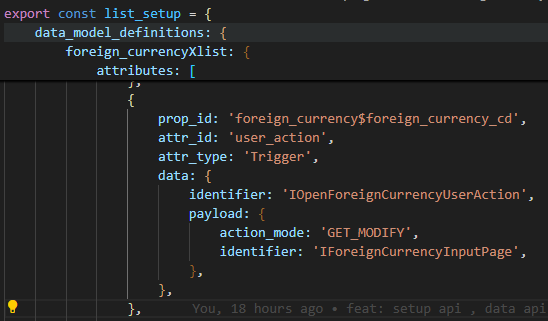
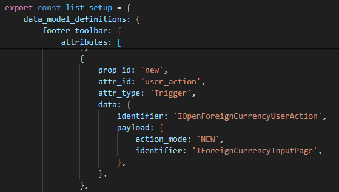

# Daily Retrospective

**작성자**: 나아연

**작성일시**: 2025-01-23

## 1. 오늘 배운 내용 (필수)

### UserAction Request

- owner - 해당 action을 dispatch한 컴포넌트의 기본 정보
- dm_manager - 해당 Page에서 생성되어 있는 dmc 관리 정보
- vmc - UI를 변경하거나 UI의 상태 정보를 읽을수 있는 모듈
- payload - UserAction을 disaptch한 컴포넌트에서 전달한 정보, 각 UserAction마다 정의

### popup - HandleRouteFeature

PageRouteOption - 주로 서버에 요청하기 위한 옵션 정보를 정의
PageLoadOption - 주로 팝업 페이지 로딩에 필요한 옵션 정보를 정의
receiver - 팝업 페이지에서 메시지를 반복적으로 받아야 할때 정의

reloadPageAsync 함수를 팝업에서 신규/수정 후 새로고침을 할 수 있지 않을까 생각했다.
결과적으로는 적용이 되지 않았고 해당 생각해보니 해당 reload는 팝업에서 reload 되겠구나 생각했다.

```ts
const feature = execution_context.getFeature<ui_handler.IHandleRouteFeature>(ui_handler.IHandleRouteFeature);
await feature.reloadPageAsync();
```

## 2. 동기에게 도움 받은 내용 (필수)

- 도형님께서 웨지감자를 주셨습니다.. 감사합니다!
- 성철님께서 연말정산을 도와주셨습니다 감사합니다!

## 3. 개발 기술적으로 성장한 점 (선택)

### 1. 교육 과정 상 배운 내용이 아닌 개인적 호기심을 해결하기 위해 추가 공부한 내용

기존에 OpenForeignCurrencyUserAction과 OpenModifyForeignCurrencyUserAction을 분리해서 사용했다. 두 파일은 로직이 동일하고 필요한 값만 달랐는데, 이를 해결하기 위해 필요한 값을 request에 담아 유동적으로 값을 넣어주고 로직을 실행하도록 변경했다.
request에서 identifier와 action_mode, menu_type을 찾아 실행하도록 했다. 이를 위해 직접 payload에 어떤 값을 넣을 지 지정해야 하는데,
이를 setup에서 수행했다. 수정의 경우에는 foreign_currencyXlist section 하위에 두었으며, 신규의 경우에는 footer_toolbar의 속성으로 두었다.





```ts
@action_impl(IOpenForeignCurrencyUserAction)
export class OpenForeignCurrencyUserAction {
  static executeAsync: IOpenForeignCurrencyUserAction = async (request) => {
    const popup_handler = request.execution_context.getFeature<ui_handler.IHandleRouteFeature>(
      ui_handler.IHandleRouteFeature
    );

    const { payload, execution_context } = request;

    popup_handler.openPopupAsync(
      {
        bizz_sid: request.execution_context.action.bizz_sid,
        identifier: payload.identifier,
        action_mode: payload.action_mode,
        param: {
          menu_type: execution_context.action.menu_type,
          data_sid: request?.owner?.dmc?.getReferTypeBasedDataModelByIndex(request.owner.data_model_index ?? 0)?.[
            "foreign_currency_cd"
          ],
        },
        reqData: {
          authority_type: EN_AUTHORITY_TYPE.Anonymous,
        },
      },
      {}
    );
  };
}
```

### 3. 위 두 주제 중 미처 해결 못한 과제. 앞으로 공부해볼 내용.

- OpenForeignCurrencyUserAction을 작성하면서 bizz_sid가 넘어오지 않는 것을 확인했다.
- 어디서 넘겨주는 지 아직 확인하지 못했다.
- 그런데 이미 클래스명이 XXXForeignCurrencyXXX인데 하드코딩을 지양해야하느냐 라고 질문이 들어온다면 제대로 답변하지 못할 것 같다.
