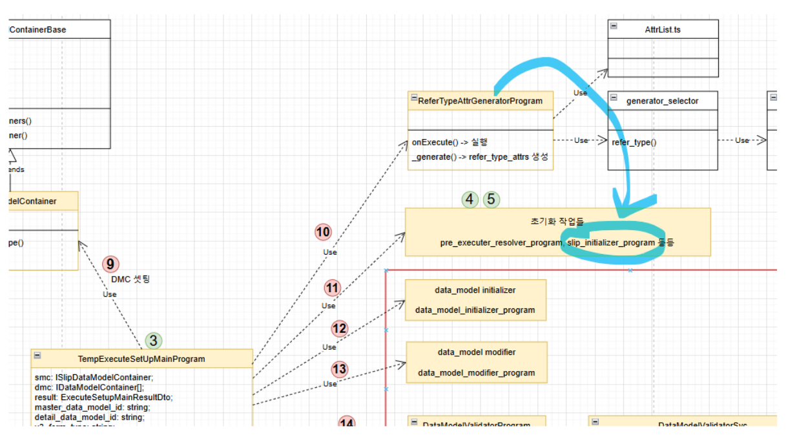

# Daily Retrospective

**작성자**: [박주현]  
**작성일시**: [2025-01-23]

# 1. 오늘 배운 내용

## 1️⃣ 저장이나 수정 행위를 했을 때 데이터를 새로 받는 selectList 행위 기능을 만들었습니다.

사용자가 저장 버튼을 누르면 원본 조회 리스트 화면을 새로운 데이터가 들어있는 새로운 화면으로 재 랜더링 해줘야합니다. 이는 화면 데이터를 바꾸는 행위입니다.
화면을 띄울때 지금 이카운트에선 화면 양식 정보인 setup api 와 채워 넣을 데이터 data api 을 요청하게 됩니다. 여기서 데이터를 하나 추가했을 때 화면을 재구성한다면, 이는 양식 정보는 바뀐 것이 없고, 데이터 정보들만 바뀌었기에 data api 만을 다시 호출하는 게 이치에 맞을 겁니다.

5.0 에서도 `SelectList{ForeignCurrency}UserAction` 통해 사용자의 행위에 대한 데이터 리뉴얼을 할 수 있게 했습니다.
`SelectListForeignCurrencyUserAction` 을 통해 저장이나 수정행위가 성공이면 data api를 다시 호출해 리스트 조회 하면의 데이터 뭉치를 새롭게 호출해서 응답으로 받은 데이터 뭉치로 바꿔주게됩니다. 이로인해 사용자는 새로 저장한 데이터를 즉시 화면에서 볼 수 있게 됩니다. 화면 양식은 바뀌지 않았기에 setup api 는 호출하지 않습니다.


보라색 순서를 살펴보겠습니다.
먼저 1번과정을 통해 list 조회 page를 렌더링하게 됩니다. 사용자가 `신규` 버튼을 눌렀습니다. 그러면 2번이 동작되게 됩니다. `OpenForeignCurrencyUserAction` 을 통해 입력화면을 호출하기 위해 3번 과정이 일어납니다. 그리고 입력화면을 렌더링하기 위해 4번 동작이 일어납니다.
그 후 데이터를 넣고, 저장을 누릅니다. 저장을 누르면 5번 과정이 동작하며 `CreateForeignCurrencyUserAction`이 호출됩니다. 서버에 가서 DB에 도착해 데이터를 영구적으로 DB에 반영합니다. 이로인한 반환값은 타고타고 넘어와서 결국 `OpenForeignCurrencyUserAction` 까지 오게 됩니다.

`OpenForeignCurrencyUserAction` 의 receiveHandler 를 통해 행위에 대한 백그라운드 변경 행위가 일어납니다.그 과정이 6번이고, 코드로는 아래와 같습니다.

```ts
const receiveHandler = (
  request: IBaseUserActionRequest<IOpenForeignCurrencyUserActionRequestDto>
) => {
  return async (result: any) => {
    if (result.message.redraw) {
      await request.userActionExecutor.onDispatchActionAsync<any, void>(
        ISelectListForeignCurrencyUserAction
      );
    }
  };
};
```

`SelectListForeignCurrencyUserAction`은 바로 GetForeignCurrencyDataAction 을 호출하게 되어, 새롭게 데이터가 추가된 데이터 리스트를 반환 받게 됩니다.

```ts
@action_impl(ISelectListForeignCurrencyUserAction)
export class SelectListForeignCurrencyUserAction {
  static executeAsync: ISelectListForeignCurrencyUserAction = async (
    request
  ) => {
    const { execution_context, dm_manager, vmc } = request;
    const httpFeature =
      execution_context.getFeature<system.IHttpRequestFeature>(
        system.IHttpRequestFeature
      );
    const { result } = await httpFeature.sendAsync<
      GetForeignCurrencySetupRequestDto,
      GetForeignCurrencySetupResultDto
    >(IGetForeignCurrencyDataAction, {
      data: {
        bizz_sid: "TB_000000E040114",
        menu_type: execution_context.action.menu_type,
        action_mode: EN_ACTION_MODE.Get,
      },
    });

    const dmc = dm_manager.getDataModelContainer("foreign_currencyXlist");

    vmc.updateDataAsync({
      data_model: result.data_model ?? [],
      data_model_definition: { [dmc.data_model_id]: dmc.getDefinition() },
    });
    return;
  };
}
```

그 후 `updateDataAsync()` 통해 데이터를 리뉴얼하게 됩니다.

---

# 2. 동기에게 도움 받은 내용

성철님이 연말정산하는 법을 알려주셨습니다. 민준님과 어제 있던 제네릭 관련 이야기를 나눴습니다. 서로 맞는 이야기 였지만, 대상이 다르기에 틀린 얘기로 받아들인 문제였습니다. 승준님과 응답을 보내줄때 json 파싱 양식에 대한 이야기를 나눠서 도움을 받았습니다. 연아님이 차를 사주셔서 목보호를 할 수 있었습니다.

---

# 3. 개발 기술적으로 성장한 점

## 3-2. 오늘 직면했던 문제 (개발 환경, 구현)와 해결 방법

### (1번) ReferTypeAttrGeneratorProgram의 호출 순서

### 질문

팀장님 안녕하십니까? 엄지희 선임님의 지식 공유 게시글 을 보며 공부하다가 궁금한게 있어 여쭤보려고 합니다. 저희는 속성 제너레이터 과정을 TempExecuteSetupMainProgram에서 pre_executer resolver 실행하기 전 refer_type_attr_program 직접적으로 프로그램을 생성해서 속성을 generate 했는데, 엄지희 선임님이 정리한 그림을 보면 InitializeSlipDataModelProgram 내부에서 해당 프로그램을 호출해 작업하는 것으로 보입니다. 이는 ExecuteSetupMainProgram 내부에 있는 프로그램입니다. 엄지희 선임의 그림처럼 ExecuteSetupMainProgram 의 InitializeSlipDataModelProgram 에서 속성 generate 과정이 일어나는게 맞을까요? 아니면 조금 변화가 있어, 현재는 다르게 구현돼 있을까요?

### 답변

generator의 종류가 여러개가 있는데, definition attribute는 저단계에서 일어나는게 맞습니다. 지희님이 정리해준내용이 맞아요. invetory_attr_map에 명세한 속성들을 smc로 추가되는 이유가 저시점에 definition attr generator를 실행해서 그런거에요. 잘 보셨습니다. 팀원들한테 공유해줘도 좋을만한 내용이에요. 공유해주세요.



위 그림처럼 저희는 TempExecuteSetupMainProgram에서 직접 ReferTypeAttrGeneratorProgram 호출해 속성 정보를 동적으로 추가해줬습니다. 하지만 실제 ExecuteSetupMainProgram에서는 다르게 동작합니다.


위는 엄지희 선임님의 도식화로 ExecuteSetupMainProgram 에서 InitializeSlipDataModelProgram 내에서 속성
generate 과정이 일어나고 있습니다. generator 와 validator 차이를 경험하기 위해 직접 호출하면서 디버깅해보기 위한 과정으로 생기는 차이였습니다.

### (2번) loadset 이 초기화 되는 소스를 보며 execution_context로 초기화 되는 부분을 공부

loadset 은 setup 정보를 부르기 위한 중요한 컴포넌트 입니다. 파일로 작성된 setup 정보와 db에 저장된 setup 정보를 조회에 하나의 setup 정보를 merge 한 후 브라우저에 응답을 보내게 됩니다. 이는 `erp_app.tsx` 파일에서 일어나는 과정으로 어제 공부를 했습니다.
오늘 아침 더 공부하기 위해 소스 보다가 아래 메소드 호출을 발견했습니다.

```ts
configurations.addNavigationPolicy(navigation_policy.CreateContext);
```

이 메소드가 execution_context를 초기화 해주는 메소드로 유추해보았습니다. 실제로 페이지에서 브라우저의 프로그램으로 menu_type 을 호출하지도 않았는데, execution_context에서 꺼내올 수가 있었습니다. input page 에선 input menu_type이 list page 에선 list menu_type 이 알아서 꺼내졌습니다.
아래 로직과 같습니다.

```ts
const menu_type = this.execution_context.action.menu_type;
```

CreateContext() 함수를 들여다 보니 위 행위가 가능한 이유를 유추해볼 수 있었습니다.

```ts
const page_name = _.toString(
  request.pageRouteOptions.action_identifier ??
    request.pageRouteOptions.identifier ??
    request.pageRouteOptions.viewName
);

request.page_name = page_name;
const uuid = request.pageRouteOptions.requestKey || _.uniqueId(`${page_name}_`);

$ECount.logger.info("Create execution context", uuid);

const factory = await application.configurations.getContextFactory();
const http_client = application.context.execution_context.getFeature(
  system.IHttpRequestFeature
) as system.IHttpRequestFeature;

const createOptions = _.merge(
  {},
  application.context.create_execution_context_options,
  {
    uuid,
    routeConfig: {
      pageLoadOptions: request.pageLoadOptions ?? {},
      pageRouteOptions: request.pageRouteOptions,
      param_once: request.param_once,
    },
    versionMap: request.pageRouteOptions.versionMap,
    resourceVersionMap: request.pageRouteOptions.resourceVersionMap,
    dependencyVersionMap: request.pageRouteOptions.dependencyVersionMap,
  }
) as ICreateExecutionContextOptions;
```

```ts
request.execution_context = context;
const bizz_sid =
  context.action.bizz_sid != ""
    ? context.action.bizz_sid
    : context.routeConfig.pageRouteOptions?.param?.bizz_sid;
const menu_type =
  context.action.bizz_sid != "" && context.action.menu_type
    ? context.action.menu_type
    : context.routeConfig.pageRouteOptions?.param?.menu_type;
```

위 로직에서 보는 것과 같이 page의 이름을 가공해 menu를 알아내고 여러 과정을 거친 후 context의 action의 menu_type 에 할당해주고 있습니다.

이를 통해서 넣어주지도 않은 menu_type을 꺼내다 쓸 수 있음을 배웠습니다.

---

# 4. 소프트 스킬면에서 성장한 점

점점 5.0에 대해 이해하는 바가 높아지면서 많은 분께 도움을 줄 수 있는 모습으로 성장한 것 같습니다.
