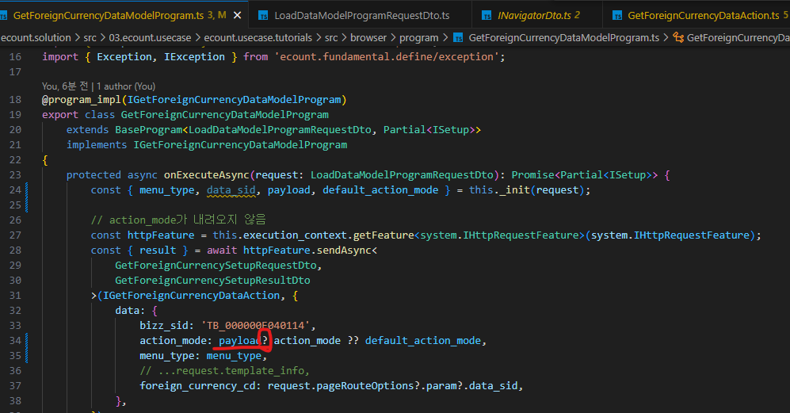

# Daily Retrospective

**작성자**: [설다은]  
**작성일시**: [2025-01-23]

## 1. 오늘 배운 내용 (필수)

1. 신규입력, 수정조회 팝업에서 저장 or 수정 클릭 시 데이터가 저장되면서 리스트 화면이 리로드 되는 로직 구현하기

2. 전체적인 흐름 정리

## 2. 동기에게 도움 받은 내용 (필수)

**지은님, 연아님, 주원님** 
오늘 구현하는 부분에서 막히는 지점이 있었는데 같이 해결해주셨습니다. 

**승준님** 
gitlab에서 원하는 정보의 디렉토리를 찾아주셨습니다. 

## 3. 개발 기술적으로 성장한 점 (선택)

### 1. 교육 과정 상 배운 내용이 아닌 개인적 호기심을 해결하기 위해 추가 공부한 내용

### 2. 오늘 직면했던 문제 (개발 환경, 구현)와 해결 방법

기존에 구현 시 OpenCreateUserAction과 OpenModifyUserAction을 각각 만들었었습니다. 
오늘은 이것을 하나의 OpenUserAction으로 만들고 action_mode로 분기처리를 하는 로직으로 수정했습니다. 
최초 구현 시, 클릭 했을 때 리스트가 나와서 당황했었는데, 승준님의 도움으로 힌트를 얻고, Menu_type을 INPUT으로 고정하니 해결되었습니다. 
만약 해당 로직이 다른 메뉴타입에서 쓸 일이 없다면 고정해도 되지만, 추후 해당 로직으로 다른 작업이 필요하다면 유동적이 값이 들어오도록 수정이 필요해보입니다. 
 

 

undifine일 떄 defalut_action_mode로 넘어가야하는데 자꾸 action_mode가 없다는 에러가 떳습니다. 
알고보니 payload에 `?`가 빠져서 발생하는 것이었습니다. 
어제도 이와 비슷한 오류를 발견한 적이 있는데, 다시한번 TS문법을 공부해야할 것 같습니다...

### 3. 위 두 주제 중 미처 해결 못한 과제. 앞으로 공부해볼 내용.

디버깅 스킬이 점점 늘고 있다고 생각했는데 오늘 디버깅 포인트를 어디로 찍을지 고민하는데 시간이 좀 걸렸습니다.  많이하면 실력이 늘어날 것이라고 하니까 계속 정진해야겠습니다.
