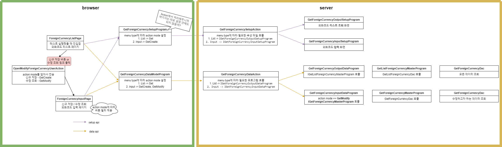
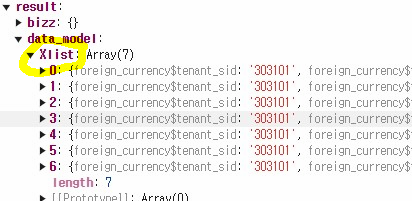

# Daily Retrospective  
**작성자**: [이연아]  
**작성일시**: [2025-01-23]  

## 1. 오늘 배운 내용 (필수)  
### 리스트 조회 화면 구현


1. setup api, data api (화면 그리기)

2. 신규버튼 클릭후 신규 저장
3. 외화코드/외화명 링크 클릭후 수정 저장
- `OpenModifyForeignCurrencyUserAction.ts`
    - 신규 저장, 수정 조회 버튼 클릭 했을 때 입력화면을 띄어주기 위한 useraction 작성

4. 신규, 수정 화면 별 버튼 필터 적용
- `ForeignCurrencyInputPage` - 입력 페이지에서 속성에 따라 버튼을 필터링
```typescript
private static _getTargetReferTypeByActionMode(action_mode: EN_ACTION_MODE): string[] {
    switch (action_mode) {
        case EN_ACTION_MODE.GetCreate:
            return ['modify', 'delete', 'undelete', 'remove'];
        case EN_ACTION_MODE.GetModify:
            return ['save'];
    }
    return [];
}
```

```typescript
if (_.vIsEmpty(attr)) {
				setup.data_model_definitions[target].attributes?.push({
					attr_type: EN_ATTR_TYPE.Renderer,
					attr_id: renderer_attrs.display_state,
					prop_id: prop?.prop_id as string,
					data: false,
				});
			}
```
- 해당 action mode 사용하지 않을 값들을 지정해서 display_state 속성을 false로 지정

## 2. 동기에게 도움 받은 내용 (필수)
- 외화코드 화면 구현하면서 주현님의 찰떡같은 설명으로 문제없이 해결할 수 있었습니다. 감사합니다!! 님혹천? (님 혹시 천사냐는 뜻)  
- 항상 아침 일찍 출근하시는 건호님에게 도움을 받을 수 있었습니다. 감사합니다!
- 수경님이 같이 문제를 봐주시면서 해결해주셨습니다. 감사합니다!

---

## 3. 개발 기술적으로 성장한 점 (선택)
### 1. 교육 과정 상 배운 내용이 아닌 개인적 호기심을 해결하기 위해 추가 공부한 내용
### 2. 오늘 직면했던 문제 (개발 환경, 구현)와 해결 방법
### 3. 위 두 주제 중 미처 해결 못한 과제. 앞으로 공부해볼 내용.


- `bizz_sid`가 없어서 업무를 못찾아서 발생한 문제로 직접 설정해줬더니 문제가 해결되었습니다. 어디서 어떤 데이터가 담겨져 오는지 디버깅을 통해 잘 찾아봐야할 것 같습니다. 
```typescript
@action_impl(ISelectListForeignCurrencyUserAction)
export class SelectListForeignCurrencyUserAction {
	static executeAsync: ISelectListForeignCurrencyUserAction = async (request) => {
		const { execution_context, dm_manager, vmc } = request;

		const { result } = await execution_context
			.getFeature<system.IHttpRequestFeature>(system.IHttpRequestFeature)
			.sendAsync<any, any>(IGetForeignCurrencyDataAction, {
				data: {
					bizz_sid: 'TB_000000E040114',
					menu_type: execution_context.action.menu_type,
					// action_mode: EN_ACTION_MODE.Get,
				},
			});

		const dmc = dm_manager.getDataModelContainer('foreign_currencyXlist');

		vmc.updateDataAsync({
			data_model: result.data_model,
			data_model_definition: { [dmc.data_model_id]: dmc.getDefinition() },
		});
		return;
	};
}
```
