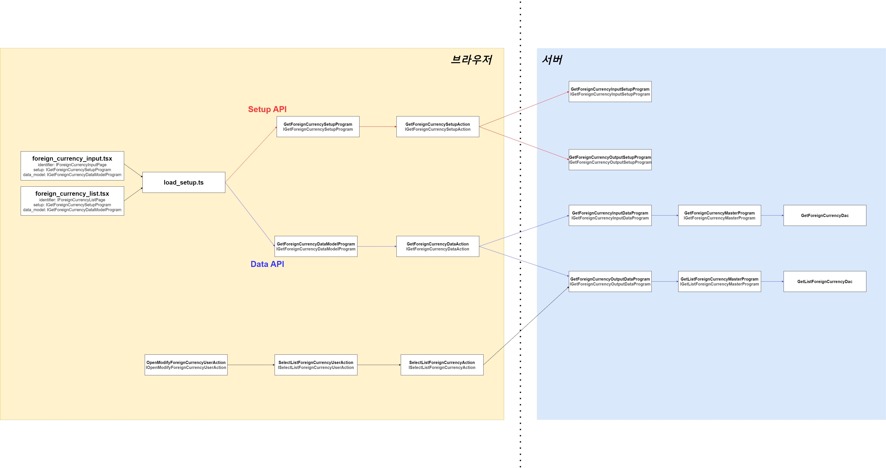

# Daily Retrospective

**작성자**: [이지은]  
**작성일시**: [2025-01-23]

## 1. 오늘 배운 내용 (필수)

### Setup, Data API 흐름 정리



### 실습

신규 저장, 수정저장시 화면 닫힘과 바닥화면 새로고침 구현하기

#### OpenForeignCurrencyUserAction

```ts
import { action_impl } from "ecount.infra.common/decorator";
import { IForeignCurrencyInputPage, IOpenForeignCurrencyUserAction, ISelectListForeignCurrencyUserAction } from "ecount.usecase.tutorials/@abstraction";
import { EN_AUTHORITY_TYPE, EN_MENU_TYPE } from "ecount.fundamental.define/enum";
import { ui_handler } from "ecount.infra.bridge/feature";
import { IBaseUserActionRequest } from "ecount.infra.bridge/user_action";

@action_impl(IOpenForeignCurrencyUserAction)
export class OpenForeignCurrencyUserAction {
	static executeAsync: IOpenForeignCurrencyUserAction = async (request) => {
		const popup_handler = request.execution_context.getFeature<ui_handler.IHandleRouteFeature>(ui_handler.IHandleRouteFeature);

		popup_handler.openPopupAsync(
			{
				bizz_sid: request.execution_context.action.bizz_sid,
				identifier: IForeignCurrencyInputPage,
				param: {
					menu_type: EN_MENU_TYPE.Input,
					data_sid: request?.owner?.dmc?.getReferTypeBasedDataModelByIndex(request.owner.data_model_index ?? 0)?.["foreign_currency_cd"],
					payload: request.payload,
				},
				reqData: {
					authority_type: EN_AUTHORITY_TYPE.Anonymous,
				},
			},
			{},
			receiveHandler(request)
		);
	};
}

const receiveHandler = (request: IBaseUserActionRequest<void>) => {
	return async (result: any) => {
		if (result.message.redraw) {
			await request.userActionExecutor.onDispatchActionAsync<any, void>(ISelectListForeignCurrencyUserAction);
		}
	};
};
```

-   receiveHandler를 추가하여 redraw하도록 한다.

#### SelectListForeignCurrencyUserAction

```ts
import { EN_ACTION_MODE } from "ecount.fundamental.define/enum";
import { system } from "ecount.infra.bridge/feature";
import { action_impl } from "ecount.infra.common/decorator";
import { ISelectListForeignCurrencyAction, ISelectListForeignCurrencyUserAction } from "ecount.usecase.tutorials/@abstraction";

@action_impl(ISelectListForeignCurrencyUserAction)
export class SelectListForeignCurrencyUserAction {
	static executeAsync: ISelectListForeignCurrencyUserAction = async (request) => {
		const { execution_context, dm_manager, vmc } = request;

		const { result } = await execution_context.getFeature<system.IHttpRequestFeature>(system.IHttpRequestFeature).sendAsync<any, any>(ISelectListForeignCurrencyAction, {
			data: {
				bizz_sid: "TB_000000E040114",
				menu_type: execution_context.action.menu_type,
				action_mode: EN_ACTION_MODE.Get,
			},
		});

		const dmc = dm_manager.getDataModelContainer("foreign_currencyXlist");

		vmc.updateDataAsync({
			data_model: result.data_model,
			data_model_definition: { [dmc.data_model_id]: dmc.getDefinition() },
		});
		return;
	};
}
```

-   SelectListForeignCurrencyAction을 호출한다.

#### SelectListForeignCurrencyAction

```ts
import { GetForeignCurrencySetupRequestDto, GetForeignCurrencySetupResultDto, ISelectListForeignCurrencyAction } from "ecount.usecase.tutorials/@abstraction";
import { ApiActionBase } from "ecount.application.common/action";
import { ActionDataBase } from "ecount.infra.base/abstraction";
import { IExecutionContext } from "ecount.infra.bridge/base";
import { ProgramBuilder } from "ecount.infra.common/program";
import { IGetForeignCurrencyOutputDataProgram } from "ecount.usecase.tutorials/@abstraction";

export default class SelectListForeignCurrencyAction
	extends ApiActionBase<ActionDataBase<GetForeignCurrencySetupRequestDto>, GetForeignCurrencySetupResultDto>
	implements ISelectListForeignCurrencyAction
{
	executeSync(context: IExecutionContext, request: ActionDataBase<GetForeignCurrencySetupRequestDto>): GetForeignCurrencySetupResultDto {
		let result = {} as GetForeignCurrencySetupResultDto;

		const program = ProgramBuilder.create<GetForeignCurrencySetupRequestDto, GetForeignCurrencySetupResultDto>(IGetForeignCurrencyOutputDataProgram, context);
		result = program.execute(request);

		return result;
	}
}
```

-   SelectListForeignCurrencyAction은 GetForeignCurrencyDataAction처럼 동작하며, 이를 호출하면 내부적으로 GetForeignCurrencyOutputDataProgram과 GetListForeignCurrencyMasterProgram, GetListForeignCurrencyDac을 순차적으로 실행하여 데이터를 가져온다.

#### CreateForeignCurrencyUserAction, ModifyForeignCurrencyUserAction

```ts
export class CreateForeignCurrencyUserAction {
static executeAsync: ICreateForeignCurrencyUserAction = async (request) => {

(.. 저장 http 통신이후 ...)

vmc.sendMessage({ redraw: true });
vmc.closePage();

return;
```

-   `vmc.closePage();` 추가하여 데이터를 삽입, 수정한 후 팝업 페이지가 닫기도록 한다.

#### GetForeignCurrencyDataModelProgram

```ts
import { EN_ACTION_MODE, EN_MENU_TYPE } from "ecount.fundamental.define/enum";
import { ISetup } from "ecount.infra.base/setup";
import { system } from "ecount.infra.bridge/feature";
import { program_impl } from "ecount.infra.common/decorator";
import { BaseProgram } from "ecount.infra.common/program";
import { LoadDataModelProgramRequestDto } from "ecount.usecase.common/@abstraction";
import { GetForeignCurrencySetupRequestDto, GetForeignCurrencySetupResultDto, IGetForeignCurrencyDataAction, IGetForeignCurrencyDataModelProgram } from "ecount.usecase.tutorials/@abstraction";

@program_impl(IGetForeignCurrencyDataModelProgram)
export class GetForeignCurrencyDataModelProgram extends BaseProgram<LoadDataModelProgramRequestDto, Partial<ISetup>> implements IGetForeignCurrencyDataModelProgram {
	protected async onExecuteAsync(request: LoadDataModelProgramRequestDto): Promise<Partial<ISetup>> {
		const { menu_type, data_sid, action_mode } = this._init(request);

		// action_mode가 내려오지 않음
		const httpFeature = this.execution_context.getFeature<system.IHttpRequestFeature>(system.IHttpRequestFeature);
		const { result } = await httpFeature.sendAsync<GetForeignCurrencySetupRequestDto, GetForeignCurrencySetupResultDto>(IGetForeignCurrencyDataAction, {
			data: {
				bizz_sid: "TB_000000E040114",
				menu_sid: "TM_000000E040114",
				action_mode: action_mode,
				foreign_currency_cd: data_sid,
				menu_type: menu_type,
			},
		});

		return result;
	}

	private _init(request: LoadDataModelProgramRequestDto) {
		const { menu_nm, data_sid, payload } = this.execution_context.routeConfig.pageRouteOptions?.param || {};

		let menu_type = request.menu_type;

		if (!menu_type) {
			menu_type = this.execution_context.action.menu_type;
		}

		let default_action_mode;
		switch (menu_type) {
			case EN_MENU_TYPE.List:
				default_action_mode = EN_ACTION_MODE.Get;
				break;
			case EN_MENU_TYPE.Input:
				if (payload.action_mode) default_action_mode = payload.action_mode;
				else default_action_mode = EN_ACTION_MODE.GetCreate;
				break;
		}

		this.execution_context.action.action_mode = default_action_mode;

		return {
			menu_type,
			data_sid,
			action_mode: this.execution_context.action.action_mode,
			menu_nm,
			payload,
		};
	}
}
```

-   payload에서 보내주는 action_mode에 따라 분기 처리한다.

## 2. 동기에게 도움 받은 내용 (필수)

-   **강민님**: 디버깅할 때 data_model_definition이 들어오지 않는 문제가 있었는데 세션 문제임을 찾아주셨습니다.
-   **민준님**: GetModify, GetCreate될 때 data_model이 들어오지 않는 이유에 대해 설명해주셨습니다.
-   **다은님**: 기안서 작성을 도와주셨습니다.

---

## 3. 개발 기술적으로 성장한 점 (선택)

### 2. 오늘 직면했던 문제 (개발 환경, 구현)와 해결 방법

1.  구조 리팩토링

    기존에는 OpenCreateForeignCurrencyUserAction과 OpenModifyForeignCurrencyUserAction으로 분리해서 사용했으나, 5.0 버전 방향성을 고려하여 OpenForeignCurrencyUserAction으로 공통화하는 리팩토링을 진행.

2.  버튼 동작 구현

    GetForeignCurrencyOutputSetupProgram에서 버튼 클릭 시 payload에 action_mode를 담아 전송.
    GetForeignCurrencyOutputDataProgram에서 이를 payload.action_mode로 받아 처리하는 코드 구현

3.  발생한 문제

    execution_context의 action_mode 값이 업데이트되지 않아 동작에 문제가 발생.
    이는 execution_context에 action_mode를 동기화하거나 반영하는 로직이 누락되었기 때문.

4.  해결 방안

    ```ts
    this.execution_context.action.action_mode = default_action_mode;
    ```

    execution_context의 action_mode 업데이트 로직 추가

### 3. 위 두 주제 중 미처 해결 못한 과제. 앞으로 공부해볼 내용.

1. execution_context 전달 과정에 대한 이해 부족
    - execution_context가 전달되는 과정에서 동작 원리를 제대로 이해하지 못해 문제가 발생.
    - 특히 load_setup을 통해 setup을 생성한 후, 이를 반환하지 않는 구조에서 문제가 잦음.
2. 데이터 전달 및 처리 과정에서 발생하는 문제
    - 데이터를 전달하거나 업데이트할 때, 값이 제대로 반영되지 않거나 누락되는 상황이 발생.
    - 브라우저에서 작동하는 코드에서 데이터를 받아오는 과정이 특히 어렵게 느껴짐.
3. 추후 학습 방향
    - execution_context가 어떤 방식으로 전달되고, 데이터가 업데이트되는지를 정확히 이해할 필요가 있음.
    - load_setup처럼 데이터를 생성하고 반환하지 않는 구조에서 이후 데이터를 넣는 과정의 설계를 더 깊이 공부해야 함.
