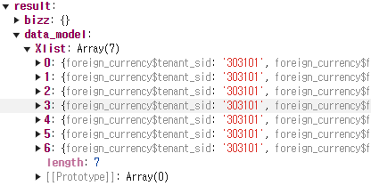

# Daily Retrospective

**작성자**: 허수경

**작성일시**: 2025-01-23(목)

## 1. 오늘 배운 내용 (필수)

- UserAction Request
- 신규/수정 후 그리드 다시 그리기

### UserAction Request

---

#### 1. UserAction이란

- **UserAction**은 **browser 환경에서 UI 이벤트를 처리**하고 서버와의 요청을 정의하는 역할을 합니다.
- `04.application(browser)`과 `03.usecase(browser)`의 **경계에 대한 명세**로, UI에서 발생하는 액션(버튼 클릭, 데이터 입력 등)을 독립적으로 관리합니다.

#### 2. UserAction Request

- browser 환경에서 데이터를 전달하기 위한 방법
- 페이지의 소스를 최소화 하여, 기능단위(`UserAction`)로 프로그램을 구현합니다.
- 페이지에서 데이터를 동적으로 전달하는 것이 아닌 `UserAction` 호출시 제공하는 파라미터 정보들로 부터 필요한 데이터를 가공합니다.
- `PayLoad`를 통한 정보 전달은 Setup정보 또는 컴포넌트를 통해서만 제공합니다.
- `UserAction`의 `Request`에는 해당 컴포넌트가 전달한 `payload` 정보 이외에 몇가지 정보들이 추가 전달 됩니다.

  - `owner` - 해당 action을 dispatch한 컴포넌트의 기본 정보
  - `dm_manager` - 해당 Page에서 생성되어 있는 dmc 관리 정보
  - `vmc` - UI를 변경하거나 UI의 상태 정보를 읽을수 있는 모듈
  - `payload` - UserAction을 disaptch한 컴포넌트에서 전달한 정보, 각 UserAction마다 정의 된다.

  

  ```ts
  export interface IBaseUserActionRequest<TPayload> {
    execution_context: IExecutionContext;
    vmc: Omit<IViewModelStateContainer, "usePageState">; //react hook 제공X
    dm_manager: IDMManager;
    owner: IOwnerInfo;
    payload: TPayload;
  }
  ```

#### request 상태 변경하기

1. UI 변경 > `PropState`

- `vmc.setPropState`를 통해 항목의 상태를 읽거나 변경할 수 있습니다.

```ts
const vmc = request.vmc;
vmc.setPropState<datatype_state.ITxtState>(dmc_id, prop_id, {
  display_name: "테스트",
  writable: false,
});
```

2. 값 변경 > `DMC`

- `DMC`는 데이터를 관리하는 객체로서 항목의 값을 읽고 쓸 때는 `DMC`를 이용해야 합니다.

```ts
const dmc = request.dmc_mapper[dmc_id];
dmc.setValueByPropId(prop_id, "340");
```

3. `VMC`

- UI 상태를 관리하는 `VMC`와 데이터를 관리하는 객체 `DMC`로 구분합니다.
- UI를 다루기위한 기본적인 API를 제공합니다 :

  ```ts
  setViewerStore(data_model_ids: string[], store): void;
  updateData(
    data_model: { [data_model_id: string]: any },
    data_model_definitions: { [data_model_id: string]: IDataModelDefinition }
  ): void;
  alert(options: IAlertOption): void;
  alertAsync(options: IAlertOption): Promise<void>;
  confirmAsync(options: IConfirmOption): Promise<boolean>;
  showPageProgress(): void;
  hidePageProgress(): void;
  ```

### 신규/수정 후 그리드 다시 그리기

---

#### 요구사항

- 팝업 창에서 데이터를 신규 저장 또는 수정 저장한 후 팝업을 닫고, 리스트 화면(바닥 화면)을 새로고침하는 기능을 구현하기.

---

#### 1. 팝업 닫기

- 팝업을 닫기 위해 UI를 관리하는 `VMC`를 활용합니다.
- `VMC`는 `closePage()`라는 함수를 제공하며, 이를 사용하여 화면 닫기를 처리합니다.

#### 2. 바닥(리스트) 화면 새로고침

2-1. **비즈니스 로직 완료 후 메시지 전송**

- `CreateForeignCurrencyUserAction`에서 비즈니스 로직이 완료되면, `vmc.sendMessage`를 통해 새로고침 요청 메시지를 전달합니다.

```ts
vmc.sendMessage({ redraw: true });
```

2-2. 메시지 수신 및 처리

- `OpenModifyForeignCurrencyUserAction` 에서 `receiveHandler` 함수가 메시지를 수신하여 새로고침 작업을 실행합니다.

```ts
const receiveHandler = (
  request: IBaseUserActionRequest<{ action_mode: EN_ACTION_MODE | undefined }>
) => {
  return async (result: any) => {
    if (result.message.redraw) {
      await request.userActionExecutor.onDispatchActionAsync<any, void>(
        ISelectListForeignCurrencyUserAction
      );
    }
  };
};
```

2-3) 리스트 화면 데이터 재조회

- `SelectListForeignCurrencyUserAction`에서 HTTP 통신을 통해 최신 데이터를 조회한 후, VMC에 데이터를 업데이트합니다.

```ts
//(http 통신을 통해, 최신정보 조회하는 로직)
vmc.updateDataAsync({
  data_model: result.data_model,
  data_model_definition: { [dmc.data_model_id]: dmc.getDefinition() },
});
```

---

## 2. 동기에게 도움 받은 내용 (필수)

- 건호님께서 비타민을 주셔서 활기찬 하루를 보낼 수 있었습니다.
- 엄지희 선임님께서 공유한 도식도에서 '6개월 뒤 미래전표 흐름도'의 의미가 궁금했는데, 다은님께서 자세히 설명해 주셨습니다.
- 주현님 덕분에 `ExecuteMainSetup`에서 `generator`가 실행되는 정확한 순서를 이해할 수 있었습니다. 흐름을 명확히 알게 되어 큰 도움이 되었습니다.
- 도형님께서 점심을 사주셔서 성철님, 주원님과 함께 맛있는 점심시간을 보낼 수 있었습니다.
- 아연님, 성철님, 민준님과 함께 `feature`에 대해 궁금증을 나누며 유익한 시간을 보냈습니다.
- 성철님께서 전표 올리는 법을 자세히 알려주셔 잘 처리할 수 있었습니다.

---

## 3. 개발 기술적으로 성장한 점 (선택)

### 1. 교육 과정 상 배운 내용이 아닌 개인적 호기심을 해결하기 위해 추가 공부한 내용

#### generator의 순서

- 실습을 할 때는 `ExecuteSetupMainProgram`대신 간략화된 `TempExecuteSetupMainProgram`를 사용했습니다. 저희는 여기서 generator를 실행할 때 `pre_executer_resolver`를 실행 하기 전에 `refer_type_attr_program`를 직접적으로 프로그램을 생성해서 진행했습니다. 하지만 엄지희 선임님이 공유해주신 자료를 보면 `ExecuteSeupMainProgram`의 `InitializeSlipDataModelProgram` 내부에서 해당 프로그램을 호출해 작업하는 것으로 보였습니다. 실습 했던 내용과는 다르다는 점을 알 수 있습니다. 그래서 주현님께서 성준팀장님께 여쭤본 답을 공유해주셨습니다.
- generator의 종류가 여러개 있는데

### 2. 오늘 직면했던 문제 (개발 환경, 구현)와 해결 방법

#### 문제

- 연아님과 함께 리스트 화면의 데이터를 재조회하던 중, 데이터 모델 이름이 올바르게 들어오지 않는 문제를 발견했습니다.
- 데이터 모델 이름은 `foreign_currencyXlist`로 전달되어야 하지만, 실제로는 `Xlist`로 들어와 렌더링되지 않는 현상이 발생했습니다.
- 해당 문제로 인해 리스트 화면이 올바르게 표시되지 않았습니다.

  

#### 원인

- 데이터를 디버깅해본 결과, `bizz_sid` 값이 `undefined` 상태인 것을 확인했습니다.
- `bizz_sid`가 비어있어 데이터 모델이 제대로 생성되지 않았고, 결과적으로 데이터 모델 명이 누락된 상태로 전달된 것이 문제의 원인이었습니다.

#### 해결 방법

- 테스트코드에서는 `bizz_sid` 값을 가져오지 못해 하드코딩 방식으로 `bizz_sid` 값을 직접 설정했습니다.
- 디버깅 도구를 통해 데이터가 어떤 흐름으로 전달되는지 파악할 수 있었고, 데이터가 올바르게 들어오는지 확인하는 좋은 기회가 되었습니다.
