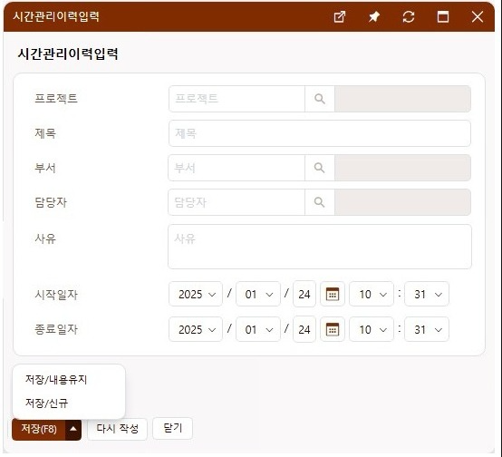
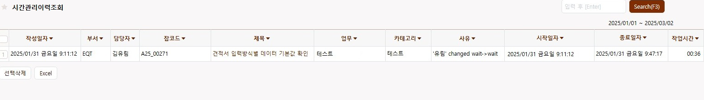
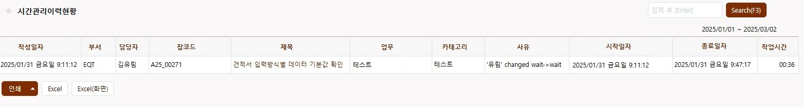
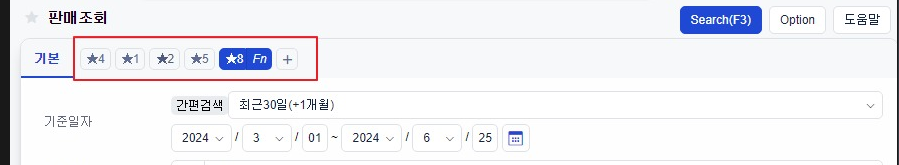

# Daily Retrospective

**작성자**: [김승준]  
**작성일시**: [2025-02-03]

## 1. 오늘 배운 내용 (필수)

- 이카운트에서 사용하고 5.0으로 개발할 일정관리에 대해 학습했습니다.
    - [시간관리](#시간-관리)
    - [시간관리이력](#시간관리-이력)

- 기능명세를 보며 맡은 업무를 이해하고자 했습니다.
    - [시간관리이력입력](#시간관리이력입력)
    - [시간관리이력조회](#시간관리이력조회)
    - [시간관리이력현황](#시간관리이력현황)


## 2. 동기에게 도움 받은 내용 (필수)

- 다은님 께서 비용처리, 근태관리에 대한 가이드를 올려주어 원활하게 진행할 수 있었습니다.
- 주현님께서 비용처리, 근태관리 결재 처리를 도와주었습니다.
- 민준님께서 `async`, `await`의 비동기를 `microtask queue`와 관련하여 설명해주셨습니다.

---

## 3. 개발 기술적으로 성장한 점 (선택)

아래의 3가지 주제 중 하나를 선택하여 작성합니다.

### 1. 교육 과정 상 배운 내용이 아닌 개인적 호기심을 해결하기 위해 추가 공부한 내용

- 민준님께서 [`async`, `await`](#async-await)의 비동기를 `microtask queue`와 관련하여 설명해주셨습니다.

### 2. 오늘 직면했던 문제 (개발 환경, 구현)와 해결 방법


### 3. 위 두 주제 중 미처 해결 못한 과제. 앞으로 공부해볼 내용.


# 학습내용
## 시간 관리
- 일정 만들고 진행, 완료하는 업무

- 신규버튼을 통해 생성.
    - 업무 : 게시글과 연결
    - 게시글 번호 : 특정 게시글 번호, 수기로 등록
        - 검색량이 많아서 지양
    - 잡(프로젝트)코드 : 회계1 - 프로젝트 등록. 에 있는 게시글 연결(여러명이 동일한 프로젝트 연결)
        - 잡 코드 하나에 여러개 일정생성(회의, 개발, ...)
    - 카테고리 : 일정의 분류(테스트, 개발, 회의 ... 등등)
    - 담당자 검색, 입력시 : 부서에 자동 입력 (관리- 사원등록 에서 불러옴)
    - 라벨 : 라벨링 편의기능
    - 쪽지 : 일정 만들었을 때 쪽지로 알림.
    - 기타, 메모, 제목 : 메모와 비슷함(개인 확인용)
    - 본문/댓글 : 위의 연결된 게시글에 답글로 내용이 들어감. 연결된 게시글이 없을 경우 본문 내용으로 게시글이 새로 만들어짐.

- 잡코드를 눌러서 수정가능
    - 담당자, 잡코드, 카테고리, 게시글 번호 등등 수정가능.
    - 본문 내용은 변경 불가.
    - 상태 : 재생버튼을 누르면 진행중으로 변경, 중단시 사유 입력창
        - 카테고리가 테스트일때 배포상태 변경시 기획, 개발팀도 자동 변경
            - 전체 배포(완료, 동기화), 수시배포(일부배포)
        - 폐기 : 일정 취소, 폐기사유 필수 입력해야함.
    - 시작 일자: 시작을 눌렀을때(상태가 시작으로 변경되었을때), 중단시 종료로 들어감.(시작일자,종료일자로 이루어진 데이터가 여러개.)
    - 종료예정 일자 : 언제 종료될것같다고 생각될때 직접 입력
    - 종료 일자 : 일정이 끝났을 때(개발완료, 완료, 폐기) 자동 
    - 비율 : 예정일자와 종료일자의 차이를 비율로 보여줌.
    - 배포일자 : 

- 우클릭 (편의기능) : 동일한 잡코드, 선택한 카테고리를 바로 연결해 줌. 
    - dev progress : 게시판 연결 (검색조건에 잡코드 연결)
    - 이력추가 : 


- 삭제 : 작업시간이 있으면 삭제불가.-> 상태가 폐기로 변경. 폐기사유 자동 입력.

- 조회 : 
    - 전체 잡 : 모든 일정 확인(검색)가능.
    - 내 잡 : 담당자가 본인, 상태가 예정, 중단, 개발완료, ... 인것만 / 완료건 보기 체크시 가능
    - 우리팀 : 담당자 ...
    - 내가 만든 : 최초 작성자가 본인
    - 부서별 : 부서별로 정렬
    - 잡 별 : 잡코드 기준 정렬
    - 테스트 : 카테고리가 테스트 or  TP(구버전)
    - 미배정 개발 : 카테고리 개발, 담당자 안정해짐.
    - 미배정 기획 : 카테고리 기획, 담당자 안정해짐.


- 기획, 개발, 설계 게시글 연결


## 시간관리 이력
- 일정을 만든 것들을 확인하는 업무

- 현황 : 
    - 내역 : 입력한 이력들을 기준으로 전체 확인가능
    - 집계 : 항목별 조건 집계확인가능. 담장자별, 부서별, 카테고리별, ...
        - 설정 저장 가능.(마이탭)
- 보고서 : 작업시간이 0이 아니거나, 우클릭 이력추가로 추가한 이력이 있는 일정만 보여줌.
- 보고서(일간간트, 시간간트,) : 일별, 시간별로 그래프,
    - 엑셀로 다운로드(그래프), 파란 엑셀(데이터 화)
    -  *이력추가로 추가한 일정은 표시안됨.* 확인후 공지


- 수정,삭제는 추가해서 개발 예정.

- 신규 잡 생성시 : 내 잡, 80000번 프로젝트(설계, 개발, ...), 현황(시작버튼 클릭시) 생성 (생명주기가 달라, 파생아님)
    - 기존 전표 이력은 파생, 시간관리 이력은 파생 안됨
- 조회, 현황은 같은 정보 but 현황에서는 집계 사용


## async await
### async await 동작방식
await가 실행되면 해당 코드가 비동기적으로 중단되고, 그 뒤에 오는 코드는 다시 콜스택에 들어갈 때까지 대기합니다. <br>
이로 인해 실행권한은 await가 포함된 함수의 상위 객체로 넘어가게 됩니다.

```js
async function asyncFunc() {
    console.log(1);
    const value = await innerFunc();
    console.log(value);
}

async function innerFunc() {
    console.log("innner 1");
    return 2;
}

console.log("start");
asyncFunc();
console.log("end");
```
위 코드의 출력(node기준)은 아래와 같습니다.
```sh
start
1
innner 1
end
2
```


위와 같이 출력되는 이유를 확인하겠습니다.<br>
1. console.log("start"): 첫 번째로 실행되어 "start"가 출력됩니다.

2. asyncFunc() 호출
    1. asyncFunc가 호출되면, 먼저 console.log(1)이 실행되어 "1"이 출력됩니다.
    2. 그 후 await innerFunc()가 실행됩니다. innerFunc 함수는 비동기 함수이므로, 실행이 끝난 후에 await가 microtask queue에 들어가게 됩니다.

3. innerFunc() 실행
    1. innerFunc가 호출되고 console.log("innner 1")이 실행되어 "innner 1"이 출력됩니다.
    2. innerFunc는 값 2를 반환하고, asyncFunc로 돌아가서 이 값은 await 구문을 통해 전달됩니다.
    3. await는 비동기 코드이므로, 현재 innerFunc의 실행이 끝난 후, 2는 마이크로태스크 큐에 들어가게 됩니다.
4. console.log("end"): console.log("end")는 asyncFunc()가 비동기적으로 실행되는 중간에 실행됩니다. 따라서 "end"가 먼저 출력됩니다.


# 기능 명세

## 시간관리이력입력

### 특이사항
- 업무권한을 적용받는다.  행위-수정권한은 DMO, 본부장, 부문장으로 권한있음으로 둔다. (그 외에는 수정 권한없음)


### 동작방법

입력화면으로 진입할 수 있는 경로가 다양하다. 

- 시간관리조회에서 전환버튼[4928]으로 중단 시 (신규)

- 시간관리의 진행상태를 일부값으로 변경 시  (신규)

- 시간관리조회에서 이력추가[4936]로 클릭 시 (신규)

- 시간관리이력조회에서 제목 클릭하여 진입 시 (수정)

이력추가[4936]를 통해 진입 했을 때 선택한 거래의 위젯 기본값을 넘겨받는다.

선택한 거래의 업무, 거래, 프로젝트, 제목, 부서, 담당자 값을 넘겨준다.

#### 위젯별 동작방법

|항목[기능명세]|타입|필수여부|편집가능여부|
|--|--|--|--|
|프로젝트[3075]|코드|Y|Y|
|제목[3100]|문자|Y|Y|
|부서[3145]|코드|N|Y|
|사유[4938]|문자|조건에따라 Y|Y|
|시작일자[4931]|코드|Y|신규 : N, 수정 : Y|
|종료일자[4932]|코드|Y|신규 : N, 수정 : Y|

#### 푸터


|||화면|
|--|--|--|
|푸터|	신규|	수정|
|저장(F8)[3117]|	O|	O|
|저장/내용유지[3319]	|O	|O|
|저장/신규[3318]|	O|	O|
|다시작성[2871]|	O|	O|
|닫기[3334]|	O	|O|
|삭제[3867]	|X	|O|

### 화면구성


#### 푸터
- 신규 : 저장(F8), 저장/신규, 저장/내용유지,  다시작성, 닫기를 제공한다.

- 수정 : 저장(F8), 저장/신규, 저장/내용유지, 이전, 닫기, 삭제를 제공한다.

### 유효성체크

업무권한에 따라 일반 아이디로 이력 수정화면에서 저장(F8) 클릭 시 저장처리되지 않고 권한체크한다.

저장 시 case에 따라 사유 위젯의 필수값을 체크한다.

1) 진행상태를 폐기로 변경한 경우

2) 배포대기, 개발완료, 수시배포완료, 완료(동기화), 폐기 진행상태인 거래를  진행중으로 변경한 경우

3) 시작일자를 변경하는 경우

4) 종료예정일자를 변경하는 경우

5) 배포일자를 변경하는 경우
---

## 시간관리이력조회

###  특이사항

- 양식 제공하지 않는다.

- 내 업무의 리스트탭, 진행상태 제공하지 않는다.

- 업무권한을 적용받는다.[2951]

- 인쇄 및 다운로드 제한 적용받는다.[2965]

### 화면구성


### 동작방법


|header|grid|footer|
|--|--|--|
|즐겨찾기[2961]|타이틀정렬[2921]|선택삭제|
|업무명|--|Excel[2970]|
|퀵서치[2903]|--|--|
|프리셋[2907] \*|--|--|
|Search(F3)[2911]|--|--|


### 유효성체크

업무권한에 따라 일반 아이디로 이력 수정화면에서 저장(F8) 클릭 시 저장처리되지 않고 권한체크한다.


저장 시 case에 따라 사유 위젯의 필수값을 체크한다.

1) 진행상태를 폐기로 변경한 경우

2) 배포대기, 개발완료, 수시배포완료, 완료(동기화), 폐기 진행상태인 거래를  진행중으로 변경한 경우

3) 시작일자를 변경하는 경우

4) 종료예정일자를 변경하는 경우

5) 배포일자를 변경하는 경우

-----

## 시간관리이력현황

### 특이사항

- 양식 제공하지 않는다. 
- 업무권한을 적용받는다.[2951]
- 이력업무의 행위-수정권한은 DMO와 부문장으로만 허용한다.
- 인쇄 및 다운로드 제한 적용받는다.[2965]

### 화면구성



### 동작방법

|header|grid|footer|
|--|--|--|
|즐겨찾기[2961]|UI필터[3751]|인쇄[4518]|
|업무명|--|프린트문제해결[2969] \(호버링)|
|퀵서치[2903]|--|PDF[2967] \(호버링)|
|프리셋[2907] \*|--|미리보기[2968] \(호버링)|
|Search(F3)[2911]|--|Excel[2970]|
|--|--|excel(화면)[4489]|

### 유효성체크

인쇄 및 다운로드 제한 적용받아, 차단인 아이디로 인쇄, PDF, 엑셀변환 시 인쇄/다운로드 되지 않고 체크한다. 알림창 제공한다.


### 개발참고사항

asis 일정관리에서 이력이 없고 작업시간이 00:00이면 안나오도록 처리

tobe 제공안함


--- 
\* 프리셋은 검색조건 항목의 값을 미리 저장하여 사용하는 기능
