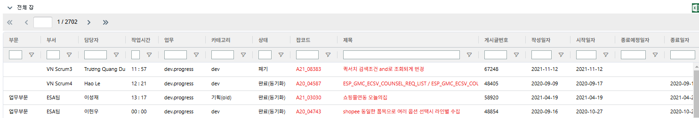
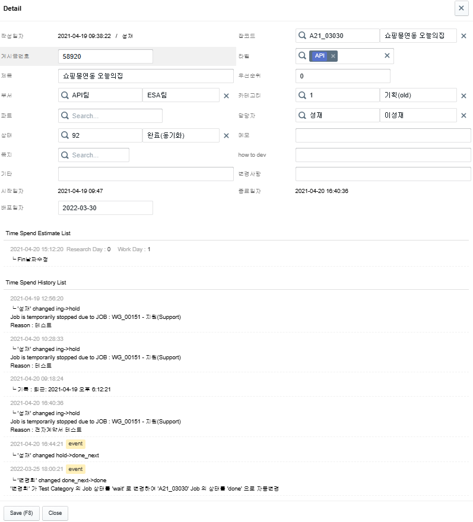
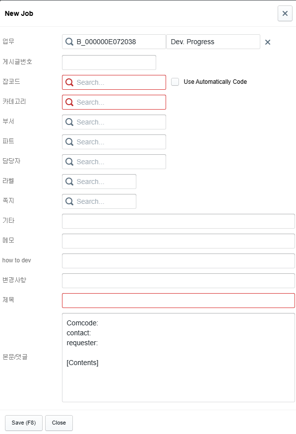
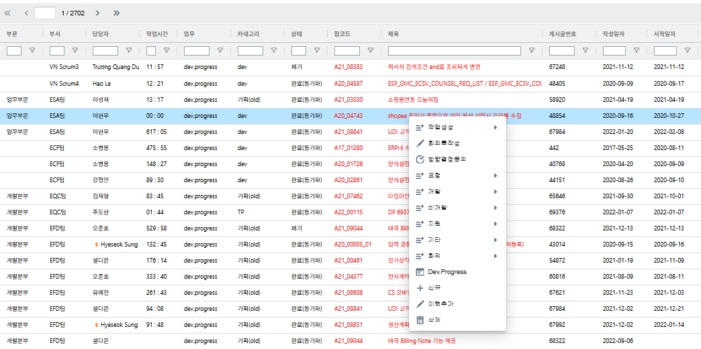
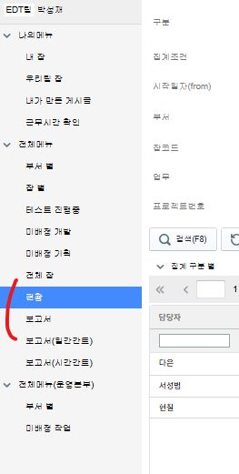
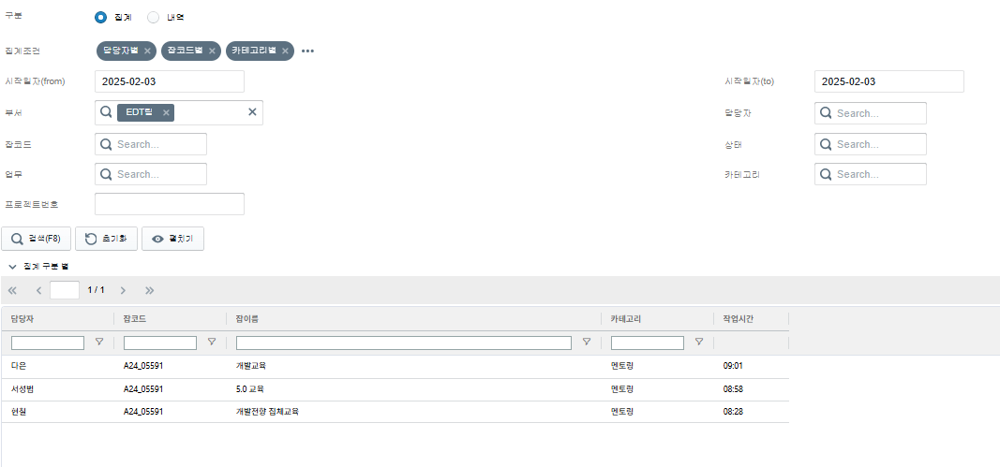
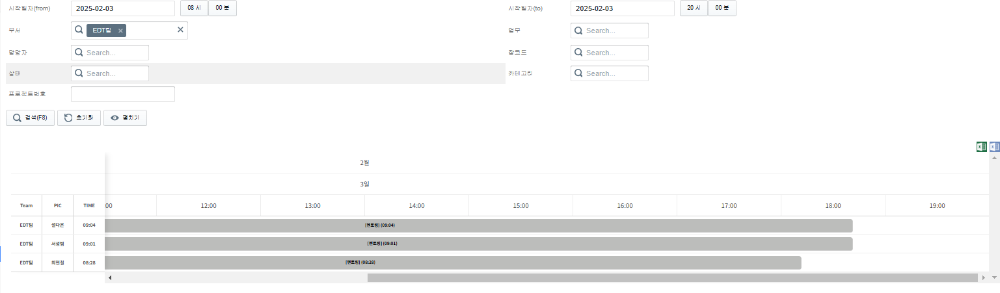
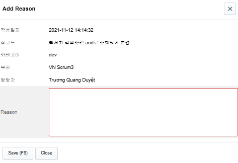

# Daily Retrospective

**작성자**: [박성재]  
**작성일시**: [2025-02-03]

## 1. 오늘 배운 내용 (필수)

- 기존 일정관리 기능
- 프로젝트 시작

 

## 기존 일정관리 기능
프로젝트 시작에 앞서, 기존에 구현되있던 일정관리 기능을 교육받는 시간을 가졌습니다. 크게 시간관리 업무와, 시간관리 이력 업무로 나뉘어졌습니다.

### 1. 시간관리 업무

### 1-1. 시간관리 조회

- 일정관리를 등록한 데이터들을 일괄적으로 볼 수 있는 화면입니다.
- 위 화면은 전체 잡 메뉴 기준이며, 검색 조건별로 다양한 메뉴들이 나누어지게됩니다.
- 해당 화면에서 잡코드를 누르면 Detail 화면으로 이동됩니다.

### 1-2. 시간관리 상세조회

- 일정관리 상세화면입니다.
- 해당 화면에서 일정관리의 상태, 제목 등을 수정할 수 있습니다.
- 해당 일정관리의 이력들의 리스트를 보여줍니다.

### 1-3. 시간관리 입력

- 조회 페이지에서 신규버튼을 클릭할 경우 나오는 UI입니다.
- 시간관리를 저장할 수 있습니다.
- 시간관리들은 하나의 Job 아래에 여러가지 둘 수 있으며, Job-Code를 통해 구분지을 수 있습니다.
- 각 시간관리들은 회사코드 80000번(이카운트)의 게시판의 게시글을 할당할 수 있습니다.
- 게시글을 할당하게되면 본문 내용이 해당 게시글의 답글로 달리게됩니다.
- 게시글 할당하지 않으면 본문의 신규 게시글로서 작성이 되게 됩니다.

### 1-4. 다양한 시간관리 기능

- 각 데이터에 커서를 두고, 우클릭을 하면 동작시킬 수 있는 다양한 기능들이 존재합니다.
- 특히, 이력추가 버튼을 누르면 해당 시간관리에 대한 이력을 추가할 수 있습니다.

 

### 2. 시간관리 이력 업무

시간관리 이력 업무는 크게 `현황`과 `보고서`로 나뉘어지게됩니다.

- `보고서` : 현황과 같은 데이터이지만, 작업시간이 0이 아니거나, 작업시간이 0이어도 우클릭 `이력추가`로 추가한 이력이 있으면 보여주는 탭입니다.

### 2-1. 시간관리 이력 현황

- 검색 기능을 통해 시간관리 이력들을 필터해서 조회할 수 있는 화면입니다.
- `구분` : `내역`의 경우 일반 필터된 데이터들이 조회되며, `집계`의 경우 원하는 항목을 기준으로 그룹핑을 하여 데이터를 조회할 수 있습니다.

### 2-2. 시간관리 이력 보고서(시간간트)

-  이력 현황 데이터들을 간트차트 형태로 볼 수 있는 화면입니다.

### 2-3. 시간관리 이력 추가

-  시간관리 조회 화면에서 우클릭 후, 이력 추가했을 시 나오는 화면입니다.
- 사유를 입력하고, 해당 시간관리의 히스토리를 추가할 수 있습니다.
- 시간관리를 등록하거나, 재생 등 상태변경이 일어날 때마다 자동으로 이력이 추가되기도 합니다.

 

## 프로젝트 시작

회사에서 드디어 프로젝트를 처음으로 시작하게되었습니다. 설레는 마음을 가지고 전달받은 요구사항들을 파악해보았는데, 저에게 주어진 요구사항을 보다 명확하게 이해하기 위해 아래와 같이 꼭 필요한 내용만 UI를 기반으로 도식화를 해보았습니다.

도식화를 하고나니 어떤 부분에 집중하여 고민해야할 지 알 수 있었고, 연관된 `Job`을 담당하게된 도형님과도 소통의 기준을 마련할 수 있어 큰 도움이 되었다고 느꼈습니다.

해당 내용을 내일 팀장님과의 회의를 기반으로 보다 구체화해볼 예정입니다.

 

## 2. 동기에게 도움 받은 내용 (필수)

#### 다은, 현철 선임
택시비 및 월말마다 해야하는 일들에 대해 친절하게 잘 설명해주셔서 도움이 되었습니다.

#### 승준, 민준 선임
지지난주에 함께 논의했던 Setup과 Data API 비동기 처리 관련 의문에 대해 민준님이 자체적으로 공부하고나서 알게된 부분을 공유해주셨습니다. 덕분에 JS의 비동기 처리에 대해 이해도가 높아진 것 같아 도움이 되었습니다.

#### 도형 선임
프로젝트를 함께 첫날 진행하게되면서 요구사항 등 논의를 거쳐 앞으로 어떻게 개발을 해나가야할지 예상을 해보았습니다.

아직 구체화되지 않은 부분들이 많아 내일 보다 세밀하게 정할 수 있을 것 같습니다.