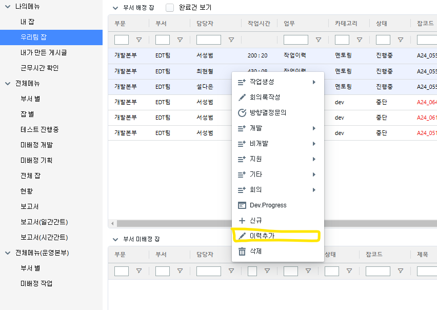
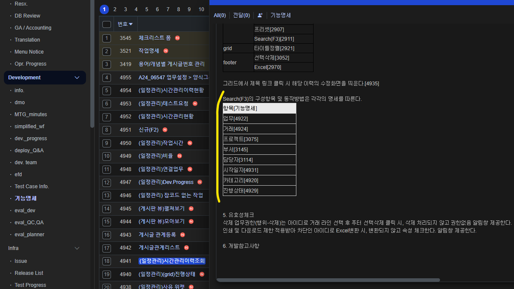
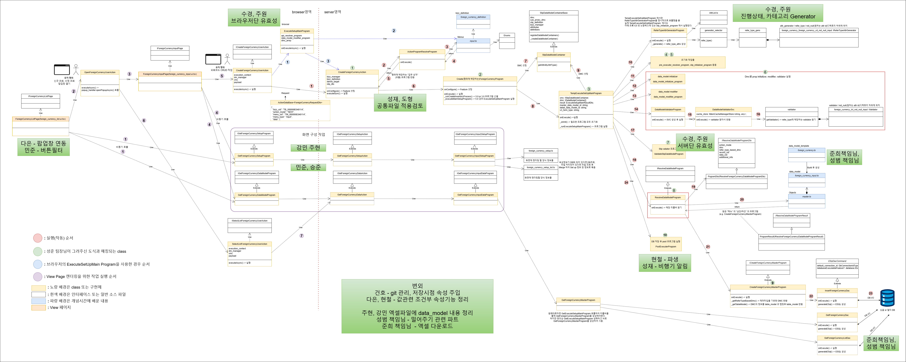

# Daily Retrospective

**작성자**: [박주현]  
**작성일시**: [2025-02-03]

# 1. 오늘 배운 내용

## 일정관리 업무의 기능들과 앞으로 방향성을 배웠습니다.

일정관리는 현재 이카운트 개발자들을 위한 협업 도구입니다. 유명한 PaaS 로는 Jira 가 있습니다. 개인 job 관리하여 업무 효율성 높이고 job 을 칸반형식이나 현항 도표을 통해 팀장님들의 매니징을 돕습니다. 현재는 리액트 코드와 하드코딩으로 개선해야할 부분이 많습니다.

이 일정관리 기능을 5.0을 도입 개발이 1달 간의 목표이고 더 나아가 erp 서비스 고객들에게 제공할 수 있는 서비스로 성장이 궁극적인 목표입니다.

일정관리는 5.0 으로 들어오면서 두가지 업무 타입을 가진 서비스로 명세됐습니다. `시간관리업무` , `시간관리이력업무` 일정관리라는 워딩으로 앞으로 시간관리로 바뀔 것이고, 이 두가지 업무를 파트를 2팀으로 나눠서 고도화 작업을 진행하게 됩니다.

특히나 지금 `시간 관리 이력 업무` 에서는 수정이나 삭제가 불가능합니다. 하지만 휴먼에러가 발생하는 경우가 있으므로 수정과 삭제를 도입해야하고, 5.0에서는 수정과 삭제 기능이 추가되게 됩니다.

`시간 관리 업무` 5.0의 전표화 되면서 `H` 전표 이력기능이 추가되게 됩니다. 현재는 `시간 관리 이력 업무`가 마치 `시간 관리 업무`의 이력처럼 작동하지만, 이는 기능적으로도 기획적으로도 분리되게 됩니다.

<br>
<br>
<br>
<br>



<br>
<br>

`시간 관리 업무` 에서 하나의 Job 에서 우클릭을 하게 되면 `이력추가`를 하여 세부 업무를 추가할 수 있습니다. 이러한 이력이 `시간 관리 이력 업무` 입니다.

시간관리 업무를 맡게 되면서 setup 중심의 구현 개발을 맡게 됐습니다. 특히나 Search 쪽 파트 setup 또한 구현을 하게 되어 다른 소스 코드의 참고가 필요하다고 생각했습니다.

<br>
<br>


<br>

위 명세를 통해 각각의 속성이 어떤 자료형인지, 밸리데이션을 어떻게 해야하는지를 고려해야할 거 같습니다.

---

# 2. 동기에게 도움 받은 내용

다은님께 기안서 올리는 작업을 배웠습니다. 잘못 작성하여 회계팀분께 메신저를 받았는데, 너무 죄송했습니다ㅜ,ㅜ 비용내역의 날짜를 말일로 바꿨는데, 지출결의서와 가지급 에서도 바꿔줘야했는데, 자동 적용이 되는 줄 알았습니다. 승준님과 이야기를 통해 잘 수정했습니다.

---

# 3. 개발 기술적으로 성장한 점

## 3-1. 교육 과정 상 배운 내용이 아닌 개인적 호기심을 해결하기 위해 추가 공부한 내용

<br>

`HTTP 로 보내진 API 요청이 TS ACTION 파일로 연결되는 과정` 문답을 보면서 HTTP Request 가 어떻게 이카운트 서비스에 오는지 공부했습니다. 벨록스는 nvc 패턴으로 구현되어 있으며 Controller 를 EndPoint 라고 부르고 있습니다.

요청의 path 를 파싱하여 원하는 useraction의 인스턴스를 생성하여 execute()를 호출하게 됩니다.

이때 벨록스는 async 키워드를 활용하여 호출하게 됩니다.

```c#
public virtual async Task<object> ExecuteAsync(Func<ScriptRuntime, object> customCodeBlock, bool normalize = true)
{
    var result = customCodeBlock(this);

    if (result is PromiseInstance promise) {
        result = await promise.ToTask(this).ConfigureAwait(false);
    }

	// 콜백 함수를 실행시킨 뒤 결과를 반환합니다.
    return normalize ? JSObject.NormalizeValue(result) : result;
}

```

<br>

자바, 스프링의 경우도 mvc 프레임워크가 있고, 비동기에서 주로 쓰이는 webflux 프레임워크가 있습니다.
물론 mvc 프레임워크에서도 비동기 프로그래밍이 가능합니다. @Async + Executor 을 쓰거나 Callable<T>을 활용하여 가능합니다.
.NET 의 MVC 프레임워크도 동기적인 프레임워크로 알고 있는데, 스레드 풀을 생성하고 비동기 프로그래밍을 하는 것일지 아니면 .NET 의 MVC 프레임워크는 동기 뿐아니라 비동기 관련 프로그래밍 라이브러리를 제공하여 가능한 것인지 궁금했습니다.

관련 의문증을 정리하여 현우 팀장님께 여쭤봤습니다.

### 핵심질문

1. 벨록스의 비동기 프로그래밍도 위에서 스프링의 mvc 프레임워크 + 비동기 프로그래밍 방식이 맞을까요?
2. 위 방식이 맞다면 결국엔 스레드풀 관리가 핵심인데, 풀 관리를 벨록스에서는 어떻게 하고 있는지 궁금합니다.
3. .net 프레임워크에서도 비동기 프로그래밍 특화 프레임웍(e.g. 스프링부트의 webflux)이 있을 거 같은데 사용하지 않은 이유가 궁금합니다.

<br>

---

# 4. 소프트 스킬면에서 성장한 점

일정관리를 5.0으로 고도화하게 되면서 파트장을 맡게 됐습니다. 몇몇 팀원분들이 건의사항을 주셔서 즉각적으로 반영하는 모습이 소프트 성장 같습니다.

현철님의 건의사항으로 저희가 구현한 클래스다이어그램 호출 순서도에서 각자 맡은 역할군을 표시하여 개개인이 무엇을 핵심적으로 담당해야할지 직관적으로 볼 수 있게 추가했습니다.


