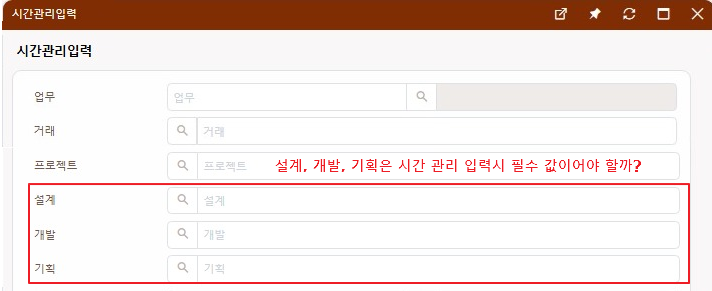

# Daily Retrospective

**작성자**: 허수경

**작성일시**: 2025-02-03(월)

## 1. 오늘 배운 내용 (필수)

- 일정관리 프로그램 기능 교육(with DMO 노수민 선임님)

### 일정관리 프로그램 기능 교육

- 목적: 일정 관리의 목적은 업무 시간 관리 및 업무 기록 관리입니다.
- 여기서 "업무"란 관리하고자 하는 일의 단위를 의미합니다.
- 일정 = 잡(Job) = 프로젝트

#### 일정관리 프로그램 키워드

#### 1. 잡코드

- 프로젝트 등록 시 사용되는 고유 코드입니다.
- 여러 사람이 공동으로 프로젝트를 진행할 때, 프로젝트를 식별하는 Key 역할을 합니다.
- 잡 코드 하나에 여러 일정이 존재할 수 있습니다.

#### 2. 상태

- 일정의 진행 상태를 나타내며, 예정 / 진행 중 / 중단 / 폐기 등의 상태값을 가집니다.
- 일정 등록 시, 상태는 자동으로 "예정"으로 설정되며 수정할 수 없습니다.
- 중단 또는 폐기로 변경할 때는 반드시 사유를 입력해야 합니다.

#### 3. 시작일자

- start를 누른 일자가 자동으로 반영됩니다.

#### 4. 종료예정일자

- 예정일이 있을 때 입력합니다.
- 일정의 예정된 종료일을 의미하며, 신규 등록 시에만 입력할 수 있습니다.
- 수정 화면에서는 입력 불가능(Disabled) 처리됩니다.
  - 이는 종료 예정일을 계속 변경할 경우 의미가 없어질 수 있기 때문으로 보입니다.

#### 5. 종료일자

- 일정의 상태가 개발완료/완료/폐기가 되었을 때 자동으로 반영됩니다.

#### 6. 현황과 보고서

- 두 기능은 동일한 데이터를 기반으로 하지만, 표시 방식이 다릅니다.
  - 현황: 모든 일정을 조회할 수 있습니다.
  - 보고서: 작업 시간이 0이 아니거나, 작업 시간이 0이지만 우클릭으로 추가한 이력만을 간추려 보여줍니다.

#### 7. from, to

- 하나의 일정에는 여러 개의 이력이 기록될 수 있으며, 각 이력에는 여러 시작일자 및 종료일자가 존재할 수 있습니다.
  이를 조회하기 위해 from(시작일)과 to(종료일) 개념이 사용됩니다.

#### 일정(시간) 관리의 밀어주기

- 일정 관리 입력을 하게 되면 다음 3군데에 저장되어야 합니다.
  - 내 잡
  - 일정 관리 이력
  - 80000 게시글(게시글이 존재할 경우, 해당 게시글의 답변으로 등록)
- 이는 "파생"의 개념과는 다릅니다.
  - 기존 전표의 이력은 자동 생성되므로 파생 방식으로 구현이 가능했습니다. (이력 수정 불가)
  - 그러나 일정 관리 이력은 수정이 가능하므로, 파생 방식으로 구현하기 어렵습니다.
  - 따라서 **"밀어주기"** 방식을 적용해야 합니다.

---

## 2. 동기에게 도움 받은 내용 (필수)

- 건호님께서 본체를 옮기는 작업을 도와주셨습니다.
- 주원님께 시간관리 입력에 대해 질문하며 보다 깊이 이해할 수 있었습니다. 또한, 비슷한 업무를 맡고 있어 서로 지식을 공유하며 진행할 수 있었습니다.
- 민준님과 밀어주기와 파생 개념에 대해 의견을 나누며 다시 한번 개념을 정리할 수 있었습니다.
- 다은님과 현철님께 월말에 해야 할 업무에 대해 도움을 받았습니다.
- 현철님과 시간관리 입력 기능 명세에서 일부 항목이 필수값으로 지정된 이유에 대해 의견을 나누었습니다. 또한, 이해가 어려운 부분은 테스트 계정을 활용해 상세히 설명해 주셨습니다.

---

## 3. 개발 기술적으로 성장한 점 (선택)

### 2. 오늘 직면했던 문제 (개발 환경, 구현)와 해결 방법

#### 시간관리입력 시 전표항목(설계, 개발, 기획)은 필수값이어야 할까?

**문제**

- `4915 | (일정관리) 시간관리입력` 기능 명세에서 전표 항목(설계, 개발, 기획)이 필수값으로 지정되어 있었습니다.
- 하지만 일정 입력 시 모든 단계(설계, 개발, 기획)가 반드시 진행되는 것은 아닐 수 있어, 이를 필수값으로 설정하는 것이 적절한지에 대한 의문이 생겼습니다.

**의견 도출 과정**

1. **전표 항목이 필수값으로 지정된 이유 탐색**

   - 현철님과 논의하며, 하나의 프로젝트에는 여러 일정이 존재할 수 있으며, 각 일정은 **전표 항목(설계, 개발, 기획) 중 하나와 매핑되어도 된다**로 도달했습니다.
   - 즉, 일정이 등록될 때 반드시 **하나의 전표 항목과 연결**되어야 하고, 굳이 (설계, 개발, 기획) 세가지 항목이 필수값일 필요는 없다고 생각이 들었습니다.

2. **화면 UI 개선 아이디어 도출**

   - 우리의 의견이 맞다면, 현재 화면에서는 세 개의 전표 항목(설계, 개발, 기획)이 모두 표시되는데,  
     **하나의 일정에는 하나의 전표 항목만 필요하다면, 드롭다운(드롭박스) 방식으로 선택하는 것이 더 적절할 것**이라는 생각이 들었습니다.
   - 사용자가 한 개의 전표 항목을 선택하고, 이후 해당 항목에 따라 전표 데이터를 조회하도록 변경하면 더 직관적인 흐름이 될 것으로 판단했습니다.

3. **카테고리와 전표 항목의 역할 충돌 문제 발견**
   - 하지만 일정 입력 시 이미 **카테고리(설계, 개발, 기획) 선택 항목이 존재**하는데,  
     전표 항목과의 역할이 겹치는 문제가 발생할 수 있음을 인지했습니다.
   - 즉, 카테고리와 전표 항목이 동일한 값을 사용한다면, **두 항목이 중복될 가능성이 있으며, 역할을 명확히 해야한다고 생각했습니다.**

#### 🏁 결론

- 아직 완전히 해결하지는 못했지만, 필수값 기준과 전표 항목 선택 방식에 대해 더 깊이 고민할 필요가 있다고 판단되었습니다.
- 이번 고민을 통해 **유효성 검사 기준을 검토하는 과정에서 여러 조건을 고려하는 좋은 경험**이 되었다.

---

### 3. 위 두 주제 중 미처 해결 못한 과제. 앞으로 공부해볼 내용.

- 유효성검사 설계를 하다보니 항목에 같은 명세가 되어 있더라도 입력과 조회 시에 다른게 적용되어야한다고 생각이 들었습니다. 이를 더 알아보고자합니다.
