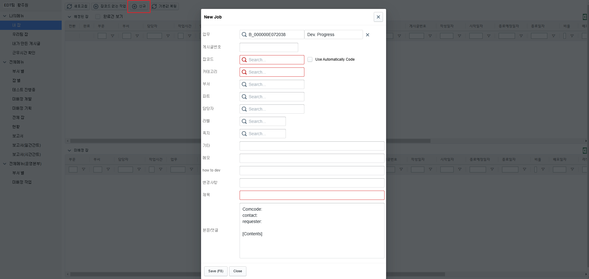
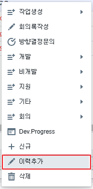
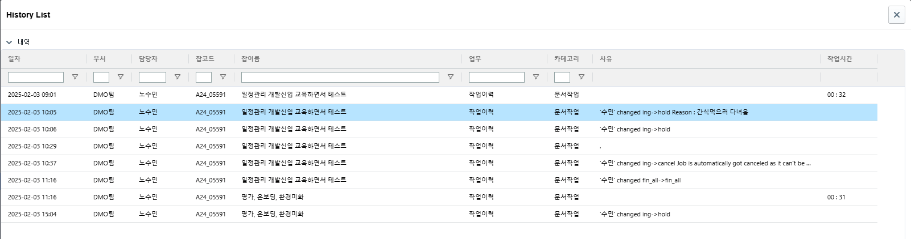

# Daily Retrospective

**작성자**: [황주원]  
**작성일시**: [2025-02-03]

## 1. 오늘 배운 내용 (필수)

현재 이카운트에서 제공하고 있는 잡 운영 방식을 배우고  
앞으로 구현해야 하는 방식에 대해 설명 들었습니다.

### 시간 관리 업무
신규로 Job을 아래와 같이 생성할 수 있습니다.

생성된 Job을 실행, 중단 등의 상태를 변화시키며 진행할 수 있습니다.

+) 하나의 Job 에는 여러 가지의 업무와 이력이 올 수 있다.

### 시간 관리 이력 업무
Job을 우클릭해 이력을 관리할 수 있습니다.

추가한 이력은 history를 볼 수 있고,  
job을 잠깐 멈췄을 때 사유를 쓸 수 있습니다.

### 앞으로 진행하면서 유의할 점
* 유효성 검사 단톡에 가장 먼저 문의
* 개별 메신저 보다는 전체 톡방에서 문의
* 모르는 부분은 팀원들과 가장 먼저 상의

## 2. 동기에게 도움 받은 내용 (필수)
* 수경님과 모르는 부분을 물어보면서 시간 관리 업무에 대해 이해할 수 있었습니다.
* 유효성을 명세하면서 애매한 부분들이 있었는데 다은님께서 알려주셨습니다.

---

## 3. 개발 기술적으로 성장한 점 (선택)

### 2. 오늘 직면했던 문제 (개발 환경, 구현)와 해결 방법
#### 2-1. 설계 파일과 게시글 사이의 혼동 
최종 반영된 부분은 게시글 !!  
게시글을 보면서 설계 파일을 수정

ex) '프로젝트 번호' 항목 -> '거래' 항목  
ex2) #조회 - 푸터 부분 신규 -> 선택 삭제 항목

#### 2-2. 게시글 번호 오류
2145로 기입된 게시글은 알고보니 3145였다. .. 다은님 짱 ... 

### 3. 위 두 주제 중 미처 해결 못한 과제. 앞으로 공부해볼 내용.
* 업무와 거래의 차이 ?
* 시간 관리 이력 저장 필수값 

---

## 4. 소프트 스킬면에서 성장한 점 (선택)
유효성을 실제로 구현한다고 생각하고 기능 명세를 해보니 더 어려웠다!!   
배운 건 not null 뿐이였는데 아주 다양한 validation을 맛볼 수 있었다. .. !!

