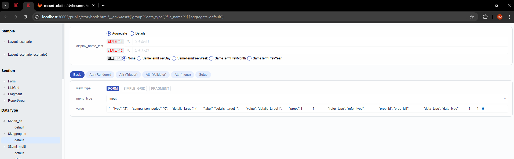

# Daily Retrospective

**작성자**: [나강민]  
**작성일시**: [2025-02-04]

## 1. 오늘 배운 내용 (필수)

## **일정관리 5.0 개발을 위한 Search Program 준비 정리**

### **📌 개요**
- 일정관리 5.0 개발을 위해 **Search(검색) 기능**을 담당하는 **ESF팀 문진솔 선임님**에게 교육 진행.
- Search Program을 활용하여 **일정관리의 "내 잡", "보고서" 부분에서 조회, 입력, 현황 관리** 가능.
- Search 기능이 필수적이며, 데이터를 검색하여 가져오는 구조.

---

## **✅ Search Program 개발을 위한 3가지 준비 사항**
### **1️⃣ BizzDefinition 정의**
- **목적**: 검색 대상(Target), 테이블, 메인 테이블의 Key를 정의.
- **구성 요소**:
  - `datamodedefinition`: 필요한 데이터 모델 정의 (일부 생략 가능).
  - `메인 테이블의 Key 값`: 반드시 `object` 내부에서 정의 (예: `base.ts`).
  - 업무 간 연계: 다른 업무(`inventory_single`, `inventory_multi`)를 검색해야 하는 경우 정의 필요.

---

### **2️⃣ Search Program의 Request 설계**
- **목적**: 검색 요청(Request)의 구조를 정리하여 일반화된 프로그램을 설계.
- **주요 고려 사항**:
  - **검색 조건 (condition) 설정 필수**.
  - 고정된 `select`, `from` 구문이면 **표로 정리**.
  - `where` 절을 동적으로 설정할 수 있도록 **유형별 정리**:
    - **정적 검색 조건**: 이카운트에서 필수로 포함해야 하는 검색 조건.
    - **동적 검색 조건**: 유저가 직접 검색 API에서 전달하는 조건.

- **조건 작성 예시**:
  - **기준일자, 거래 유형, 내외자 구분** 등 필수 검색 조건 정의.
  - 검색 대상(Target) 및 Prop ID 목록을 정리하여 **엑셀 파일로 정리**.

---

### **3️⃣ UserAction 정의 (비즈니스 로직)**
- **목적**: 검색 실행 및 결과 처리를 담당하는 `UserAction` 정의.
- **구성 요소**:
  - **Setup 과정**:
    - 페이지 진입 시 검색 화면 설정 정보 수신.
    - 검색창 없이 바닥만 그려줄지 여부 결정.
  - **검색 API 호출 흐름**:
    - **검색 전**
    - **검색 API 호출**
    - **검색 API 호출 후**
  - 속성 값에 따라 **자동으로 화면을 그릴지, 검색 후 상태 전환할지 정의**.

---

## **✅ 정리**
1. **BizzDefinition 정의**  
   - 타겟 데이터, 메인 테이블 Key 설정  
   - 업무 간 연계 시 정의 필요  

2. **Request 설계 (검색 요청 구조화)**  
   - `condition` 설정 필수  
   - 검색 조건이 고정이면 표로 정리  
   - 동적 검색 조건 정의  

3. **UserAction 정의**  
   - 검색 실행 및 화면 렌더링  
   - 검색 API 호출 전/후 흐름 정리  
   - 속성 값에 따른 처리 방식 정의  

## 2. 동기에게 도움 받은 내용 (필수)

주현, 민준, 승준 : setup을 구성하면서 작업해야하는 방향성과 이야기를 나누면서 어떻게 진행해야할지 같이 이야기 해주셔서 감사합니다.

현철 : 데이터모델을 잡을 때 어떻게 잡아야할지 알려주셔서 감사합니다. ㅜㅜ

수경, 주원 : setup에 유효성검사에 필요한 자료들을 잘 정리해주셔서 감사합니다.

---

## 3. 개발 기술적으로 성장한 점 (선택)

### 2. 오늘 직면했던 문제 (개발 환경, 구현)와 해결 방법

search setup을 구성할 때 setup 형태를 분석하고 화면 구성은 어떻게 하는지, 어떻게 prop들을 하나로 모아서 그룹형태의 화면으로 보여지는지, 데이터 모델과 테이블 모델에 대해서 어떻게 매칭시켜야하는지 등 처음하는  작업에 갈피를 잡기 어려운 부분들이 있었지만, 현철님의 특강과 '견적서/조회' 부분의 setup을 참고하면서 현재 상태의 setup을 구성할 수 있었습니다. 

ECStoryBook에서 data_type을 확인하고 해당 data_type에서 설정할 수 있는 attribute 속성들을 확인하면서 setup을 설정하는 방법에 대해 배웠습니다.

view_type과 menu_type, value의 값을 확인하면서 만들어야하는 조회-검색에 맞춰서 render 속성을 통해 화면을 구성했고, attribute의 값을 통해 setup을 구성했습니다. 

해당 시간관리업무 중 검색-서치 부분의 화면 구성과, 해당부분의 validator을 넣어가며 화면 ui상에서 이루어지는 유효성 검사 속성들을 이용하여 구성했습니다.

---

## 4. 소프트 스킬면에서 성장한 점 (선택)

각자의 잡을 해결하는 것이 아닌 17기 전체가 하나의 프로젝트를 진행하면서 혼자서 모든걸 해결할 수 없으니 소통이 중요하다는 것을 많이 느끼게 되었습니다. 내가 부족한 부분이 무엇인지 아는 것이 제일 중요하다는 것을 느끼게 되었습니다. 

이로 인해 개발자로써 소통하는 방식에 대해 더 고민할 수 있는 스킬이 성장한 것 같습니다.

---

