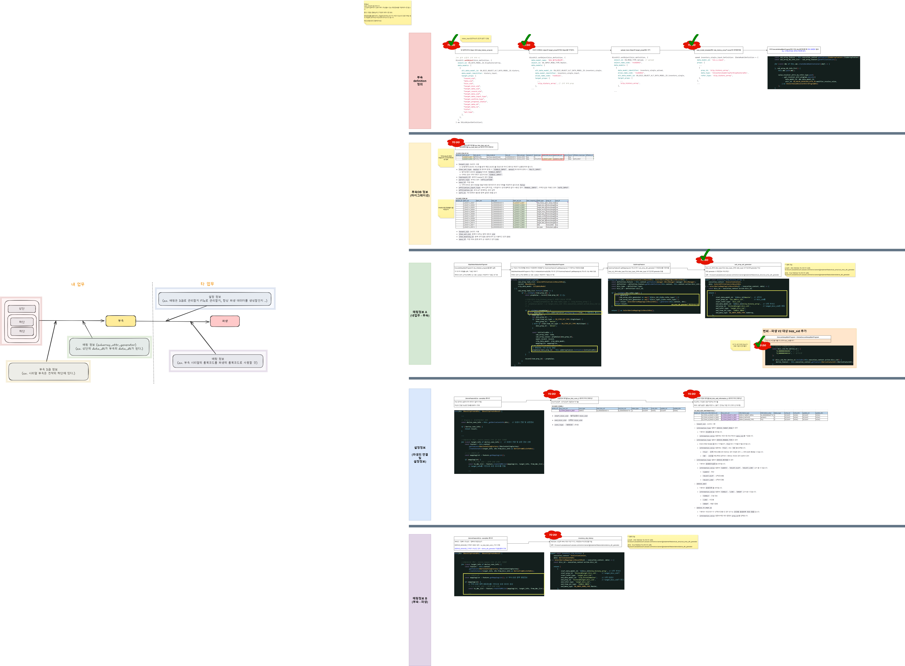

# Daily Retrospective

**작성자**: [최현철]  
**작성일시**: [2025-02-04]

## 1. 오늘 배운 내용 (필수)

### Search Engine

1. 목적 : ESQL 자동으로 생성, 어떤 업무에서 Search 하더라도 하나

2. Search를 위해 필요한 정보

- object definition에 조회/현황의 각 key값이 뭔지(is_key)

- condition(검색조건)은 key-value 형태로 prop_id를 key로 겁색대상값을 value로 가진다.

3. Search 관련 요청

- target : 엑셀 양식에 따라 어떤 prop 찾을건지

- condition : 사용자가 직접 검색조건 설정하는 경우

- ecount condition : 이카운트 검색조건, 고정된 검색조건

99. 기타

- 업무간의 연결도 definition 안에 정의

- Life Cycle Action 이라는 attribute로 검색자동으로 하냐/마냐 를 구분
  - 조회는 LCA 달려있고, 현황은 안달려있고

### 파생 구현

소스상 구현 (5/6) 완료
내일 소스 마무리 후 DB마이그레이션 부분 진행하면 마무리될듯.

## 2. 동기에게 도움 받은 내용 (필수)

금일 작업내역을 내일로 이어가야하는데, 강민/건호/성범책임님께서 방법을 알려주셨습니다.

1. 커밋 후 브랜치 최신화 / 체리픽 -> 변경사항이 많아 불편
2. 커밋/푸시 -> 해당 방향으로 진행

---

## 4. 소프트 스킬면에서 성장한 점 (선택)

일이 바쁘거나, 머리를 많이쓰면 예민해지는 일이 종종 있는데,
준봉선임님께서 정성스럽게 정리해놓은 메뉴얼을 보고 차분함이 개인적/조직적으로도 큰 도움이 된다는 것을 배울 수 있었습니다.

자리에 찾아가 질문했을 때에도 전달해주시려고 메모장에 적어가시며 설명해주시는 부분을 보며 본받아야겠다고 생각했습니다.

---
