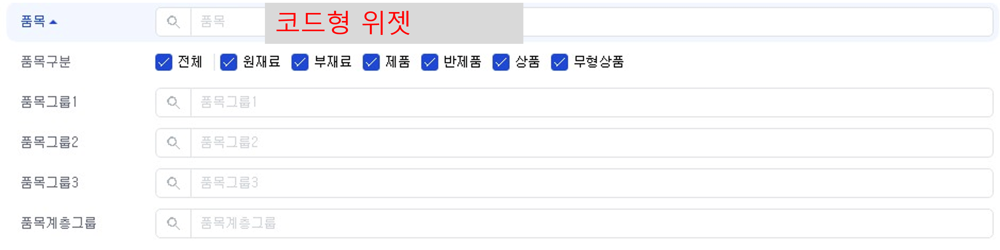
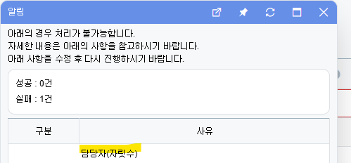

# Daily Retrospective

**작성자**: 허수경

**작성일시**: 2025-02-04

## 1. 오늘 배운 내용 (필수)

- SEARCH 교육

### SEARCH 교육

- **모든 메뉴에 대한 검색이 하나의 program으로 동작**할 수 있도록 하는 것이 search engine의 목적입니다.

#### SearchProgram을 쓰기 위한 필요한 작업

1)해당 업무에 대한 BizzDefinition 정의
2)SEARCH PROGRAM에 전달되어야 하는 REQUEST 모양 정리 3)해당 업무에 대한 UserAction 정의 (비즈니스 로직이 가득한)

#### search 지원 요청 전 정리 목록

1. BizzDefinition 정의

   1. DataModelDefinition
   2. ObjectDefinition

   - BizzObjectDefintion 은 크게 3개의 정보가 필요합니다.
     1. 사용해야할 DataModelDefinition
     2. 메인 테이블의 key 값
     - `is_key` 속성
     - `is_key`는 PK 역할을 합니다.
     3. 업무 간의 참조관계 (타업무와의 매핑관계)
     - `mapping` 속성

2. Request 설계

   ```ts
   request = {
     object_id: EN_MENU_TYPE.List,
     bizz_sid: "sales", // 실제 bizz_sid와는 다릅니다
     data: {
       target: {
         // SELECT 절에 들어갈 대상
         sales_list$data_dt: {},
         sales_list$data_no: {},
         cust$cust_list$name: {},
       },
       condition: {
         // WHERE 절에 들어갈 대상
         cust$cust_list$group_name: {
           type: EN_COMPARER_OPERATOR_TYPE.equal,
           value: "마트",
         },
         sales_list$data_dt: {
           type: EN_COMPARER_OPERATOR_TYPE.range,
           value: { from: "20240101", to: "20240131" },
         },
       },
       sort: {
         // ORDER BY 절에 들어갈 대상
         sales_list$data_dt: { sort_type: EN_SORT_TYPE.Desc, priority: 0 },
       },
     },
   };
   ```

3. target 및 condition 설계

   1. target

   - select 절 역할을 합니다.

   2. condition

   - where 절 역할을 합니다.
   - 유저가 직접 search API에 검색조건을 설정해서 전달하는 경우에 작성합니다.
   - 어떤 prop들이 검색조건으로 들어올 수 있는지? 에 대한 내용을 작성합니다.

   3. 이카운트 검색조건(coindition)

   - 이카운트 개발자가 이 메뉴에는 무조건 이 검색조건이 들어간다하는 경우에 작성합니다.

---

## 2. 동기에게 도움 받은 내용 (필수)

- 오늘도 현철님께 기능에 대한 큰 도움을 받았습니다.
- 강민님 덕분에 위젯의 명세를 확인할 수 있는 유용한 사이트를 알게 되었습니다.
- 주원님께서 validator 파일을 찾는 것을 도와주셨습니다.
- 다은님께서 저녁 주문을 도와주셨습니다.

---

## 3. 개발 기술적으로 성장한 점 (선택)

### 2. 오늘 직면했던 문제 (개발 환경, 구현)와 해결 방법

### 코드형 위젯 조회시 자릿수 제한이 필요할까

**코드형 위젯**


**문제**

- 코드형 위젯(2900)의 기능 명세에 따르면, **"최대 자릿수는 조회되는 코드 데이터의 명칭까지 조회할 수 있는 만큼으로 한다."**라는 유효성 검사 항목이 존재합니다.

- 그러나 코드형 항목은 돋보기 기능을 통해 조회 후 입력하는 방식이므로, **신규 입력이 아닌 경우에도 자릿수 제한이 필요한가?**라는 의문이 들었습니다.

**테스트 및 분석 과정**

이 의문을 해결하기 위해 현철님과 함께 다음과 같은 테스트를 진행했습니다.

- 돋보기 조회 후 입력 테스트

  - 돋보기 기능을 통해 코드를 조회하여 입력했을 때 자릿수 유효성 검사가 적용되지 않음을 확인
  - 돋보기 기능을 통해 입력할 경우, 사용자가 별도의 입력 없이 선택만 하므로 자릿수 검증이 필요 없을 수도 있습니다.
  - 하지만 사용자의 입력 방식을 통제하여 일관된 경험을 제공하는 것이 편의성 향상에 기여할 수 있습니다.

- "웹자료올리기" 기능을 통한 입력 테스트

  - "웹자료올리기" 방식으로 데이터를 입력했을 때는 자릿수 유효성 검사가 적용됨을 확인

    

**결론**

코드형 위젯 조회에도 자릿수 제한이 필요한 이유는 다음과 같습니다.

1. 코드형 위젯을 입력할 때 적절한 자릿수 제한을 적용하면, 잘못된 데이터를 입력하는 실수를 방지할 수 있어 사용자 편의성이 향상됩니다.
2. UI(위젯)를 통한 입력이 아닌 "웹자료올리기" 같은 텍스트 입력 방식이 존재하기 때문에, 데이터 일관성을 유지하기 위해 자릿수 제한이 필요합니다.
