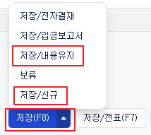
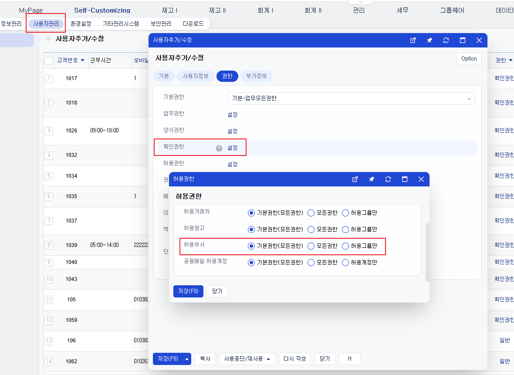

# Daily Retrospective

**작성자**: [황주원]  
**작성일시**: [2025-02-04]

## 1. 오늘 배운 내용 (필수)
### Search Engine
- erp 에서 검색이란 DB에 있는 데이터를 적절한 Query를 통해 가져오는 것
- 검색이라는 행위를 일반화하기 위한 엔진

### SearchProgram을 쓰기 위해 어떤 작업이 필요한지?
1. 해당업무에 대한 BizzDefinition 정의
2. Search Program 에 전달되어야 하는 Request 모양 정리
3. 해당 업무에 대한 UserAction 정의 (비즈니스 로직이 가득한)  
    extra) 직접 SearchProgram을 사용해 보고 싶다면, BizzView & DataView & .. 작업 정리

### 왜 필요할까 ?
> 검색 기능을 일반화하면 어떤 정보를 주입받아야 할까?
- 해당 업무를 검색할 때, 어떤 DB의 어떤 Table 에서 데이터를 가져와야할 지
- 해당 Table의 Key는 어떻게 되는지
- 어떤 Table과 어떻게 join 해야 하는지
- 검색을 위한 정보(검색조건, 검색 대상, ...) 는 어떤 것이 있는지  
이런 정보를 전달하기 위해서는 1~3 준비물이 필요하다.

### 용어 정리
- target : UI 상 보여지는 부분 (항목들) - SELECT
- condition (검색조건): 유저가 직접 search API 에 검색조건을 설정해서 전달하는 경우  - WHERE 
- 이카운트 검색조건(condition): 이카운트의 어떤 검색조건에서는 이게 무조건 들어가야 한다.

## 2. 동기에게 도움 받은 내용 (필수)
* 수경님과 모르는 부분을 물어보면서 시간 관리 업무에 대해 이해할 수 있었습니다.
* 기능 중 모르겠는 부분과 결재 잘못 올렸을 때 다시 작성하는 방법을 다은님께서 알려주셨습니다.

---

## 3. 개발 기술적으로 성장한 점 (선택)

### 2. 오늘 직면했던 문제 (개발 환경, 구현)와 해결 방법
#### 2-1. 설계 파일과 게시글 사이의 혼동 
1. 엑셀 파일과 명세서와 입력을 제외한 부분의 항목이 거의 달랐다. 
    - 해당 부분은 명세를 따르기 ! 
    - +) 예전엔 `프로젝트번호` 로 관리하던 항목을 `거래`로 대체
2. 명세서의 유효성 명세도 논리와 어긋났다.
    - ex) 시간관리 및 시간관리이력 입력의 수정화면에서 삭제 기능 명세(3867)에는 
리스트 코드 기준으로 삭제 유효성 검사를 진행
    - 해당 건은 다 건이 아닌, 단 건의 경우라 3328 따라야 한다.
    - 이런 부분들은 QT 팀에 전달하여 명세 변경 문의

#### 2-2. 저장 | 저장/신규, 저장/신규유지
Q. `저장(F8)`을 눌렀을 때는 유효성 검사를 하는데, `저장/내용유지, 저장/신규` 를 눌렀을 땐 타지 않는다. 그 이유가 뭔지 감이 잘 안 왔다. 

해결과정 : 준희 책임님께 물어봤는데 해당 부분은 모르겠다고 하셔서 팀장님께 물어 이해할 수 있었다.

저장에 대한 유효성 검사는 이미 진행한 뒤  
내용 유지를 눌렀을 때는 기존에 유효성 검사가 다 진행된 후 `복사` 만 하는 과정으로 이해하면 된다.

해당 항목들에 대한 검사는 `표시 속성`을 통해 관리하고 있다고 한다.

#### 2-3. 허용부서
> 허용부서 사용하는 아이디가 부서항목을 빈값으로 두고 전표 저장 시 체크한다. (입력화면설정의 필수입력 체크와 별개)

해당 의미가 무엇인지 궁금해 다은님께 물어보며 이해할 수 있었습니다.

현재는 부서항목을 SC 설정 > 사용자관리 > 권한 > 허용권한 > 허용부서 탭에서 설정할 수 있습니다. (필수 입력 체크 별개)

해당 허용부서 탭이 기본권한 | 모든권한 | 허용그룹만 으로 설정 가능한데,  
원하는 그룹마다의 권한을 줄 수 있다. 는 의미를 뜻한다고 해석하면 될 것 같습니다.

---

## 4. 소프트 스킬면에서 성장한 점 (선택)
* 모든 기능들을 하나씩 현재 이카운트에서 제공되는 기능들로 테스트를 해보니 설계 과정이 궁금해진 부분들이 많았습니다.
* 하나씩 매칭해 보면서 알아가는 과정이 재밌었고, 이카운트 개발 방식에 대해 많이 배울 수 있었습니다.
