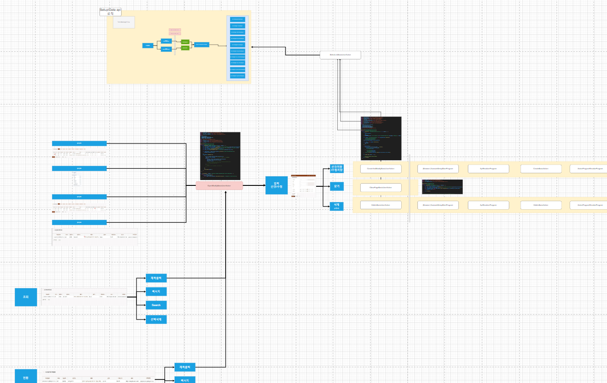

# Daily Retrospective

**작성자**: [김도형]  
**작성일시**: [2025-02-05]

## 1. 오늘 배운 내용 (필수)

- 공통 로직 도식화하기
- 성준 팀장님과 회의

## 도식화한 공통 로직 구현 플로우

성재님과 함께 browser/server 공통 로직을 개발하는 흐름을 도식화하였습니다. 현재 Setup/Data api 쪽은 구현이 완료된 상태이며, 시간관리이력의 기능들을 도식화하였습니다. 추가적으로, 시간관리의 기능들이 추가될 예정입니다.

## 성준 팀장님과의 회의

개발을 착수하면서 궁금한 점이 많아서 팀장님께 대면으로 질문을 드려도 되는 지 요청드렸고, 회의실에서 여러 질문을 드리고, 도식화에 대한 컨펌을 받았습니다.

`1. 시간관리, 시간관리이력 도식화해서 정리하기`

`2. 단일 삭제는 data_sid로 조회, 다건 삭제는 record_sid로 삭제. 그러므로 userAction 분리 필수`

`3. 퀵서치, Search 껍데기만 만들어두고, 1개의 SelectListUserAction, 1개의 DataModelProgram으로 개발이 가능한 지 여부 파악.`

`4. 시간관리 - 진행상태변경, 퀵서치, 서치에 대한 userAction 추가`

`5. 새로운 대안을 제안하기 위해서는 장,단점을 파악하고, 설득할 것 `

 

## 2. 동기에게 도움 받은 내용 (필수)

성재님과 함께 도식화를 그리고, 공통화에 대해 많은 고민을 하였습니다.

강민님과 현철님과 점심 식사를 함께 하였습니다.

다은님, 주현님, 민준님과 저녁 식사를 함께 하였습니다.

수경님, 주원님과 함께 Search 기능에 대해 논의하였습니다.

 

---

## 3. 개발 기술적으로 성장한 점 (선택)

### 2. 오늘 직면했던 문제 (개발 환경, 구현)와 해결 방법

- 개발 과정에서 궁금했던 질문 사항

`Q1.` 시간관리 상태 변경 userAction 개발 시, 퇴근 클릭하면 '진행중' 일정이 '중지'로 변경되는 것만 고려해야 하나요?

A: 보류 상태입니다. 나중에 다른 분에게 Job이 배정될 것입니다.

 

`Q2.` 시간관리이력입력 메뉴를 통한 진입 경로가 명세되어 있지 않은데, 이 메뉴는 존재하지 않는 것인가요?

A: 존재하며, 팝업으로 구현 필요도 필요합니다.

 

`Q3.` UserAction을 common 모듈에 만들어야 하나요?

A: 네.

 

`Q4.` setup/data api 호출 시 Search 관련 api도 고려해야 하나요?

A: 아니오.

 

`Q5.` 기능명세 저장 시 "저장", "저장/신규", "저장내용유지"의 차이점은?

A: 현철님께 해당 ERP 기능에 대해 여쭤보고 구현하면 돼요.

 

`Q6.` 구현해야 하는 삭제는 완전삭제가 아닌, 나중에 다시 볼 수 있는 삭제인가?

A: 나중에 다시 볼 수 있는 삭제입니다. Remove가 아닌 Delete를 의미합니다.

 

### 3. 위 두 주제 중 미처 해결 못한 과제. 앞으로 공부해볼 내용.

- Delete/BulkDeleteUserAction 구현

- 상태변경 UserAction

- Search/QuickSearch/CRUD에 대해 1개의 UserAction과 DataModelProgram으로 공통화가 가능한 지 여부

 

---

## 4. 소프트 스킬면에서 성장한 점 (선택)

오늘 여러 측면에서 소프트 스킬 성장이 있었습니다. 팀장님께 직접 대면 미팅을 요청하고 개발 관련 의문점을 명확히 해결하는 과정에서 소통 능력이 향상되었습니다. 특히 새로운 대안을 제시할 때는 장단점을 철저히 분석하고 설득력 있게 제안하는 것의 중요성을 배웠습니다.
