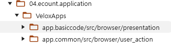

# Daily Retrospective

**작성자**: [김승준]  
**작성일시**: [2025-02-05]

## 1. 오늘 배운 내용 (필수)

-   시간이력관리입력의 validation, trigger를 연결했습니다.

## 2. 동기에게 도움 받은 내용 (필수)

-   **민준님**과 함께 디버그를 하며 구체적으로 어떤 부분이 문제고 왜 문제가 되는지 확인하였습니다.

-   **주현님**께서는 동일한 문제가 안나타는 상황이었습니다. 흔쾌히 디버깅을 도와주셨습니다.

---

## 3. 개발 기술적으로 성장한 점 (선택)

아래의 3가지 주제 중 하나를 선택하여 작성합니다.

### 1. 교육 과정 상 배운 내용이 아닌 개인적 호기심을 해결하기 위해 추가 공부한 내용

### 2. 오늘 직면했던 문제 (개발 환경, 구현)와 해결 방법

-   [**ISelectPopupUserAction의 구현체를 찾지 못하는 문제**](#cannot-resolve-iselectpopupuseraction)

-   setup의 속성이 동작하지 않는 문제

    -   [validator : code의 max_length가 동작하지 않는문제](#code_max_length)

    -   Renderer : date_time 의 writable(false)가 동작하지 않는 문제.

### 3. 위 두 주제 중 미처 해결 못한 과제. 앞으로 공부해볼 내용.

-   date_time 의 writable을 false로 하여도 수정이 가능한 문제가 있습니다.<br> ui와 관련된 부분은 storybook에서는 동작함에도 test에서는 동작하지 않는 문제가 있습니다.<br>
    왜 동작을 안하는지 확인하고, 수정해야겠습니다.

---

# 학습내용

## cannot resolve ISelectPopupUserAction


1. 서버에는 구현체가 존재하지만 브라우저에선 해당 구현체를 가져오지 못하는 문제

**브라우저 디렉토리**




**서버 디렉토리**


2. 브라우저에서 `UserAction`을 가져오는 로직을 디버깅 해보았습니다.

-   user action이 매핑되어 있는 map에는 `app.basiccode`, `app.basic`의 키 값으로만 구현체를 찾아오므로
-   저희 로직에서는 module.name이 `app.timemanage`라서 구현체를 찾지 못합니다.
-   ecount erp 실제 환경에서는 팝업이 뜨면 module.name이 `app.basiccode`로 변경되는 것을 확인할 수 있었습니다.

```ts
getPath(id: string | UserActionIdentifier, moduleName?: string): action.    IActionManagerImplInfo | undefined {
    const actionId = UserActionIdentifier.string(id);

    if (!this._map[actionId]) {
        return;
    }
    /*
        moduleName = app.timemanage
    */
    return this._map[actionId].implements?.[moduleName as any] ?? this._map[actionId].implements?.['app.common'];
}
```

user action이 매핑되어 있는 map


====================================================================

질문

1. 팝업이 뜰 때 팝업 화면에 해당하는 module 이름으로 바껴야하는데 바뀌지 않습니다. `setup` 객체의 어떤 부분을 설정해야되는지 궁금합니다.

---

`resolve_prop_item.ts`
execution_context.moduleName 는 undefined지만
module_name 에는 값이 채워짐.

```ts
// 295line
if (!resolver) {
    const module_name = execution_context.moduleName;
    const store = CustomDataTypeRegistry.get(module_name);
    const custom_resolvers = store?.attribute_resolvers?.[`${attr_type}`];

    if (custom_resolvers) {
        resolver = findResolver({
            resolvers: custom_resolvers,
            data_type: data_type as string,
            attr_id,
            optional: { refer_type, menu_type, view_type, module, refer_group, is_custom: true },
        });
    }
}
```

**`context.moduleName`의 값이 변경되는 문제**

1. 디버깅을 통해 `create_context.ts`에서 해당 값이 변경되는 것을 확인
2. test와 배포환경이 다른 `contextFactory`를 사용하는 것을 확인

```ts
// 136 line
const context = (await factory.createInstanceAsync(application.context, createOptions)) as unknown as IExecutionContext;
```

-   배포 환경에서는 `ExecutionContextFactory.ts` 파일을 사용.
-   테스트 환경에서는 `MockContextFactory.ts` 파일을 사용.

`\01.ecount.modules\ecmodule.testutil\src\browser\ecsolution\testApp\context\MockContextFactory.ts`에서 파일이름을 파싱해 moduleName을 주입되는 것을 확인.

```ts
const query = getQueryString() as any;
if (query["targetModule"] && query["targetFile"]) {
    const fileName = `${query["targetModule"]}.${query["targetFile"]}`;
    await requireFile(`${createOptions.appConfig.APPLICATION_ROOT_PATH}${createOptions.appConfig.PRESENTATION_PATH}/${query["targetModule"]}/@test/${fileName}/${fileName}.js`);
} else if (query["targetFsPath"] && (globalThis as any).__ec_test_env[query["targetFsPath"]] !== true) {
    console.log(`[@test] load test file - ${query["targetFsPath"]}`);
    await requireFile(`http://localhost:30002/static/nextv5/${query["targetFsPath"]}`);
    const moduleName = query["targetFsPath"].split("/apps/nunittest/__tests__")[0].split("/").pop() || "";
    // moduleName 주입
    if (moduleName.indexOf("app.") === 0) {
        createOptions.moduleName = moduleName;
        createOptions.routeConfig.pageRouteOptions.moduleName = moduleName;
    }
}

...
function getQueryString() {
	return location.search
		.replace('?', '')
		.split('&')
		.reduce((p: any, s) => {
			const i = s.split('=');
			p[i[0]] = i[1];
			return p;
		}, {});
}

```

3. 테스트 환경에서 moduleName을 주입하지 않는 팀원은 정상 작동.

-   `fileName`은 location.search를 통해 filePath를 가져옴.
-   정상 작동하는 팀원의 filePath는 `/` 문자가 `%2F`로 인코딩 된 상태로 가져오는 것을 확인.

4. 해당 코드에서 moduleName이 존재하면 값을 주입하지 않도록 수정시 제대로 동작하는 것을 확인.

```ts
if (moduleName.indexOf("app.") === 0) {
    createOptions.moduleName = createOptions.moduleName ?? moduleName;
    createOptions.routeConfig.pageRouteOptions.moduleName = createOptions.moduleName ?? moduleName;
}
```

## code_max_length

code값의 validation이 동작하지 않는 것을 확인했습니다.

디버깅을 통해

`02.ecount.infrastructure\ecount.infra.attribute\src\@shared_infra_attribute\validator\max_length\code_max_length.ts`

파일로 진입하는 것을 확인했습니다.

```ts
export const code_max_length: IValidator<$$code, ExtractedOptionType<validator_attrs.code_max_length>> = (
	value,
	options,
	caller_type
) => {
	if (_.vIsEmpty(value?.sid)) { // 검색이 완료되어서 해당값이 들어가기 전에는
		return true;
	} else {
		// code에 할당되어 있는 max_length 기준값이 0보다 크고 value의 code 값이 유효하게 입력된 경우
		if (_.vToNumber(options.code) > 0 && !_.vIsEmpty(value.code)) {
			// 입력받은 code 값이 설정해둔 max_length 값 보다 큰경우 return
			if (value.code.length > _.vToNumber(options.code)) {
				return {
					status: false,
					error_message: _.vFormat($Resx.rex00316, Math.floor(options.code / 2), options.code),
				};
			}
		}
        ...
```

데이터타입이 `$$code`인 prop에 입력을 하면 `value.code`또는 `value.name`에 값이 들어갑니다.

하지만 검색이 완료되기전까지는 `value.sid`는 값이 들어가지 않은 상태이기 때문에 무조건 `true`를 반환합니다.

해당파일의 위치에
`time_mange_history_code_max_length`를 만들어 해당 `if문`을 제거한 코드를 작성하면 정상 동작하는 것을 확인했습니다.
