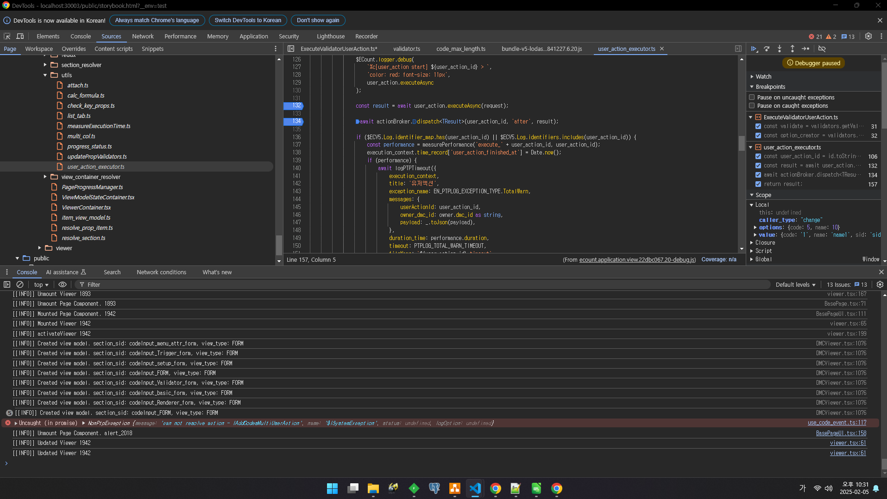
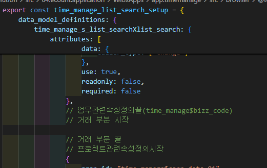

# Daily Retrospective

**작성자**: [나강민]  
**작성일시**: [2025-02-05]

## 1. 오늘 배운 내용 (필수)

### validator 적용 및 확인하는 방법
1. ecstorybook에 접속하여 요구사항에 맞는 validator을 먼저 찾는다.
2. 만약 있다면 해당 validator에 관하여 어떤 유효성 코드를 동작시키는지 찾는다.
3. 이후 나에게 맞는 유효성 코드를 작성하여 적용한다.

### useraction이 안되는 상황
1. useraction을 찾기 위해 user_action_executor에서 executeAsync를 찾는다.
2. useraction_id가 내가 원하는 useraction과 맞는지 확인한다.
3. 만약 테스트라면 MockContextFactory에서 위치를 찾는다.
4. 최종적으로 ActionManager에서 getPath의 map을 확인한다. 

### setup 중 range가 마음대로 그려지지 않는 상황
1. setup을 그리는 도중 화면이 나오지 않거나 값이 적용되었는지 확인하는 방법
2. data_type을 담당하는 validator을 찾아서 value 값들이 제대로 적용되었는지 확인하고 ecstorybook을 참고하여 setup 속성을 다시 적용한다.

## 2. 동기에게 도움 받은 내용 (필수)

setup 가족들인 민준, 승준 주현 항상 감사하고 오늘 없었으면 죽음뿐이였습니다.
성범책임님이 제 옆에 안계셨더라면 눈물만 흘렸을 것입니다. 감사합니다 ㅜ

현철님은 진짜 제 구세주이십니다.. 화면과 기획의도를 알고 계셔서 어떤 질문을 하시더라도 눈높이에 맞춰서 항상 잘 설명해주셔서 감사합니다 

도형님, 건호님은 제가 놓치고 있는 부분들을 캐치해주시고 챙겨주셔서 감사합니다.

수경님 오늘 validator부터 시작해서 유효성 관련된 모든 질문을 받아주시고 처리해주셔서 감사합니다

다은님 유저액션 정리를 저희가 보기 좋게 정리해주셔서 너무 편안했습니다 감사합니다 ㅜㅜ

---

## 3. 개발 기술적으로 성장한 점 (선택)

### 1. 교육 과정 상 배운 내용이 아닌 개인적 호기심을 해결하기 위해 추가 공부한 내용
http://git2.ecount.kr/ecount-doc/ecount-docs/-/blob/master/5.0-manual/000.renewal/006.%20erp%20(input)/ecount-17-presentation/%EA%B9%80%EB%AF%BC%EC%A4%80.md?ref_type=heads

오늘 validator을 적용시키기 위해 찾던 도중 제너레이터의 이해도가 낮아 빠르게 처리하지 못한 거 같아서, 민준님이 만들어주신 자료로 따로 공부했습니다. 

### **Attribute Generator 개념과 동작 방식 정리**

#### **1. Attribute와 Generator의 개념**
Attribute(속성)는 특정 기능을 수행하는 데이터로, 다양한 `ATTR_TYPE`에 따라 여러 시점에서 활용된다. 이 속성들은 `resolver`를 통해 해석되며, 필요에 따라 동적으로 추가되거나 제거될 수 있다. 속성을 추가하는 방법에는 두 가지가 있는데, 하나는 `definition`의 `attributes` 배열에 직접 추가하는 방법이고, 다른 하나는 `generator`를 활용하여 속성을 동적으로 생성하는 방법이다.

Attribute Generator는 이러한 속성을 자동으로 생성해주는 역할을 한다. 개발자는 `usecase.common/attr_generator` 디렉토리 안에서 `I{type}AttrGenerator` 타입의 함수를 정의하여 원하는 속성을 동적으로 만들 수 있다. 주로 UI의 `setup API`에서 활용되며, `setup`에서 `AttrGeneratorProgram`을 호출해 특정 조건에 맞는 속성을 자동으로 생성하는 구조로 되어 있다.

---

#### **2. Attribute Generator의 실행 흐름**
Attribute Generator는 `setup` API에서 실행되며, 특정 `refer_type`과 `menu_type`을 기반으로 속성을 동적으로 생성한다. 이를 위해 `ProgramBuilder`를 사용하여 `IAttrGeneratorProgram`을 실행하고, 특정 `refer_type`에 맞는 속성을 찾아 정의한다.

먼저 `_executeReferTypeGenerator()` 메서드가 실행되면서 속성을 생성할 대상을 결정한다. 이 과정에서 `target_attrs`를 설정하고, 특정 `refer_type`과 `data_model_id`를 매칭하여 속성을 추가할 데이터 모델을 선정한다. 이후 `ProgramBuilder.create`를 이용해 `refer_type_attr_program`을 실행하고, 속성 정보를 `setup`의 `data_model_definitions`에 반영한다.

이 프로그램이 실행되면 `AttrGeneratorProgram` 내부에서 `data_model_definition`과 `prop`을 순회하며 적절한 속성을 찾아 추가하는 작업이 진행된다. 이때, `AttrList.ts`에 정의된 속성 후보군을 참조하여 `refer_type`이 생성할 수 있는 속성을 확인한다. 이후 `generator_selector`가 실행되면서 적절한 `IReferTypeAttrGenerator`를 선택하고, 해당 `generator`를 실행하여 속성을 생성한 후 `definition.attributes`에 추가한다.

---

#### **3. Attribute Generator 내부 동작 과정**
Attribute Generator가 동작하는 과정은 크게 다섯 단계로 나눌 수 있다.

첫 번째로, `data_model_definition`을 순회하면서 각 `prop`을 확인한다. 이를 통해 `refer_type`과 `menu_type`이 속성을 생성할 대상인지 판단하게 된다. 두 번째 단계에서는 `AttrList.ts`에서 `refer_type`이 생성할 수 있는 속성을 찾아 매칭되는 속성 목록을 필터링한다. 예를 들어, `data_dt_no`라는 `refer_type`은 특정 `menu_type`에 대해 `renderer_attrs.blank`, `validator_attrs.limit_date` 같은 속성을 생성할 수 있다.

세 번째 단계에서는 `target_attr`가 `refer_type`이 생성할 수 있는 속성에 포함되는지 확인한다. 만약 대상 속성이 포함되지 않는다면 속성을 생성하지 않는다. 네 번째 단계에서는 `generator_selector`를 이용해 적절한 `IReferTypeAttrGenerator`를 찾는다. 여기서는 `bizz_id`, `refer_type`, `attr_id`, `menu_type` 등의 정보를 활용해 알맞은 `generator`를 선택한다. 마지막 다섯 번째 단계에서는 선택된 `generator`를 실행하여 속성을 생성하고, 그 결과를 `definition.attributes`에 추가한다.

---

#### **4. Attribute Generator의 활용 및 확장**
Attribute Generator는 개발자가 필요한 속성을 동적으로 생성할 수 있도록 유연한 구조를 제공한다. 새로운 속성을 추가하고 싶다면, `target_attr` 및 `target_refer_type`을 설정하고, `IAttrGenerator` 타입의 함수를 작성하면 된다. 이때, `usecase.common/attr_generator` 디렉토리 내에 적절한 네이밍 규칙을 따라 파일을 생성해야 한다. 또한, `AttrList.ts`에서 `attr_refer_type_map`을 수정하여 특정 `refer_type`이 생성할 수 있는 속성을 정의할 수도 있다.

이 방식은 `setup API`에서 동적으로 속성을 생성하는 데 유용하게 사용된다. 예를 들어, 사용자의 설정 정보에 따라 특정 속성을 자동으로 추가하거나 제거할 수 있으며, UI에서 실시간으로 반영할 수도 있다.

---

#### **5. Attribute Generator의 전체 흐름 요약**
Attribute Generator는 속성을 동적으로 생성하는 기능을 담당하며, `setup API`에서 `refer_type`과 `menu_type`을 기반으로 특정 속성을 자동으로 추가하는 구조로 되어 있다. `_executeReferTypeGenerator()`가 실행되면서 속성 생성 대상을 결정하고, `AttrGeneratorProgram`이 실행되어 속성 후보군을 탐색한 후, 적절한 `IReferTypeAttrGenerator`를 찾아 속성을 생성한다. 이후 최종적으로 생성된 속성이 `definition.attributes`에 추가되어 UI에서 활용될 수 있다.

이러한 구조를 통해 개발자는 동적으로 속성을 제어할 수 있으며, 새로운 속성을 추가할 때도 `AttrList.ts`와 `IAttrGenerator` 함수를 적절히 수정하면 쉽게 확장할 수 있다. 결과적으로, Attribute Generator는 속성의 동적 처리를 담당하며, UI 및 데이터 모델의 속성 관리를 자동화하는 데 중요한 역할을 한다.

### 2. 오늘 직면했던 문제 (개발 환경, 구현)와 해결 방법

오늘 정말 다양한 부분들에서 많은 문제들이 생겼습니다. 속성의 값 하나하나가 어떤 역할을하고 수 많은 prop들에 관하여 어떻게 정의하고 어떻게 그려나가야할지 하나하나 찾아보면서 진행하기에 너무 힘들었습니다. 그래서 저만의 방식으로 문제를 해결해나갔습니다. setup의 코드 길이가 현재 1000줄이 넘어가는 상황이 많아지기에 주석처리 규칙을 정했습니다. 

아래 이미지와 같이 prop정의와, 속성정의 부분이 가장중요한 부분이라고 생각했기에 어떤 부분의 속성을 정의하고 prop을 정의했는지 아래와 같은 규칙을 정의하고 작업하여 더 빠르게 setup을 구성할 수 있었던 것 같습니다.

### 3. 위 두 주제 중 미처 해결 못한 과제. 앞으로 공부해볼 내용.
1. 시작일자의 일자형위젯에 관하여 search 일 때 어떻게 처리할건지.
2. 현재 multi_code에 txt max_length validator가 없는데 어떻게 처리할 것인지
3. useraction에서 payload 값의 sid들을 찾아 적용시키기
4. 거래 부분에 대하여 data_model과 table_model을 매칭시키기
5. 검색화면 구성에 대해서 물어보기 등
6. useraction 테스트하기 

---

