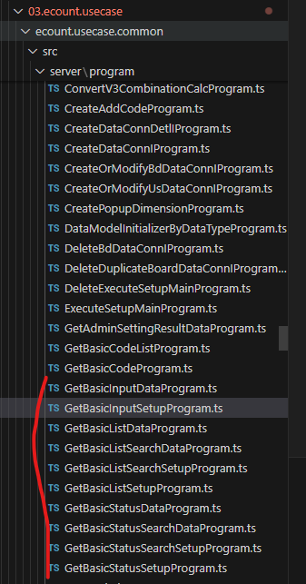

# Daily Retrospective

**작성자**: [박성재]  
**작성일시**: [2025-02-05]

## 1. 오늘 배운 내용 (필수)

## 프로젝트 진행

### 공통 로직 흐름도 작성
팀장님의 요청에 따라 로직을 디테일하게 구현하기 전에 흐름도를 그리고나서 최종 컨펌 후, 
구현하기로 되었습니다. 이에 따라 아래와 같이 공통 로직의 흐름도를 작성하였습니다.

.drawio.png)

- 위와 같이 다른 모듈에서 공통적으로 사용가능한 기능들을 UserAction 딴부터 흐름을 모아놓았습니다.
- 업무에 특화된 기능들에 대한 흐름은 별도로 분리하여 도식화하였습니다. (아직 구현 전)
- 추후에 회사 차원의 가이드 라인이 될 수 있도록 고도화하는 것이 목표입니다.

<br/>

### Setup|Data Action 임시변경 및 하위 프로그램 모듈 위치 변경

#### Setup|Data Action 임시변경

```typescript
executeSync(execution_context: IExecutionContext, request: GetBasicSetupRequestDto): GetBasicSetupResultDto {

        // const program = ProgramBuilder.create<
        // GetBasicSetupRequestDto,
        // GetBasicSetupResultDto
        // >(ISetupActionProgramResolveProgram, context);

        let program = {}as IBaseProgram<GetBasicSetupRequestDto, GetBasicSetupResultDto, IExecutionContext>;

        switch(request.menu_type) {
            case EN_MENU_TYPE.Input: {
                program = ProgramBuilder.create<GetBasicSetupRequestDto, GetBasicSetupResultDto>(
                    IGetBasicInputSetupProgram,
                    execution_context
                );
            }
            break;
            case EN_MENU_TYPE.List: {
                program = ProgramBuilder.create<GetBasicSetupRequestDto, GetBasicSetupResultDto>(
                    IGetBasicListSetupProgram,
                    execution_context
                );
            }
            break;
        // ...

        }
```
기존에 구현했었던 `SetupActionProgramResolveProgram`의 경우 팀장님께 컨펌 받았을 때, 좀 더 고민해보시겠다는 말씀을 들었습니다. 이에 따라 팀 차원의 테스트를 위해, 일시적으로 하위 프로그램을 분기처리하여 매칭시키도록 변경했습니다.

### 하위 프로그램 모듈 위치 변경



- 위에서 직접 하위 프로그램인 `GetTimeManageInputSetupProgram`을 매칭시키려고 보니 참조가 불가능했습니다.
- 확인해보니 프로젝트에서 모듈 간의 레벨이 존재했고, 현재 구현한 `Action`의 위치는 `common`이었습니다. `common` 모듈은 최상위 모듈로서 `base` 모듈을 제외한 다른 모듈 참조가 불가능했습니다.
- 이에따라 팀장님의 요구사항을 다시 이해해보았는데, `common` 모듈에 우선 `Basic` 네이밍으로 만들어두고 테스트 실행 후, 추후 리펙토링을 진행하자고 하시는 방향으로 다시 이해하였으며, 프로그램들의 모듈 이동을 진행했습니다.

<br/>

## 2. 동기에게 도움 받은 내용 (필수)

#### 김도형 선임
오늘도 함께 프로젝트 진행을 하며 도식도를 그렸으며, UI부터 Server단 까지 공통화를 위한 여러가지 고민들을 진행했습니다. 이후 팀장님께 컨펌받으며 프로젝트를 진행하였습니다.

#### 김승준 선임
함께 저녁밥을 먹으며 작지만 소소한 행복을 즐겼습니다.

---
