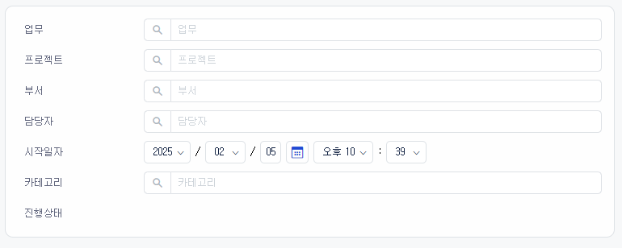
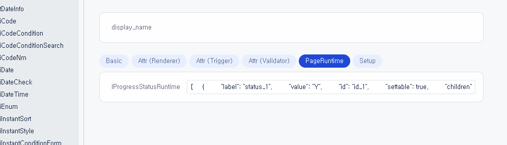
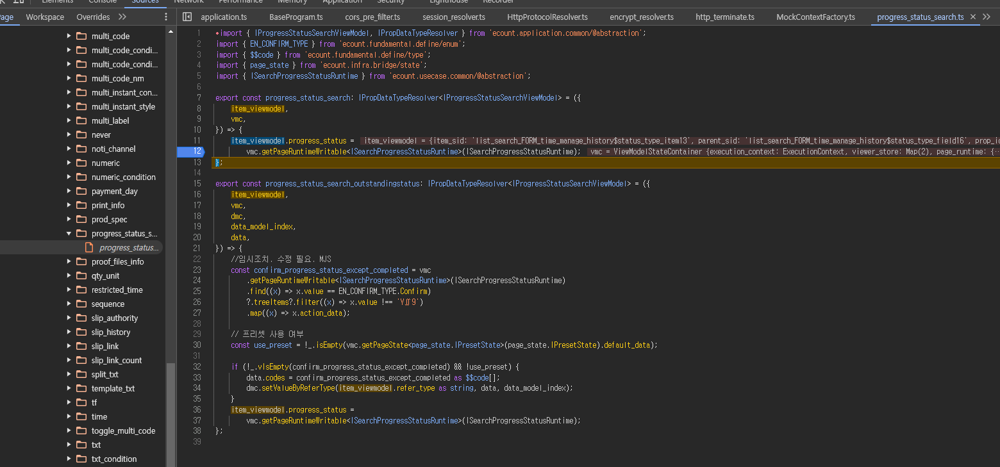
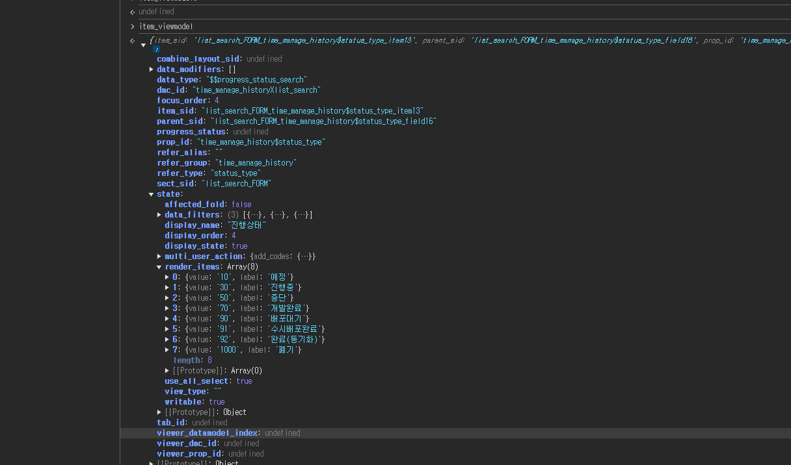

# Daily Retrospective

**작성자**: [박주현]  
**작성일시**: [2025-02-05]

---

# 2. 동기에게 도움 받은 내용

승준, 민준, 강민님과 setup ui 화면 구현을 서로 상의하면 문제를 해결했습니다. 서로 약간씩 다른 업무이지만, 상의할 수 있는 내용이 많아, 서로 의견을 주고 받으며 해결했습니다.

그룹웨어의 기능 명세를 모호하여 다은님과 현철님께 물어보면 명세에 이카운트 메뉴 항목들의 위치와 기능들에 대해 배웠습니다. 다은님껜 서치 화면을 구성하는 각각의 항목들이 5.0 으로 구현된 다른 비즈의 다른 메뉴에서 어딜 참고할 수 있는지 배웠고, 서치의 애매 모호한 항목들의 명세를 방향결정에 여쭤봐주셔서 작업이 좀더 명확해졌습니다.

현철님이 erd 설계와 data_model_template에서 모호한 점을 설명해주시고, 높은 책임님들께 여쭤봐 답을 찾아주셨습니다.

---

# 3. 개발 기술적으로 성장한 점

## 3-3. 위 두 주제 중 미처 해결 못한 과제. 앞으로 공부해볼 내용.

### 시간관리이력 조회 - 서치 / 진행 상태 ui 에러

현재 시간관리이력 조회 - 서치 setup 을 구현하면서 위 사진과 같이 라벨이 나와야 합니다. 위 진행 상태는 `판매 현황`의 검색 페이지 항목입니다.

setup json 명세를 하고 화면에 띄웠지만 다른 항목들은 잘 나타나는데 진행 상태의 라벨들만 나타나지 않았습니다.

에러가 나타나는 모습은 위와 같습니다. `판매 현황` 의 `진행상태`의 prop 과 attr 을 모두 똑같이 해줬는데도 나타나지 않았습니다.

`ECStoryBook` 을보면 각 항목의 ui 화면을 볼 수 있습니다.

위와 같이 display_name 만 있고 옆에 라벨은 없는 걸 확인할 수 있습니다. 그리고 라벨들은 `ProgressStatusRuntime` 을 통해 동적으로 가져올 수 있는 걸 추측해볼 수 있었습니다. 하지만 `IProgressStatusRuntime.ts` 파일이나 `IProgressStatusRuntime.ts` 파일은 찾아 볼 수 없었습니다.

대신 ProgressStatus 에서 쓰이는 `progress_status_search.ts` 파일을 찾았습니다. 결과 값인 `item_viewmodel` 디버깅해보았습니다.

그 결과 `item_viewmodel` 에 제가 넣어둔 라벨들이 잘 들어 있는 걸 확인했습니다. 하지만 웹페이지에서는 렌더링 되고 있지 않았습니다.

지금은 test 폴더에서 test 소스 파일로 뷰페이지를 확인하고 있습니다. 테스트파일이기에 정상작동을 안하는 것인지, 아니면 제가 다른 곳에서 무언갈 빼먹었는지 에러를 아직 해결하지 못했습니다.

---

# 4. 소프트 스킬면에서 성장한 점

방향 결정을 통해 모호한 명세를 유림님과 수민님께 여쭤보는 이카운트 개발자스러운 협업 실력을 키웠습니다.

# 5. 제안하고 싶은 내용

신입 개발 교육이 끝나고 이제부터는 실제 프로젝트에 도입을 했습니다. 어제도 기능 구현에 매진하여 10시 30분까지 몰두했습니다. 회고록 작성을 할 시간이 부족하다 못해, 없는 것 같습니다. 회고록의 취지는 학습내용 정리 및 성장점 회고라고 생각합니다. 실질적인 프로젝트에 도입한 지금, 회고록 작성 시간보다 더 중요하다고 볼 수 있는 프로젝트 몰두 시간이 확보되었으면 좋겠다고 생각합니다. 또한 현상황에서 시간에 쫓겨 회고록을 작성하니 퀄리티 또한 낮아질 수 밖에 없습니다.

기존에 4시 이후 회고록 작성시간이 확보가 되었다면, 지금은 10시 반까지 기능 구현에 모든 분들이 함께 몰두하고 있습니다. 회고록 작성 시간을 아껴 기능 구현에 더 많이 시간을 쏟고 싶습니다.

성준 팀장님께서 앞으로 2시간 이상 걸린 디버깅 또는 에러 해결을 글로 작성하여 깃에 올려 팀원과 공유하도록 하셨는데, 이런 글 작성이 회고록을 대체할 수 있다고 생각합니다. 겪은 에러 및 해결점, 소구점 등을 팀원과 함께 나눌 수 있다고 생각합니다.
