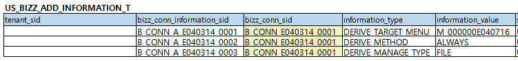

# Daily Retrospective

**작성자**: [최현철]  
**작성일시**: [2025-02-05]

## 1. 오늘 배운 내용 (필수)

### 항목세트 / 항목 / 연결관계(파생) / 파생설정 데이터 마이그레이션 준비

- 항목세트 (US-BIZZ_ITEM_SET_M) : 시간관리-상단, 시간관리-이력부속상단, 시간관리이력-상단 3개 항목세트 추가
  
- 항목 (US_BIZZ_ITEM_M) : 위 3개의 항목세트에 속한 항목들 추가
  

- 연결관계 (US_BIZZ_CONN_I) : '시간관리 > 이력' 파생 연결관계 추가
  
- 파생설정 (US_BIZZ_ADD_INFORMATION_T) : 위 파생 연결관계에 대한 파생설정 추가 (항상 파생, 매핑정보는 파일로관리)
  

### 파생 구현 중 발생한 의문점 정리

▣ data_model_template에 history 생성

- 작업 내용 요약 : 부속 데이터모델 생성을 위한 템플릿 작성

- 작업 경로 : ecount.solution\src\03.ecount.usecase\ecount.usecase.timemanage\data_model_template\history\history.ts

▶ 문제인식 : 이력은 1개의 별도 고정형 업무로 분리되었기 때문에, 모든 모듈 내 모든 업무가 파생하는 이력의 구조는 동일할 것. 그런데 모듈마다 이력관련 데이터모델템플릿을 모두 만들어 줘야 하는가 ?<br>
파생V2 적용할 때마다 모듈별로 똑같은 파일을 만들어주기보다는 하나의 파일로 같이 쓸순 없을까 ?

▶ 예상원인 : 'slip_history_array' Object에서 데이터모델 identifier를 위해 'history_input' 데이터모델을 import 해야함.<br>common에 있는 데이터 모델은 참조불가, 해당 모듈 내에 데이터모델이 존재해야함.

```typescript
import {
  EN_BIZZ_OBJECT_ALT_DATA_MODEL_ID,
  EN_DATA_MODEL_ID,
} from "ecount.fundamental.define/enum";
import { BizzUtil, IBizzObjectDefinition } from "ecount.infra.base/abstraction";
import { history_input } from "../../../data_model/history"; //★★★★★★★★
import { bizz_definition } from "../quotation_bizz_definition";

/** 견적서 전표이력 부속 Input Definition */
BizzUtil.setObject(bizz_definition, {
  object_id: EN_DATA_MODEL_ID.SlipHistoryArray,
  data_models: [
    {
      alt_data_model_id: EN_BIZZ_OBJECT_ALT_DATA_MODEL_ID.history,
      data_model_identifier: history_input, //★★★★★★★★
      target_props: [
        "record_sid",
        "data_sid",
        "bizz_sid",
        "target_bizz_sid",
        "target_data_sid",
        "target_record_sid",
        "target_menu_sid",
        "target_data_input_type",
        "target_confirm_type",
        "target_progress_status",
        "target_data_dt",
        "target_data_no",
        "title",
        "act_type",
      ],
    },
  ],
} as IBizzObjectDefinition);
```

▶ 해결방법 (예상) : common에 있는 데이터모델을 다른 모듈에서도 참조할 수 있도록 프레임워크 참조구조 변경<br>이력뿐만 아니라 여러 모듈, 여러 업무에서 하나의 고정형업무로 데이터를 넣어줘야 한다면, 해당 고정형업무는 common에 놓고 하나로 쓰는 구조가 필요하지 않을지.<br>추후 발신업무를 개발하게되면, common에 데이터모델로 모든 모듈에서 참조해서 쓸 수 있을 것임.<br>(= 발신업무 적용 시에도 동일한 문제 발생 예상 = 모듈별로 발신업무 데이터모델 존재해야함)

▣ 부모 data_model_template에 부속 입구항목 추가

- 작업 내용 요약 : 부모 템플릿 'time_manage_single.ts'의 prop에 부속 입구항목 'slip_history_array' 추가 + dto 작성

- 작업 경로

  1.  ecount.solution\src\03.ecount.usecase\ecount.usecase.timemanage\data_model_template\time_manage\time_manage_single.ts

  2.  ecount.solution\src\03.ecount.usecase\ecount.usecase.timemanage\src\@shared_usecase_timemanage\@abstraction\dto\ITimeManageSubArrayForSlipHistoryDto.ts

▶ 문제인식 : 'ITimeManageSubArrayForSlipHistoryDto'를 또 만들지 않고, 'ISubArrayForSlipHistoryDto' 하나로 같이 쓰면 안될까 ?

▶ 예상원인 : 해당 dto는 부모 'history_input' 데이터모델의 배열 타입을 가짐. 이전 문제와 동일하게 common에 있는 데이터모델을 참조할 수 없기 때문에 dto도 뜯어낼 수 밖에 없었음.

```typescript
import { history_input } from "../data_model/history"; //★★★★★★★★

export interface IInventorySubArrayForSlipHistoryDto {
  master?: history_input[]; //★★★★★★★★
}
```

▶ 해결방법(예상) : 첫번째에 작성한 해결방법과 동일.

## 2. 동기에게 도움 받은 내용 (필수)

건호님께서 git 최신화에 대해 관리해주셔서 편하게 개발에 집중할 수 있었습니다.

강민님꼐서 prop_group에 대한 개념으로 질문주셨었는데, 저도 해당 개념을 몰랐습니다.
추후에 강민님께서 따로 알아보신 후에 개념을 설명해주셔서 브라우저에서 위젯을 표현할 때 묶기위해 필요하다는 개념이라는 것을 알게되었습니다.

날씨가 많이 추웠는데 도형님께서 따뜻한 국밥과 커피를 사주셔서 따뜻하게 보낼 수 있었습니다.

---
