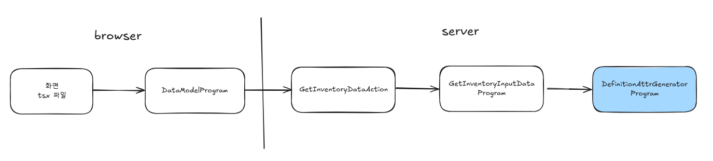

# Daily Retrospective

**작성자**: [황주원]  
**작성일시**: [2025-02-05]

## 1. 오늘 배운 내용 (필수)
### Validator 종류
validator를 적용할 수 있는 방법은 총 5가지입니다.

1. data model
    - object 에서 정의된 부분의 속성 가져와 체크
2. decorator
    - server 단 집입점 체크
    - `@_authorize(undefined, GetInventoryDataAction.getAuthorizeData)` 해당 부분에 해당된다.
3. 속성 (inventory attr map)
    - pre / post 시점 체크
4. slip 속성 (inventory attr map)
    - pre / post 시점 체크
5. useraction
    - browser 단 진입점 체크


### Validator vs Option_Creator Validator
| 구분           | Validator           | Option_Creator Validator                                              |
| -------------- | -------------- | --------------------------------------------------- |
| 다루는 영역  |   비즈니스 로직  | 데이터 |
| 설명 예시 | "내 값은 로직에서 알 수 있다."   |   "다른 정보가 필요한 경우 만들어주는 역할"   |
|  다루는 값   |  넘어온 값 |     넘어온 값 중 특정 항목들     |
| 생성 기준 |     비즈니스 로직마다 달라지면       |       데이터마다 달라지면          |

<br />

> 생성기준이 조금은 모호한 부분이 있다고 생각합니다. 현재 구현에 있어서는 막히지 않을 것 같은데, 추후에 더 자세히 파악해 보고 싶습니다.

## 2. 동기에게 도움 받은 내용 (필수)
* 유효성 파트너 수경님 .. 서로 모르는 부분, 디버깅 같이 하고 싶은 부분을 함께 해주셔서 감사합니다.
* 다은님께서 이카운트 기능과 전자결재 관련 도움 주셨습니다. 감사합니다!
* 도형님께 간간히 질문 하고 있는데 친절히 알려주셔서 감사합니다 ~ !

---

## 3. 개발 기술적으로 성장한 점 (선택)

### 1. 교육 과정 상 배운 내용이 아닌 개인적 호기심을 해결하기 위해 추가 공부한 내용
#### attr map 호출 과정
아래 흐름을 탄 후, DefinitionAttrGeneratorProgram 에서 해당 attr_map 을 가져오는 것 같다.



```ts
const bizz_attr_map: string[] | undefined =
    definition_attr_for_bizz[`${bizz_id}_attr_map` as keyof typeof definition_attr_for_bizz]?.[
        dto.action_mode
    ] ||
    definition_attr_for_bizz[`${bizz_type}_attr_map` as keyof typeof definition_attr_for_bizz]?.[
        dto.action_mode
    ];
```

### 2. 오늘 직면했던 문제 (개발 환경, 구현)와 해결 방법
#### 2-1. Validator vs Option_Creator Validator
두 방식의 차이와 어떤 방식으로 나누고 있는지 궁금했는데, 수경님이 팀장님께 질문해 주셔서 알 수 있었습니다. <br />
해당 답변은 1. 오늘 배운 내용에 정리했습니다.


### 3. 위 두 주제 중 미처 해결 못한 과제. 앞으로 공부해볼 내용.
* inventory_attr_map (slip)

---

## 4. 소프트 스킬면에서 성장한 점 (선택)
* 디버깅 실력이 나날이 성장하고 있습니다. 