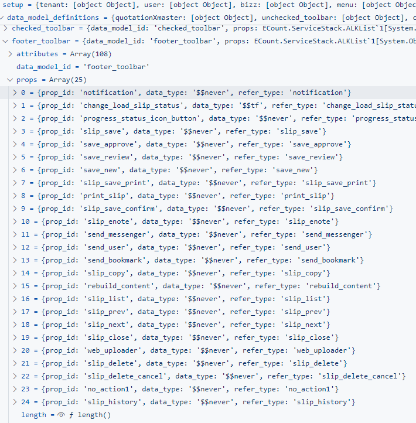

# Daily Retrospective

**작성자**: 고건호
**작성일시**: 2025-02-06

 

## 1. 오늘 업무 내용

- `button_filter_program` 정리

 

### `button_filter_program` 정리

#### 성준 팀장님의 요구 사항 정리

> 단순한 업무(버튼 적은)들이 활용할 수 있는 로직 구현하기 + `견적`, `판매`와 같은 복잡한 업무(버튼 많은) callback 적용시켜보기

`시간 관리 업무`와 `시간 관리 이력 업무`는 공통적으로 신규 입력, 수정 조회(미삭제 항목), 수정 조회(삭제 항목)에 입력 창을 띄웁니다.

공통으로 띄워지는 입력 창의 `footer_toolbar`에 `action_mode`에 따라 보여줘야 할 버튼과 보여줘야하지 말아야 할 버튼은 아래와 같이 정리했습니다.

 

##### 시간 관리 업무

- **신규**

  - 비행기
  - 저장
    - 저장/내용유지
    - 저장/신규
  - 다시작성
  - 닫기

 

- **수정 조회(미삭제 항목)**

  - 비행기
  - 저장
    - 저장/내용유지
    - 저장/신규
  - 다시작성
  - 닫기
  - 삭제
  - H

 

- **수정 조회(삭제 항목)**

  - 저장
  - 닫기
  - 삭제 취소

 

##### 시간 관리 이력 업무

- **신규**

  - 저장
    - 저장/내용유지
    - 저장/신규
  - 다시작성
  - 닫기

 

- **수정 조회(미삭제 항목)**

  - 저장
    - 저장/내용유지
    - 저장/신규
  - 이전
  - 닫기
  - 삭제

 

- **수정 조회(삭제 항목)**

  - 저장
  - 닫기
  - 삭제 취소

 

현재 `time_manager_history_input_setup`과 `time_manager_input_setup` 내에서 사용할 버튼들을 정의한 부분은 아래와 같습니다.

 

- `time_manager_input_setup`

  

 

- `time_manager_history_input_setup`

  

 

확실히 `재고`나 `판매` 쪽 보다는 버튼의 수가 적은 것을 알 수 있었습니다.

`시간 관리 업무`나 `시간 관리 이력 업무` 외에도 사용될 수 있는 `button_filter_program`을 만들기 위해서는 보다 구체적인 흐름을 파악해야 할 것 같아 오늘은 남은 시간 동안 `견적서 입력`의 `Setup API` 흐름을 가려질 버튼이 정해지는 방식과 어떻게 가려지는지에 대해 정리해봤습니다.

 

아래는 `견적서 입력`에서 호출되는 `GetInventoryInputSetupProgram`에서 생성되는 `setup` 객체의 `footer_toolbar` 데이터 모델에 담기는 `prop`의 개수입니다.

 

 

해당 `setup` 객체는 `load_setup`에서 `Data API`를 거쳐 반환된 `data`와 병합됩니다.

이후 브라우저 단의 `inventory_input`의 `_buttonFilter()` 함수에서 `action_mode`에 따라 `refer_type_by_action_mode`에 값이 담기게 됩니다.

아래는 현재 `견적서 입력` 흐름에서 `refer_type_by_action_mode`에 담기는 값입니다.

 

 

이후 로직을 타고 실행되다가 `_buttonFilterByReferType()` 함수에 파라미터로 `setup`, `footer_toolbar`, `target_refer_type`, `false`를 넣어주는 아래의 코드를 볼 수 있습니다.

 

 

`target_refer_type` 변수를 `delete_target_refer_types`로 받아주는 것에서 확인할 수 있듯이, 아래의 코드는 화면에 표시하지 않을 버튼에 `attribute`를 추가해주기 위한 로직입니다.

 

> `isDelete`가 `false`일 경우 서버에서 내려온 설정 적용이라는 부분은 아직 잘 이해하지 못했습니다.

 

이후 최종적으로 확인 가능한 `setup`에 담긴 `data_model_definitions` 중, `footer_toolbar`에 할당된 `attributes` 배열을 확인하면, 아래와 같이 `attribute`들이 새로이 추가된 것을 확인할 수 있습니다.

 

> 현재 `no_action1`이 중복으로 할당되어 있는데, 이유는 아직 잘 모르겠습니다.

 

추가된 15개의 `attribute`들을 잘 살펴보면, `prop_id`가 앞서 확인했던 `refer_type_by_action_mode`에 담긴 값들과 동일한 것을 확인할 수 있습니다.

 

최종적으로 `setup.data_model_definitions.footer_toolbar.props`에 담긴 값은 아래와 같습니다.

 

 

## 2. 동기에게 도움 받은 내용 (필수)

동기들과 오붓하게 3층에서 다 함께 치킨을 시켜 먹으며 즐거운 시간을 보냈습니다.
