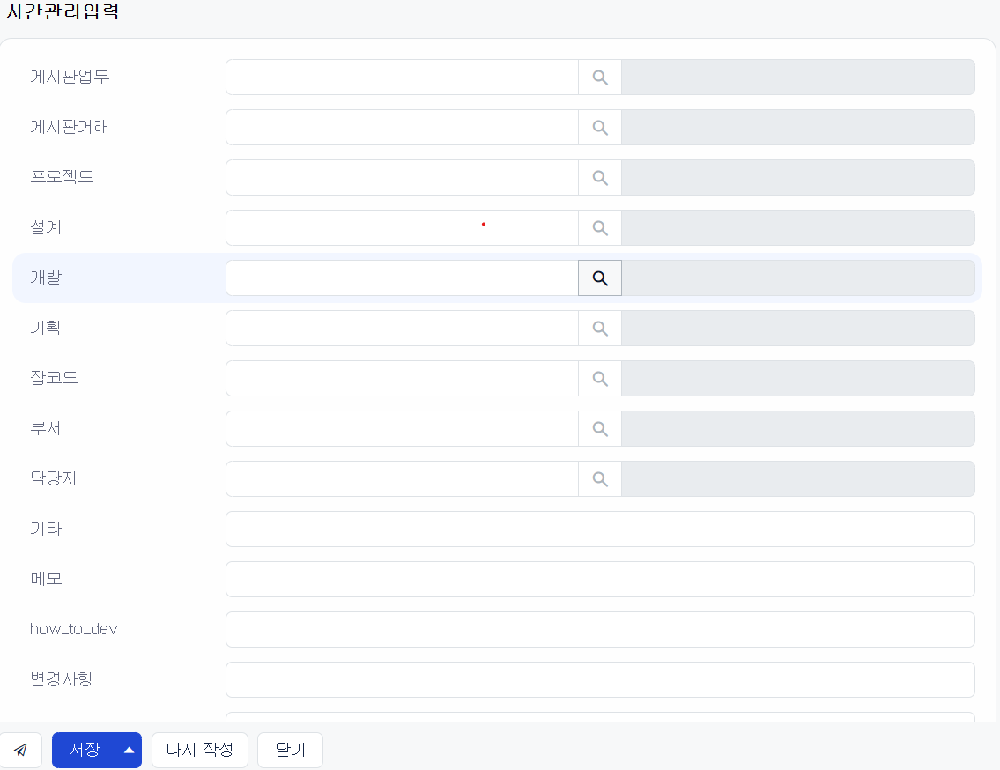

# Daily Retrospective  
**작성자**: [김민준]  
**작성일시**: [2025-02-06]  

## 1. 오늘 배운 내용 (필수)  

**테스트 환경에서는 `user_action`을 가져올 수 없다**
- `https://zeus05ba-dev.ecount.com/ECERP/V5/app.timemanage/{ui_path}?ec_req_sid={my_req_sid}&__v5domains=test`를 통해 접근하면
- `MockContextFactory`를 타지 않고 `ExecuteContextFactory`를 타면서 
- `moduleName`이 바뀌지 않아 구현체를 가져올 수 있었다.

**시간관리입력에 대한 이해**



- 게시판업무
    - 실제 해야할 job에 대한 정보
- 프로젝트
    - 프로젝트 게시판의 전표와 연결
- 설계
    - 설계 게시판의 전표와 연결
- 개발 
    - 개발 게시판의 전표와 연결
- 기획
    - 기획 게시판의 전표와 연결

## 2. 동기에게 도움 받은 내용 (필수)

- **승준님**과 입력화면과 조회화면에 대한 참고 ui를 공유했어요.
- **강민님**이 vscode에서 node(jest)가 지속적으로 돌아가는 문제에 대해서 같이 고민해주셨어요.
- **성재님**과 브라우저 단의 `bizzManager`가 bizz_definition을 어떻게 등록하는지 디버깅을 같이 해봤어요.
- **도형님**과 저장 `UserAction`이 `menu_definition`을 찾지 못하는 문제를 같이 고민했어요.

## 3. 개발 기술적으로 성장한 점 (선택)
아래의 3가지 주제 중 하나를 선택하여 작성합니다.

### 1. 교육 과정 상 배운 내용이 아닌 개인적 호기심을 해결하기 위해 추가 공부한 내용
### 2. 오늘 직면했던 문제 (개발 환경, 구현)와 해결 방법

**user_action을 찾지 못하는 문제 v2**
- 어제 `moduleName`이 원인으로 구현체를 찾지 못하는 문제가 있었습니다.
- 이번에는 map 자체에 user_action이 들어있지 않았습니다.

```ts
// D:\ecxsolution\ecount.nextv5\ecount.solution\src\04.ecount.application\ecount.application.features\src\browser\action\ActionManager.ts
async initializeAsync(versionMap: IVersionMap): Promise<action.IActionManager<TContext>> {
		const config = GET_APPLICATION_CONFIGURATIONS().config;
		const version = versionMap[`version.ecount.builder.map.user_action`];
		const map = await (
			await ECFetch(
				`${config.APPLICATION_ROOT_PATH}${config.MODULEROOT_PATH}/ecount.builder.map/user_action/user_action_impl.${version}.json`
			)
		).json();
    // ~~~
}
```
- 위 코드를 분석했을 때 산출물의 user_action_impl.${version}.json에 user_action이 매핑되어 있는 것을 확인할 수 있었습니다.

```json
// user_action_impl.9216870405704416.20.json
{
  "IOpenJournalDefaultPopupUserAction": [
    {
      "key": "OpenJournalDefaultPopupUserAction",
      "path": "app.account/user_action",
      "type": "user_action",
      "default": false
    }
  ],
  "IAddJournalGridRowUserAction": [
    {
      "key": "AddJournalGridRowUserAction",
      "path": "app.account/user_action",
      "type": "user_action",
      "default": false
    }
  ],
  "IMoveJournalGridRowUserAction": [
    {
      "key": "MoveJournalGridRowUserAction",
      "path": "app.account/user_action",
      "type": "user_action",
      "default": false
    }
  ]
  // ~~~ 생략
}
```
- 그러나 위 파일에 해당하는 `UserAction`이 존재하지 않는다는 것을 파악했고
- 먼저 `index.ts`에 정의하지 않았을까 추론을 했었는데 정말 index에 `export`를 작성하지 않은 것을 확인할 수 있었습니다.

### 3. 위 두 주제 중 미처 해결 못한 과제. 앞으로 공부해볼 내용.

**`bizz_definition`은 언제 `bizz_manager`에 등록되는 것일까?**
- 오늘 bizz_sid와 menu_sid가 있음에도 불구하고 `bizzManager.getMenuDefinition`을 통해 `menu_definition`을 가져오지 못하는 문제가 있었습니다.

**server**
- `bizz_all`이라는 객체를 가져와서 `bizz_definition`을 등록할 것이라는 것을 예측할 수 있다.
```ts
// 
const factory = new (class ExecutionContextFactory extends ContextFactoryBase<
	IExecutionContext,
	ExecutionContext
> {
    // ~~~
		$FeatureCollection.set(
			manager.IBizzManager.feature_id,
			new BizzManager(bizz_all, undefined, globalMemcacheManager, dm_mgr, { bizz_manager_enable_cache: true })
		);
    // ~~~
}
```
- bizz_all에 `bizz_definition` 객체를 그대로 들고오는 것을 확인할 수 있다.

```ts
export const bizz_all = [
	// 기타
	{ definition: slip_relation.slipRelationBizzDefinition, bizz_sid: 'slip_relation' },
	{ definition: file_attach.FileAttachBizzDefinition, bizz_sid: 'file_attach' },
	{ definition: discount.DiscountBizzDefinition, bizz_sid: 'discount' },
	{ definition: serial_inventory_mapping.SerialInventoryMappingBizzDefinition, bizz_sid: 'serial_inventory_mapping' },
	{ definition: notification.NotificationBizzDefinition, bizz_sid: 'notification' },
	{ definition: bizz_setting.BizzSettingBizzDefinition, bizz_sid: 'B_000000E200982' },
    // ~~~ 생략
]
```

- 서버에서는 정상적으로 들고 올 것으로 보입니다. 하지만 `browser`에서는 `menu_defintion`을 가져올 수 없었습니다.
    
브라우저에서는 `bizz_manager` feature를 생성할 때 서버에서 처럼 `bizz_all` 같은 객체를 넣어주지 않고 `globalMemcache`라는 것을 사용하는 것으로 추측되나 아직 정확한 답을 얻지는 못하였습니다.

## 4. 소프트 스킬면에서 성장한 점  (선택)  
- 동기분들의 문제를 같이 고민하면서 `bizzManager`나 `user_action` 구현체를 결정하는 과정을 더욱 깊게 알게된 것 같습니다.

- 너무 깊게 파는 것도 좋지만 빠르게 질문해서 해결해야할 문제도 있다고 느꼈습니다. 어느정도 깊게 파야하고 질문해야할지 조금 더 생각해봐야할 것 같습니다.