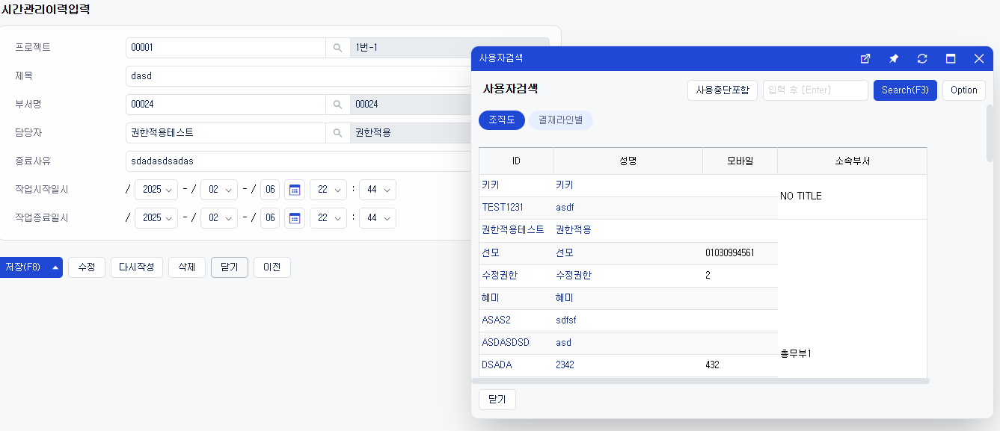
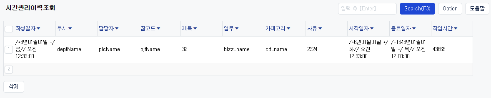

# Daily Retrospective

**작성자**: [김승준]  
**작성일시**: [2025-02-06]

## 1. 오늘 배운 내용 (필수)

-   시간관리이력입력창 setup을 만들었습니다.
    

-   시간관리이력조회창 setup을 만들고 있습니다.
    

## 2. 동기에게 도움 받은 내용 (필수)

-   주현님께서 디버깅에 도움을 주셨습니다.
-   민준님께서 setup 데이터를 참고할 소스를 찾는 걸 도와주셨습니다.
-   강민님께서 setup 테스트 환경을 우회하는 걸 알려주셨습니다.

---

## 3. 개발 기술적으로 성장한 점 (선택)

아래의 3가지 주제 중 하나를 선택하여 작성합니다.

### 1. 교육 과정 상 배운 내용이 아닌 개인적 호기심을 해결하기 위해 추가 공부한 내용

-   [cannot Resolve userAction](#cannot-resolve-useraction)

### 2. 오늘 직면했던 문제 (개발 환경, 구현)와 해결 방법

-   어제 하루종일 디버깅을 통해 test환경에서는 moduleName을 강제로 주입해주기 때문에 팝업창이 제대로 뜨지 않는 문제를 확인했습니다.<br>하지만 테스트 환경이 아닌 상황에서는 moduleName을 강제로 주입시키지 않기 때문에 오류가 나지 않습니다.
-   예를 들어 `@test/.../input.ui.tsx` 파일을 `presentation/input.tsx`로 위치시킨 후 <br>
    `https://zeus05ba-dev.ecount.com/ECERP/V5/app.timemanage/input?ec_req_sid=BA-ES2GUvVE58Q!*&__v5domains=test&MENU_TYPE=I&prg_id=E201767&bizz_id=time_manage_history`<br>
    와 같이 직접 호출할 경우 제대로 동작했습니다. 이 경우 bizz_id 등 다른 데이터도 직접 넣어서 테스트 할 수 있습니다.

### 3. 위 두 주제 중 미처 해결 못한 과제. 앞으로 공부해볼 내용.

## 4. 소프트 스킬면에서 성장한 점 (선택)

-   어제 하루 종일 디버깅을 통해 구조에 대한 이해도를 높였지만, 일을 함에 있어서는 너무 깊게 파는 것이 좋지 않다는 것을 느꼈습니다.<br>
    물론 아직 처음하는 프로젝트이기 때문에 이것이 내가 소스를 잘 못 짜서 그런건지, 아닌지를 파악하지 못하기 때문에 파고들어야 할지 말아야할지 경계가 모호해져 많은 시간이 걸리는 것 같습니다.
-   개인이 개발 실력 관점에서는 파고드는 것이 좋은 것이지만, 회사와 동료의 입장에서는 일을 빨리 처리해주는 것이 중요하기 때문에 담당자분께 빠르게 질문을 할 수 있어야겠다는 생각을 했습니다.

---

# 학습내용

## cannot resolve userAction

1. 저장 버튼 클릭시 cannot resolve userAction 오류가 발생했습니다.

2. 브라우저에서 userAction의 인터페이스 파일은 존재하지만 구현체 파일이 존재하지 않는다는 것을 확인했습니다.

3. 디버깅을 통해 `actionManager.ts` 에서

```ts
	getPath(id: string | UserActionIdentifier, moduleName?: string): action.IActionManagerImplInfo | undefined {
		const actionId = UserActionIdentifier.string(id);

		if (!this._map[actionId]) {
			return;
		}

		return this._map[actionId].implements?.[moduleName as any] ?? this._map[actionId].implements?.['app.common'];
	}
```

\_map 파일에서 해당 actionId가 매핑되지 않는다는 것을 확인했습니다.

4.

```ts
const map = await(await ECFetch(`${config.APPLICATION_ROOT_PATH}${config.MODULEROOT_PATH}/ecount.builder.map/user_action/user_action_impl.${version}.json`)).json();
```

에서 맵을 가져오는것을 확인했습니다.

5. 산출물에서부터 매핑이 되지 않는다는 것을 발견하고 빌드가 제대로 되지 않고 있다는 것을 확인했습니다.

6. 각 파일들의 index를 확인한 결과 index 누락으로 인한 문제였음을 확인했습니다.
