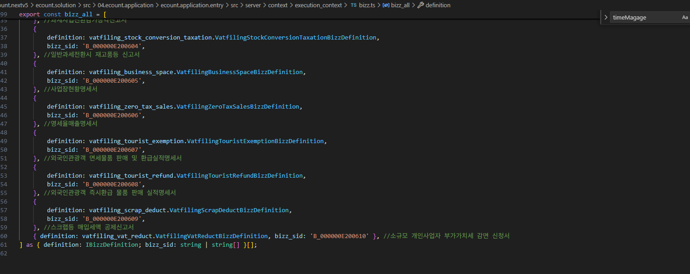
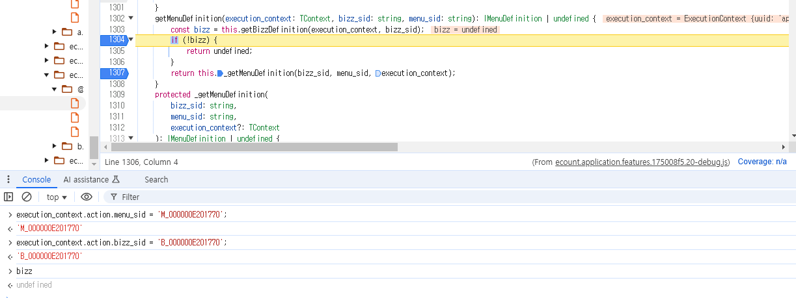

# Daily Retrospective

**작성자**: [박성재]  
**작성일시**: [2025-02-06]

## 1. 오늘 배운 내용 (필수)

- 확인의 개념
- Delete, BulkDelete의 처리
- 공통 로직 다듬기

<br/>

### 확인의 개념
- `확인`이라는 기능에 대해 처음 접해보았습니다. `진행상태` 등과 같은 `상태`의 개념들은 하나의 전표 아래에서 `확인`이라는 상태 하위에 존재하는 개념으로 대부분 업무에서 존재하고 있었습니다.
- 전표들의 상태를 변경한다는 것은 이미 그 데이터를 한번 `확인`해봤다는 의미의 데이터입니다.
- 따라서 `상태변경`의 개념은 반드시 `확인` 후에 존재할 수 있습니다.
- 이 때문에 `상태변경`의 개념이 `확인`이라는 개념 하위에 존재한다는 것입니다.

### Delete, BulkDelete의 처리
성범 책임님과 팀장님과 많은 대화를 나눈 끝에 BulkDelete는 `Browser` 딴에서는 분기하여 요청받되, 서버에서는 하나의 다건삭제 하나만 처리하는 방식으로 설계하도록 결정되었습니다.

이러한 흐름에서는 서버 로직에서 `ExecuteSetupmainProgram`을 호출하는 로직을 여러번 사용하는 상위 프로그램이 존재해야했습니다. 이에 따라 해당 상위 `Program`을 흐름 상에 추가하게되었습니다.

### 공통 로직 다듬기
이 외에도 공통 로직을 보다 유지보수에 유리하도록하려면 어떻게해야할지 다양한 고민을 진행하였으며, 앞으로도 계속 개선해볼 예정입니다.

### 도식도 다듬기
5.0 공통 로직의 흐름을 아래와 같이 최신화하여 다듬었습니다.

2.drawio.png)

<br/>

## 2. 동기에게 도움 받은 내용 (필수)

#### 김도형 선임
오늘도 프로젝트를 함께 진행하며 많은 것을 논의했습니다.

#### 김승준, 김민준 선임
`menu_definition`을 못찾는 문제에 대해 함께 깊이 파고들어 공부해보았습니다.

---

## 3. 개발 기술적으로 성장한 점 (선택)

### 1. 교육 과정 상 배운 내용이 아닌 개인적 호기심을 해결하기 위해 추가 공부한 내용

### 2. 오늘 직면했던 문제 : (Browser) ExecuteSetupMainProgram에서 menu_definition을 못찾는 문제

```typescript
export class ExecuteSetupMainProgram {
    // ...

    private _onInit() {
        // ...

        this.menu_definition = definition_feature.getMenuDefinition(
			this.execution_context,
			this.execution_context.action.bizz_sid,
			this.execution_context.action.menu_sid ?? (this.execution_context.action.menu_type as string)
		) as IMenuDefinition;

        // ...
    }
}
```

### 문제 상황

이번에 프로젝트를 진행하게되면서, 처음으로 `browser` 단에서 `ExecuteSetupMainProgram`을 사용하여 로직을 돌려보았습니다. 로직을 돌릴 때의 핵심 로직은 서버의 `Api`를 호출하는 로직입니다.

이 때, 넘겨주는 데이터로 `menu_definition`에 존재하는 속성들을 넘겨주게되는데, 여기서 `menu_definition`이 `undefind`로 넘어오는 문제가 발생하였습니다.

<br/>

### 원인 파악

이에 따라 `menuDefinition`을 찾아오는 `getMenuDefinition`함수에서 무엇인가 잘 동작되지 않고 있다고 판단이 되었습니다.

이에 따라 `getMenuDefinition` 함수를 타고들어가보기로 했습니다.

```typescript
export abstract class BizzManagerBase {
    getMenuDefinition(execution_context: TContext, bizz_sid: string, menu_sid: string): IMenuDefinition | undefined {
		const bizz = this.getBizzDefinition(execution_context, bizz_sid);
		if (!bizz) {
			return undefined;
		}
		return this._getMenuDefinition(bizz_sid, menu_sid, execution_context);
	}
}
```
- `getMenuDefinition` 함수 로직입니다. `getBizzDefinition`함수를 호출해서 `bizz`를 불러오고 있습니다.
- 그런데 여기서 `bizz`가 찾아지지 않고 있었습니다. `menu_definition`을 찾기 이전에 `bizz`의 정보부터 제대로 불러와지지 않고 있었습니다.

위에 따라 우리가 처음에 정의했던 `bizz` 정보를 명세한 `bizz_definition`파일이 서버에서 제대로 등록되지 않고있는 상태로 주요 현황을 파악했습니다.

실제로 `bizz` 정보를 등록하는 `bizz.ts`파일을 확인해봤습니다.



확인해보니 해당 파일에 명세되어있지 않았습니다. 이에따라 우리의 `Definition` 정보를 등록한 뒤, 다시 테스트해보았습니다.

```typescript
// bizz.ts

export const bizz_all = [

	// Timemanage
	{ definition: TimeManageHistoryBizzDefinition, bizz_sid: 'B_000000E201770' },

	// 기타
	{ definition: slip_relation.slipRelationBizzDefinition, bizz_sid: 'slip_relation' },
    // ...
]
```
위처럼 우리가 정의했던 `bizz_definition` 파일을 `bizz.ts`파일에 등록한 것을 볼 수 있습니다.



하지만 위처럼 여전히 `bizz` 정보를 불러오지 못하고 있었습니다.

<br/>

```typescript
export class MemCacheManagerBase {

// ...

setMemCache<TEntity = any>(
		execution_context: TContext | undefined,
		id: TIdentifier,
		key: string,
		entity: TEntity
	): void {
		MemCacheManagerBase.setMemCacheToStore<TIdentifier, TEntity>(
			this.#_mainMgr.getOrAddStore<TEntity>(id, execution_context),
			key,
			entity
		);
	}
}
// ...
```
어느 시점에 `bizz` 정보를 찾는지 확인하기 위해 기존 로직인 견적서 입력 기능을 테스트해보며 확인하려 했으나, `bizz_definition`을 명세한 정보를 브라우저에서 어느시점에 등록되는지는 아직 확인하지 못한 상태입니다.

### 3. 위 두 주제 중 미처 해결 못한 과제. 앞으로 공부해볼 내용.

`bizz_definition` 정보가 왜 등록되지 않는지 좀 더 확인이 필요한 상황입니다. 프로젝트 진행을 위해 필수적으로 처리해야할 과제인 것 같습니다.
