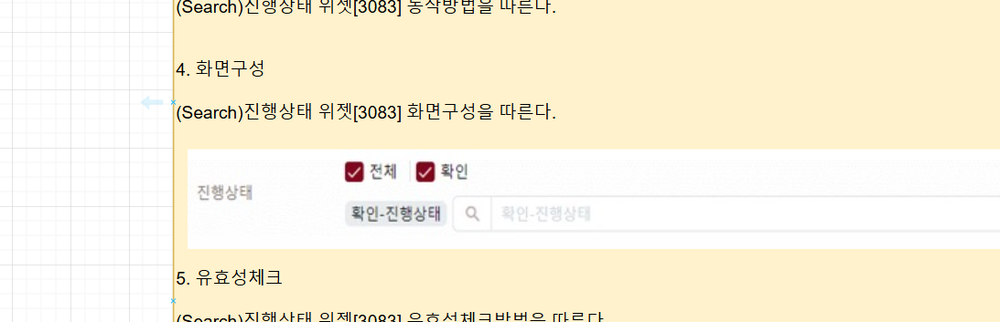
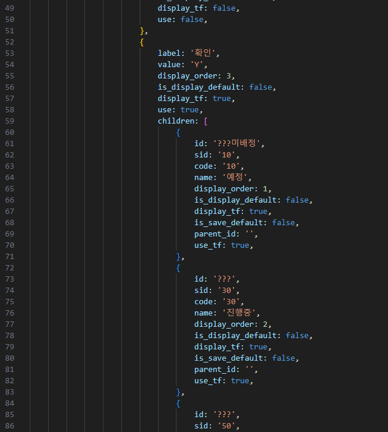
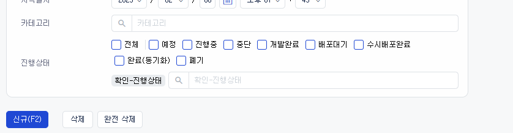
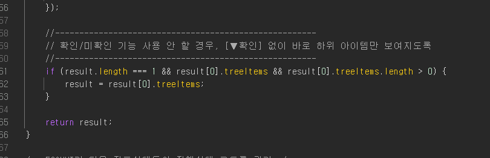

# Daily Retrospective

**작성자**: [박주현]  
**작성일시**: [2025-02-05]

---

# 2. 동기에게 도움 받은 내용

승준, 민준, 강민님과 setup ui 화면 구현을 서로 상의하면 문제를 해결했습니다. 서로 약간씩 다른 업무이지만, 상의할 수 있는 내용이 많아, 서로 의견을 주고 받으며 해결했습니다.

다른님이 5.0 이 도입된 다른 기능의 진행 상태를 탐색해서 알려주셨습니다.

---

# 3. 개발 기술적으로 성장한 점

## 3-3. 오늘 직면했던 문제 (개발 환경, 구현)와 해결 방법

### 시간관리이력 조회 - 서치 / 진행 상태 ui 에러해결 및 명세 방향 결정

어제 진행상태에서 공란인 에러가 있었습니다. 공란인 이유는 DataAction 에서 동적으로 메뉴의 값을 넣어주기 때문입니다. 조회 검색화면은 데이터 값이 들어갈 필요가 없으니 SetupAction 만을 참고하면 될 줄 알았는데, 각 항목의 Generator 를 통해 위 메뉴 타입을 넣어주는 건 DataAction 에서 이뤄지고 있었습니다.

EFE 팀의 배한조 선임님께서 디버깅 위치를 알려주셔서 판매현황과 1대1 비교하며 문제를 해결했습니다.

하지만 다른 문제가 생겼습니다.

 
 

기능 명세에는 이렇게 진행 상태의 라벨이 전체와 확인으로 되어 있고 확인의 자식 레벨로 진행중, 개발완료, 배포중 등 자식 라벨을 갖게 하고 있습니다.

 
 

 
 

저 또한 그렇게 구현하였습니다.

 
 

 
 

하지만 렌더링 될 때 확인의 자식 레벨이 대체되는 걸 볼 수 있습니다.

디버깅 결과 다음과 같은 로직에 의해 변한 것이었습니다.

 
 

 
 

위 로직에 의하여 확인/미확인을 사용 안하고 있기 때문에 확인이 사라지고 자식 라벨들이 그 자리를 차지하게 됩니다.

핵심 질문

1. 참고할만한 5.0으로 된 기능중 진행상태가 전체/확인 만 있는 곳이 있을까요?

   -> 유림님과 다은님 말씀으론 없는 것 같다고 하셨습니다.

2. 그럼 미확인 등이 없게 되면 저 로직을 타게 돼서 무조건 자식 라벨이 '확인' 을 대체하게 되는 데 어떻게 해야할까요?

라고 방향 결정에 질문을 올렸고, 유림님과 예지님 등의 방향 결정이 이뤄져야 할 것같습니다. 잔연스러운 ui를 그리기 위해선 fe 쪽 코드 변경이 이뤄져야할 것 같습니다.

---

# 4. 소프트 스킬면에서 성장한 점

디버깅실력이 많이 향상되고, 다양한 방면에서 가능성을 고려하는 실력이 늘었습니다.
