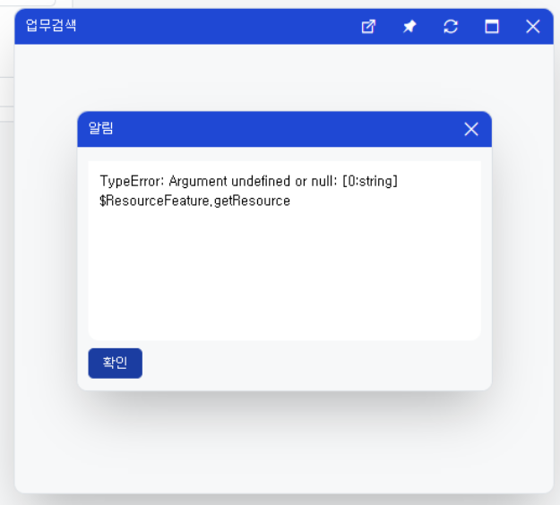

# Daily Retrospective

**작성자**: [설다은]  
**작성일시**: [2025-02-06]

## 1. 오늘 배운 내용 (필수)

### 기존 코드검색 팝업 user_action 정리

**1. 시간관리업무, 시간관리이력업무의 입력(Input)메뉴, 검색(Search)메뉴 통틀어서 코드형항목인 것은 다 검색창팝업을 띄울 수 있도록 흐름 정리 및 정보 제공**<br>

- 입력화면에서는 단건(data_type : $$code), 검색화면에서는 다건(data_type : $$multi_code)으로 화면이 구성되어야함.
- 현재 5.0에서 동작하는 것을 기준으로 어떤 Search관련 userAction을 호출하는건지 + payload에 어떤값을 값이 전달해줘야하는지 파악하여 setup담당자들에게 전달.

  ```ts
  // 참고파일 경로 : 03.ecount.usecase\ecount.usecase.common\src\server\attr_generator\refer_group\multi_user_action\dept_multi_user_action.ts (부서)
  export const dept_multi_user_action: IReferTypeAttrGenerator<trigger_attrs.multi_user_action> = (
  execution_context,
  setup,
  target
  ) => {
   return {
      prop_id: target.prop.prop_id,
      attr_id: trigger_attrs.multi_user_action,
      attr_type: EN_ATTR_TYPE.Trigger,
      data: {
         add_codes: {
            identifier: 'IGetDeptSearchUserAction',
            payload: {
               bizz_sid: target.bizz_sid,
               bizz_id: getBizzId(),
               bizz_type: getBizzAttr<bizz_attrs.bizz_type>(bizz_attrs.bizz_type),
               menu_type: target.menu_type,
            },
         },
      },
   };

   export const board_dept_multi_user_action_input: IReferTypeAttrGenerator<trigger_attrs.multi_user_action> = (
      execution_context,
      setup,
      target
   ) => {
      return {
         prop_id: target.prop.prop_id,
         attr_id: trigger_attrs.multi_user_action,
         attr_type: EN_ATTR_TYPE.Trigger,
         data: {
            add_codes: {
               identifier: 'IGetMoreCodeSearchUserAction',
               payload: {
                  bizz_sid: target.bizz_sid,
                  bizz_id: getBizzId(),
                  bizz_type: getBizzAttr<bizz_attrs.bizz_type>(bizz_attrs.bizz_type),
                  menu_type: target.menu_type,
                  identifier: 'IGetDeptSearchUserAction',
               },
            },
         },
      };
  ```

### 업무 및 거래 검색팝업창 샘플코딩 진행

**1. 현재 쓰고 있는 로직 확인하기**<br>
업무 : 회계 전표조회 search메뉴에 '업무'항목 제공. 이거 가져다쓰기.
거래 : 현재 업무 항목의 값을 가지고 유동적으로 검색창을 띄워주는 곳은 없음.<br>
(CRM의 경우 이미 업무가 정적으로 고정되어 있기 때문에 다소 다름.)<br>

## 2. 동기에게 도움 받은 내용 (필수)

**강민님**<br>

- 업무 검색팝업에 대해서 샘플코딩 구현 시, 잘 모르는 부분이 있었는데 알려주셨습니다.

**수경님**<br>

- 저녁으로 자담치킨을 주문해주셔서 동기들과 맛있게 먹었습니다.

## 3. 개발 기술적으로 성장한 점 (선택)

### 3. 위 두 주제 중 미처 해결 못한 과제. 앞으로 공부해볼 내용.

업무 항목에 `bizzTypeSearchUserAction`을 그대로 가져다쓰면 회계업무 팝업창이라도 오픈될 줄 알았는데 아래와 같이 `TypeError`가 나고 있었습니다.<br>
로직을 보니 아마 현재는 업무 검색팝업이 회계쪽에밖에 없어서 하드코딩된 부분이 있는데 이거 때문인가 하는 의심이 들었습니다. 일단 setup파트에서 캡처해준 오류이기 때문에 내일 다시한번 확인해보려고 합니다.



## 4. 소프트 스킬면에서 성장한 점 (선택)

팀원들에게 적극적으로 질문하고, 답을 얻는 스킬이 성장한 것 같습니다.<br>
질문하기 전 내가 어디까지를 파악했는지, 어디서 막힌건지 설명하는 습관도 길러진 것 같습니다.<br>
