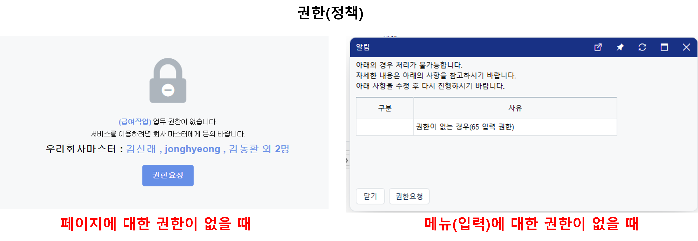
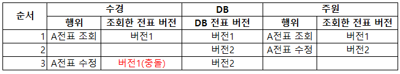

# Daily Retrospective

**작성자**: [허수경]  
**작성일시**: [2025-02-06]

## 1. 오늘 배운 내용 (필수)

- 권한 유효성 검사의 종류와 방법
- 유효전표체크 유효성 검사 방법

### 권한 유효성 검사의 종류와 방법

- 이카운트에서 권한을 확인하는 방법은 **정책**과 **권한 적용 범위** 두 가지로 나뉩니다.

#### 1. 정책(Policy)

- 서버의 진입점(Action)에서 요청 정보(고정 정보)에 대해 확인합니다.

- 쉽게 말해, 브라우저에서 전달된 요청 정보가 특정 액션에서 요구하는 권한에 포함되는지 검증하는 방식입니다.

- 예를 들어:

  - 페이지 자체의 접근 권한을 확인하여 접근을 차단합니다. (예: 설정 페이지, 급여관리 조회 페이지)
  - 등록/삭제/수정 등 특정 기능의 사용 권한을 확인하여 UI에서 해당 기능을 막습니다.

  

- 이러한 정책은 데코레이터(@\_authorize)를 통해 구현됩니다.
  ```ts
  @_authorize({ authority_type: EN_AUTHORITY_TYPE.Access } as AuthorityDataDto)
  ```

#### 2. 권한적용범위

- 특정 데이터(전표, 게시글 등)에 대한 권한을 비즈니스 로직을 통해 확인합니다.
- `{bizz_id}_attr_map`에서 pre 속성으로 등록하여 유효성을 검사합니다.
- 예를 들어:

  - 타인이 작성한 게시글을 수정할 때, 현재 사용자에게 해당 게시글을 수정할 권한이 있는지 확인하는 과정이 필요합니다.
  - 이 경우 단순한 정책 검사가 아니라 데이터별 권한을 판별하는 비즈니스 로직이 동작해야 합니다.

- 아래의 경로에서 권한적용범위를 설정하고 테스트를 진행해볼 수 있습니다.(관련 기능명세No : 2972)
  - Self-Customizing > 사용자관리 > 사용자/추가수정 > 사용자ID > 권한적용범위 설정 링크로 진입한다.
  - Self-Customizing > 사용자관리 > 권한그룹설정 > 기타권한 설정 > 권한적용범위 설정 링크로 진입한다.

### 유효전표체크 유효성 검사 방법

- 전표를 조회/수정/삭제하려면, 해당 전표가 유효한 상태인지 확인해야 합니다.
- 즉, 전표가 삭제되지 않았거나, 다른 사용자가 수정하지 않은 상태인지 검증하는 과정이 필요합니다.
- 이러한 유효성 검사는 두 가지 방식으로 이루어집니다.

#### 1. 버전체크

- 전표의 버전과 DB에 저장된 버전을 비교하여 다르면 유효하지 않다고 판단합니다.
- 예제:



1. 오전 10시: 수경과 주원이 동시에 A 전표를 조회함 (현재 버전: 1)
2. 오전 10시 10분: 주원이 A 전표를 수정하여 DB에 버전 2가 저장됨
3. 오전 10시 15분: 수경이 기존의 A 전표(버전 1)를 기반으로 수정 시도 →
   - 이 시점에서 DB에 저장된 버전은 2이므로,
   - 수경이 바라보고 있던 버전(1)과 충돌 발생 → 버전 불일치 오류 발생

- 이처럼 여러 사용자가 동시에 같은 전표를 수정할 가능성이 있는 경우, 버전 체크를 통해 데이터 충돌을 방지합니다.
- 버전 체크하는 로직 추후 확인해보겠습니다.

#### 2. 실제 데이터 확인

- 조회 시에는, 해당 전표의 데이터가 실제로 존재하는지 또는 삭제된(또는 삭제상태) 전표인지 확인해야 합니다.
- 사용자가 검색을 통해 특정 전표를 조회하려고 할 때, 다른 사용자가 그 전표를 삭제했다면 조회가 불가능합니다.
- 따라서 조회 과정에서 해당 데이터가 실제로 존재하는지 또는 삭제된(또는 삭제상태) 전표인지 확인하는 유효성 검사가 필요합니다.
- `SlipDataValidationFeature`의 `checkInvalidData`를 통해 전표의 삭제 여부를 판단합니다.

---

## 2. 동기에게 도움 받은 내용 (필수)

- 주현님께서 맛있는 유부초밥을 나눠주셔 든든한 오전을 보낼 수 있었습니다.
- 주원님 덕분에 컴포넌트에서도 유효성 검사가 실행되는 부분을 알게 되었습니다.
- 현철님, 다은님께 프리셋의 위치에 대해 도움을 받았습니다.

---

## 3. 개발 기술적으로 성장한 점 (선택)

아래의 3가지 주제 중 하나를 선택하여 작성합니다.

### 2. 오늘 직면했던 문제 (개발 환경, 구현)와 해결 방법

### 어제 궁금증에 대한 해결

> 유효성 검사가 실행되는 5가지 장소를 이해했지만, 삭제 전표 체크의 로직을 살펴보면서 궁금한 점이 생겼습니다.
> GetInventoryDataAction에서 SlipDataValidatorFeature를 통해 유효성 검사가 진행되는 것처럼 보였는데, 이는 선택한 전표의 값을 기준으로 삭제 가능 여부를 판단하는 로직입니다.
> 그렇다면, 이 검사가 {bizz*id}\_attr_map을 활용한 속성 기반 유효성 검사와 동일한 방식인지, 아니면 별도의 로직으로 동작하는지 확인이 필요합니다.
> 내일 코드를 더 깊이 살펴보며 정확한 동작 방식을 분석해보겠습니다.<br> - 2025-02-25*허수경\_회고록

**내가 궁금했던 근본적 이유**

- 전표를 삭제할 때 "이 전표가 삭제 가능한 상태인지"를 확인하는 과정이 필요합니다.
- 하지만, 왜 Data API 호출 시에도 유효성 검사를 수행하는지가 의문이었습니다.

**해결방법**

- 금일 성준팀장님과의 미팅에서 해당 궁금증을 해결할 수 있었습니다.
- 유효전표체크에 대한 2가지 방법이 있었기 때문입니다.

1.  트랜잭션 충돌 방지를 위한 유효성 검사 (버전체크 방식)

- 기존에 제가 이해했던 삭제 전표 체크는, 전표 조회 후 삭제 요청을 할 때 발생하는 트랜잭션 충돌을 방지하기 위한 검사였습니다.
- 이 경우, 전표의 버전 정보를 비교하여 데이터가 변경되었는지 확인하는 것이 핵심입니다.
- 따라서, 이 상황에서는 SlipDataValidatorFeature가 아닌 버전체크 방식으로 검증해야 합니다.<br>
  📌 즉, 삭제 요청을 하기 전에 "이 전표가 최신 상태인지"를 확인하는 과정이 필요하며, 이를 상위 내용 중 유효 전표 체크 방법 ①로 정리하였습니다.

2.  조회 시점의 유효성 검사 (`SlipDataValidatorFeature` 활용)

- 반면, GetInventoryDataAction에서 SlipDataValidatorFeature를 통해 진행되는 유효성 검사는 전표 조회 시점에서 실행됩니다.
- 즉, 전표를 삭제하려는 것이 아니라, 조회할 때부터 이 전표가 유효한 상태인지 판단하는 과정입니다.
- 이 유효성 검사는 전표가 완전삭제되었거나 삭제된 상태인지 확인하는 역할을 합니다.<br>
  📌 따라서, SlipDataValidatorFeature는 삭제 요청이 아니라 "조회 시점"에 유효성을 판단하는 방식이며, 이를 상위 내용 중 유효 전표 체크 방법 ②로 정리하였습니다.

## 4. 소프트 스킬면에서 성장한 점 (선택)

기획적으로 모르는 부분이 있을 때, 먼저 현철님과 다은님께 여쭤보고 타 부서 분들께 질문을 드리는 방식으로 업무를 진행하고 있습니다.
단순히 모르는 것을 질문하는 것이 아니라, 어떠한 부분을 도움 받을 수 있을지를 한번 더 고민해보고 질문을 드릴 수 있었습니다.
이를 타 부서와의 협업 과정으로 인식하면서 보다 배려하는 태도를 가지게 된 것 같습니다.

또한, 유효성 검사 파트를 진행하면서 기능 명세 파일을 더욱 꼼꼼하게 살펴보게 되었고, 이를 기반으로 셋업 파트 분들과 소통하는 과정에서 협업 능력과 커뮤니케이션 스킬이 향상되었다고 느꼈습니다.
