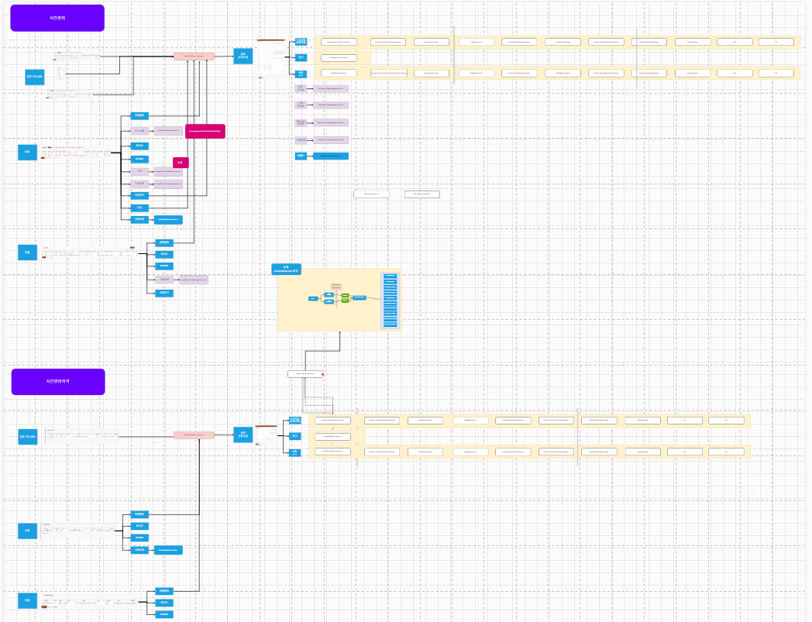
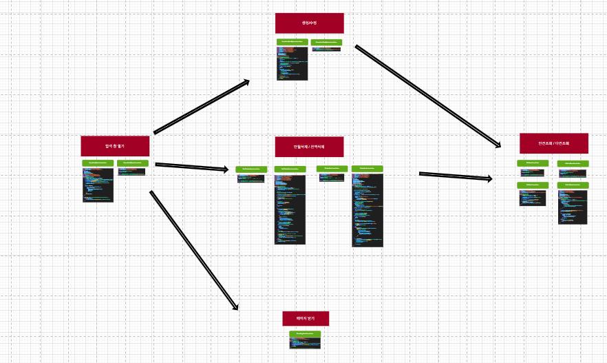
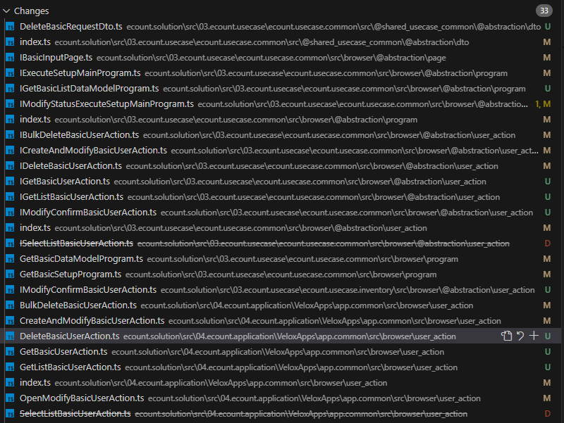

# Daily Retrospective

**작성자**: [김도형]  
**작성일시**: [2025-02-07]

## 1. 오늘 배운 내용 (필수)

- 리스트탭 (ChangeProgressStatusActiveStateUserAction) Common에 있는 파일 사용하기로 결정

- 도식도 수정

- 지속적인 개발 및 UserAction 구현

## 도식도





<br>

## UserAction 개발

최근 2일간 개발한 파일들입니다. 사실, 테스트를 하지 못하는 상황이라 어떤 데이터가 부족하고, 불필요한 지 파악이 되지 않은 상태입니다. 하지만, 오늘 동기들과 책임님과 함께 에러 상황을 해결하였고, 앞으로는 빠른 개발이 가능할 것 이라고 생각합니다...!!!



<br>

## 2. 동기에게 도움 받은 내용 (필수)

성범 책임님께 Search와 관련된 내용을 여쭤보았습니다.

오늘도 성재님과 함께 도식도를 그리고, 업무를 분담하여 개발을 진행하였습니다.

주원님, 수경님, 강민님, 주현님, 승준님, 민준님과 함께 토론을 하였습니다.

---

## 3. 개발 기술적으로 성장한 점 (선택)

아래의 3가지 주제 중 하나를 선택하여 작성합니다.

### 2. 오늘 직면했던 문제 (개발 환경, 구현)와 해결 방법

- 성준 팀장님께 질문드렸던 내용

성준 팀장님 질문있습니다. 어제 회의에서 GetBasicDataModelProgram과 GetBasicListDataModelProgram 으로 단건 조회, 다건 조회를 나눠서 구현하라고 하셨는데요.
다건 조회(search, quick, 수정/저장 이후, 그리드 재조회)의 GetBasicListDataModelProgram를 개발하는 과정에서 inventory 모듈을 참고해본 결과,

- purchases_list.tsx
- quotation_list.tsx
- sales_list.tsx 등..

모두 IGetInventoryDataModelProgram를 사용하고 있으며, 다건에 대한 DataModelProgram이 존재하지 않습니다.
그래서 Search 측에서 따로 DataModelProgram이 호출되는 것이 있는지 어제에 이어서 다시 확인해보았습니다.

SelectInventoryListUserAction
ISearchDataModelGenerateProgram 호출

역시나 다른 로직이 없습니다. 그래서 혹시 검색에 대한 처리가 Feature에서 실행되는 것일까? 싶어서 InventoryListSearchBuildProcessFeature를 파보았습니다. 많은 resolver를 발견했고,
그 중에서 아래와 같이 검색 조건에 대한 처리를 하는 로직이 있긴 했습니다.

InventoryListSearchDataModelResolver에서 SelectInventoryListProgram 호출

```ts
const { result } = await httpFeature.sendAsync<any, any>(
  ISelectInventorySearchListAction,
  {
    data: {
      menu_type: request.additional?.menu_type ?? EN_MENU_TYPE.List,
      bizz_sid: request.bizz_sid ?? this.execution_context.action.bizz_sid,
      sort: request.search_options.sort,
      page: request.search_options.page,
      limit: request.search_options.limit,
      condition: {
        ...data_model,
      },
      condition_quick: request.search_options.condition_quick,
      additional: {
        progress_status: request.search_options.progress_status,
        confirm_type: request.search_options.confirm_type,
        ...request.additional,
      },
      ...request.template_info,
      is_excel_convert: request.search_options.is_excel_convert,
    },
  }
);
```

Q1. ListDataModelProgram을 생성하라고 하셨는데, SearchProgram에서 호출되는 곳에서 ListProgram을 호출하는 로직이 존재합니다. 이런 경우에 관련 파일들도
모두 만들어야 하나요? (resolver, program 등. 수십 개의 파일들이 존재합니다.) 그렇지 않다면, search 관련 해주시는 담당 부서에서 처리해주는 것이고, 제가 만들지 않아도 되는걸까요?

Q2. inventory_input.tsx를 포함한 purchases_list.tsx, quotation_list.tsx, sales_list.tsx 등 파일에서 1개의 GetInventoryDataModelProgram만 호출하는 구조이고,
listDataModelProgram이 존재하지 않습니다. 어떻게 해야할까요? 어제 보여드렸던 로직처럼 GetListBasicUserAction에서 SearchProgram만 호출하는 구조로 만들어두고, DataModelProgram은
1개만 써도 되는걸까요?

성준 팀장님이 연차를 쓰셔서 아직 답변받지 못한 내용입니다. 월요일에 답변해주시면, 해당 사항을 반영할 예정입니다.

### 3. 위 두 주제 중 미처 해결 못한 과제. 앞으로 공부해볼 내용.

브라우저 쪽 UserAction을 개발하면서 어려움을 겪고 있습니다. Common 모듈에 일정 관리 프로그램을 새롭게 개발하게 되면서 다른 모듈들을 참고하고, 기존에 없는 것들이 많아서 새롭게 만드는 UserAction들이 많은 것 같습니다. 기한 내에 일정 관리 프로그램을 완성하는 것이 앞으로의 과제입니다.

---

## 4. 소프트 스킬면에서 성장한 점 (선택)

공통 로직을 구현하면서 전체적인 흐름을 이해하고 있으며, 지속해서 공부하고 디버깅하면서 로직을 파악 및 구현하고 있습니다. 성재님과 같은 파트를 맡으면서 지속적으로 서로 소통하고 있고, 다른 job을 담당하는 동기들과도 함께 협력하고 있습니다. 이전의 제 모습에 비하면 성장하였지만, 아직 부족함이 많으며 더욱 성장해야 합니다. 1년 후 제 모습이 궁금합니다.....ㅎ

---
