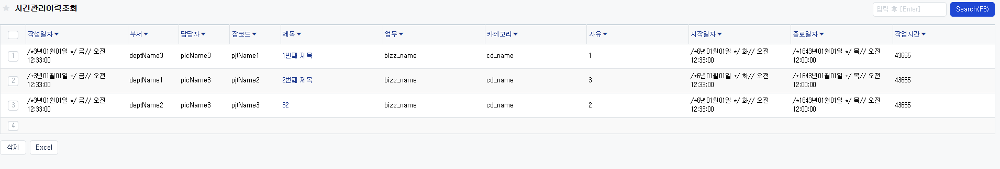
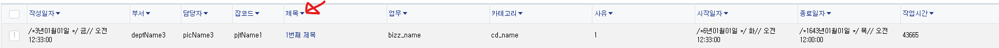

# Daily Retrospective

**작성자**: [김승준]  
**작성일시**: [2025-02-07]

## 1. 오늘 배운 내용 (필수)

-   [시간관리이력 조회 창의 setup을 구성하고 있습니다.](#setup-속성)



## 2. 동기에게 도움 받은 내용 (필수)

-   **주현님**께서 유부초밥을 나눠 주셨습니다. 유부초밥 맛집입니다.
-   **민준님**과 함께 디버그를 통해 setup에서 useraction 호출 과정을 따라갔습니다.

---

## 3. 개발 기술적으로 성장한 점 (선택)

아래의 3가지 주제 중 하나를 선택하여 작성합니다.

### 1. 교육 과정 상 배운 내용이 아닌 개인적 호기심을 해결하기 위해 추가 공부한 내용

### 2. 오늘 직면했던 문제 (개발 환경, 구현)와 해결 방법

### 3. 위 두 주제 중 미처 해결 못한 과제. 앞으로 공부해볼 내용.

-   `ecount-dev > 303101 > 그룹웨어 공유정보 > 게시판 > ㄴㅇㄹ` 에서 grid_head 정렬 버튼을 참고하였습니다.<br>
    피들러와 디버깅을 통해 setup정보를 가져왔습니다.<br>
    그런데 게시판에서는 title에만 identifier가 달려있는데 모든 헤드에서 action을 호출하고 있습니다.<br>
    모든 prop마다 attribute를 추가하는 것이 아닌 하나로 모든 헤드에 적용되도록 하고 싶습니다.

---

# 학습내용

## setup 속성

### full_width

그리드의 width를 최대로 하는 옵션

`setup > view_container > view_type:'CONTENTS', sections > view_type:'LIST_GRID', attributes > `

```ts
{
    attr_type: 'Renderer',
    attr_id: 'full_width',
    prop_id: '',
    data: true,
},
```

현재 화면크기의 따라 크기가 변합니다. <br>
화면크기가 `1000px`인 상태에서 setup이 불러온다면 `1000px`로 불러와지고 그 상태에서 화면크기를 늘리면 그에 맞게 늘어납니다.<br>
단, 화면크기를 `500px`로 줄여도 그에 맞게 줄어들지는 않습니다.

### use_bookmark

bookmark를 표시해주는 버튼을 만들어주고, menu_name에 userAction을 달아줍니다.

`setup > data_model_definitions > header_data_model > attributes >`

```ts
{
    attr_id: 'user_action',
    attr_type: 'Trigger',
    data: {
        identifier: 'INewBookmarkUserAction',
        payload: { seq: 0, sort_seq: 0 },
    },
    prop_id: 'menu_name',
},
```

### sort



그리드 헤더의 정렬 버튼을 달아주고 정렬 option을 포함한 userAction을 연결해줍니다.

`view_container > view_type:'CONTENTS', sections > view_type: 'LIST_GRID', attributes > `

```ts
{
    attr_id: 'grid_sort',
    data: true,
    prop_id: '',
    attr_type: 'Renderer',
},
```

`data_model_definition > head > attributes > `

```ts
{
    prop_id: 'title',
    attr_id: 'multi_user_action',
    attr_type: 'Trigger',
    data: {
        sort: {
            identifier: 'ISelectListUserAction',
        },
    },
},
```

### anchor

그리드 각 데이터에 링크를 연결(표시)해줍니다.

`data_model_definitions > time_manage_historyXlist > attributes > `

```ts
{
    prop_id: 'title',
    attr_id: 'user_action',
    attr_type: 'Trigger',
    data: {
        identifier: 'IOpenModifyBasicUserAction',
        payload: { action_mode: EN_ACTION_MODE.GetModify },
    },
},
{
    prop_id: 'title',
    attr_id: 'view_type',
    attr_type: 'Renderer',
    data: 'ANCHOR',
    use: true,
},
```
