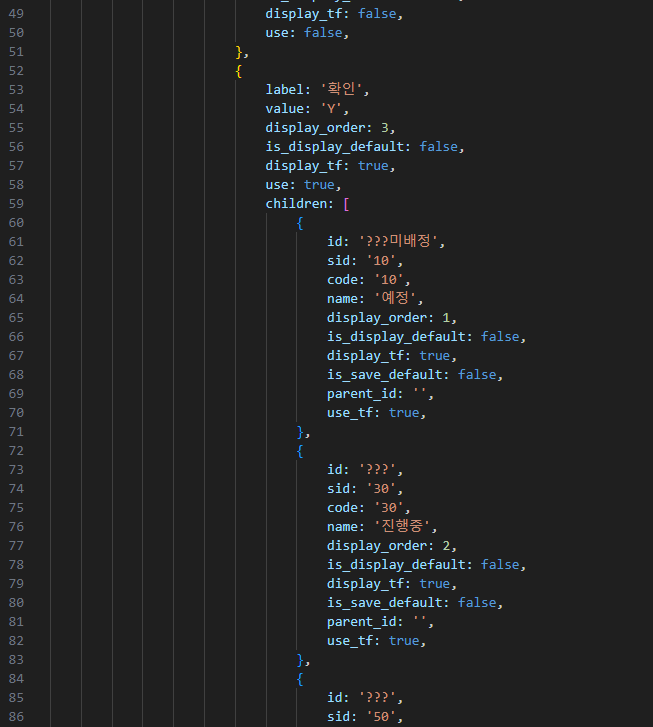
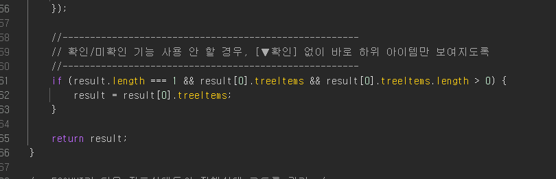

# Daily Retrospective

**작성자**: [박주현]  
**작성일시**: [2025-02-07]

---

# 2. 동기에게 도움 받은 내용

승준님과 데이터를 DB에서 데이터를 가져오지 못하는 문제를 해결했습니다. 짝궁이 승준님이라 좋습니다.ㅎㅎ 물론 건호님도 좋습니다 ㅎㅎ
다은님에게 5.0 기능에 대해서 배웠습니다.
현철님이 진행 상태 관련된 기초 코드 테이블 찾는 걸 알려주셨습니다.
건호님이 깃 브랜치가 꼬여서 발생하는 문제를 도와주셨습니다.

---

# 3. 개발 기술적으로 성장한 점

## 3-3. 오늘 직면했던 문제 (개발 환경, 구현)와 해결 방법

### 시간관리이력 조회 - 서치 / 진행 상태 ui 에러해결 완벽 해결

현재 진행상태의 문제점은 2개가 있었습니다.

1. `확인-진행상태` 돋보기를 켰을 때 진행상태 기초코드 목록이 안 나옴.
2. 미확인이 없으면 자식 라벨이 확인의 컨펌타입으로 변경돼서 셀렉스 박스로 변경됨.

### (1) `확인-진행상태` 돋보기를 켰을 때 진행상태 기초코드 목록 나오게 하기

처음엔 `확인-진행상태` 돋보기를 켰을 때 에러 메세지가 나타났습니다. 하지만 성범 책임님께서 URL 로 BIZZ 와 메뉴를 찾을 수 있는 방법을 알려주셔서 문제를 해결했습니다. 하지만 진행상태 창엔 아무 데이터도 없었습니다. 저는 데이터를 하드코딩했기에 그 데이터가 나타날 걸 기대했습니다.

하지만 팝업엔 빈 리스트만이 나왔습니다. 이는 동적으로 useraction을 활용하여 DB 에서 검색한다고 추측하였고, DB 에 회사코드, 비즈코드 등을 넣어 데이터를 만들면 나타날 것이라고 추측했습니다.

이젠 진행상태 기초코드 테이블을 찾아야하는 문제에 직면했습니다.

ERD 를 봤지만, ERD 에 있는 테이블은 현재 사용하지 않는 테이블이었습니다. 그래서 전 하드코딩하듯이 머리를 굴려서 찾을 수 밖에 없었습니다. 일단 PG 에서 컬럼 검색으로 `progress_status` 를 검색했습니다. 그렇게 하니 상태 코드등 기초코드를 활용하는 히스토리 테이블을 찾을 수 있었습니다. 그 후 기초 코드 테이블은 찾지못하여 다음날 현철님께 여쭤봐 찾을 수 있었습니다.

 

위 사진은 문제가 전부 해결된 사진입니다. 여기서 bizz_sid 와 category_sid 때문에 트러블 슛팅을 하게 됐습니다. ERD 에 컬럼에 대한 설명이 너무 부족했습니다. 전 bizz_sid엔 저희 업무인 `시간관리` 의 SID 가 들어가야하고, category_sid는 별 상관없는 컬럼이라고 생각했습니다. 결과적으로 틀렸습니다.

BIZZ_SID는 진행상태의 SID 가 들어가야했습니다. 기초코드 공통의 테이블이기 때문에 이걸 구분해야할 BIZZ_SID 가 들어가야 했습니다. 그러므로 `시간관리`가 아닌 `진행상태` SID 가 들어가야했습니다.

category_sid는 연관된 데이터 였습니다. 팝업창을 켰을 때 DB까지 조회 하게 되는 브라우저 유저액션 서버액션 서버 프로그램을 전부 디버깅하여 DAC 까지 도달하여 이것이 지금 중요한 SID 라는 걸 알았습니다.

 

브라우저의 유저액션에선 parent_bizz_sid 가 있었습니다. 이는 시간관리 업무의 진행상태이기에 parent_bizz_sid는 시간관리의 sid 가 들어갑니다. 이는 서버에서 target_bizz_sid가 되고 테이블의 category_sid 와 맵핑되게 됩니다.

따라서 category_sid엔 `시간관리업무`의 sid 가 들어가야했습니다. 정상적으로 컬럼 값을 변경하여 조회를 했을 때 진행상태 코드들을 볼 수 있었습니다.

이젠 DB에서 회사코드에 비즈코드에 맞는 진행상태 기초코드를 가져올 수 있게 됐습니다.

문제를 해결하고 나니, 한가지 생각이 들었습니다.

> 💡 어? 이러면 SETUP 에 하드코딩된 값들을 없앨 수 있지 않을까?

DB에서 조회하니 하드 코딩된 값들이 필요없다는 걸 생각했고 SETUP MENU ATTR 에 있는 확인의 자식 라벨들을 지웠습니다.

해당 자식라벨을 지우고 나니, 2번 문제도 해결하게 됐습니다.

### (2) 미확인등 다른 컨펌 타입이 없으면 자식 라벨이 확인의 컨펌타입으로 변경돼서 셀렉스 박스로 변경 문제 해결

 

위 로직을 타기 때문에 앞선 문제가 발생하는 것이었습니다.

위 조건문의 조건은 결과 즉 라벨입니다. 라벨의 길이가 1이고 라벨의 자식 라벨이 있고, 자식라벨 배열의 크기가 0보다 큰 경우입니다.

즉 확인 라벨만이 컨펌타입으로 존재하고 그 확인 라벨의 자식라벨이 1개 이상 존재하는 경우입니다.

이제 children 키의 배열의 값들을 전부 지워줬기 때문에 자식라벨 배열의 크기가 0이므로 저 조건문을 타지 않게 됐습니다.

또한 기획팀에게 첫 검색창을 들어갔을 때 `전체` 조건을 선택하는게 기본값이라 들어서 그 점까지 적용하니 완벽하게 진행상태에 대해 해결을 완료했습니다.

 

---

# 4. 소프트 스킬면에서 성장한 점

기획팀과 QT 팀과 진행방향 결정 등 협업을 통해 문제를 해결하는 실력을 키웠고, 문제가 생겨 막히는 에러도 디버깅을 통해 문제를 해결할 수 있는 능력을 향상했습니다.
