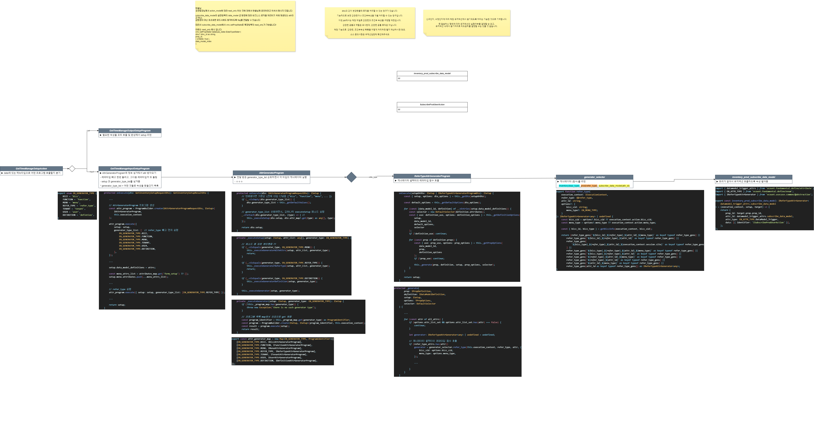

# Daily Retrospective

**작성자**: [최현철]  
**작성일시**: [2025-02-07]

## 1. 오늘 배운 내용 (필수)

### 값관련 / 조건부속성

1.  [업무] 항목 값바뀌면 [거래] 항목 초기화
2.  [시작일자], [종료예정일자] 항목은 행위가 ‘수정’일 떄 편집가능여부 N

- 제너레이터 셀렉터가 고를 수 있도록 subscribe_data_model 작성
  - initial_sync: true 넘겨줘서 최초 화면 로드시에 시작될 수 있도록
- 업무 빈값이면 거래도 빈값으로 초기화
- 행위 수정이면 리드온리처리, initial_sync: true 플래그로 최초에 실행

3.  [담당자] 항목 값 바뀌면 [담당자]의 부서 가져오기

- 값관련 타는 것처럼 setup정보에 하드코딩해서 공통 태우는게 더 나을듯
- 담당자 꽂힐 때 담당자 모든항목 다 가져오는데 그 안에 들어있는 부서만 빼서 넣으면 안되나?
- 부서 넣는것도 어짜피 검색해서 들어가야하니까 그냥 2번 타는게 맞는것 같기도

## 2. 동기에게 도움 받은 내용 (필수)

강민님께서 화면이동을 알려주서 모니터를 4개쓰는 것처럼 편해졌습니다.

---
