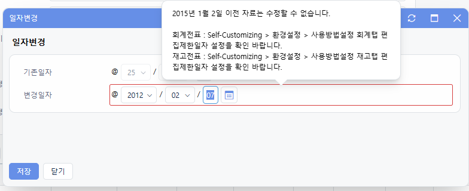

# Daily Retrospective

**작성자**: [허수경]  
**작성일시**: [2025-02-07]

## 1. 오늘 배운 내용 (필수)

- SlipDataValidationFeature의 checkInvalidData 코드 살펴보기

### 1. SlipDataValidationFeature의 checkInvalidData 코드 살펴보기

- 전표를 조회할 때 유효한 전표인지 체크하는 로직입니다.
- 전표가 유효한 상태에서만 조회/수정할 수 있도록 보장하는 역할을 합니다.

```ts
checkInvalidData(dto: CheckInvalidDataDto): void {
	const pass_bizz_ids = new Set<string | undefined>();
	pass_bizz_ids.add(EN_ECMENU_COLLECTION.Quotation);
	pass_bizz_ids.add(EN_ECMENU_COLLECTION.PurchaseRequest);

	if (_.vIsEmpty(dto.record)) {
		if (_.vIsEmpty(dto.key_value) && !_.vIsEmpty(dto.record) && !_.vIsEmpty(dto.key_columns)) {
			const sb = new $StringBuilder();

			for (const column of _.vSafe(dto.key_columns)) {
				sb.append(`${sb.length > 0 ? dto.key_delimiter : ''}${_.vSafe(dto.record)[column]}`);
			}

			dto.key_value = sb.toString();
		}

		Exception.throw(
			ExceptionBuilder.create<IInvalidDataException>(IInvalidDataException, {
				key: _.vToString(_.vSafe(dto.key_value)),
				message: $Resx.rex00081,
			})
		);
	}
	// 삭제된 전표일 경우 알림(이력조회는 제외함)
	// 재고 조회에서는 삭제된 전표 조회 가능(우선 견적만 추가함 )
	else if (
		!_.vIsEquals(dto.view_history, true) &&
		!pass_bizz_ids.has(this.context.action.bizz_id) &&
		_.vIsEquals(dto.record?.status_type, [EN_STATUS_TYPE.Delete, EN_STATUS_TYPE.NoUse])
	) {
		Exception.throw(
			ExceptionBuilder.create<ICommonWarningException>(ICommonWarningException, {
				key: _.vToString(_.vSafe(dto.key_value)),
				message: $Resx.rex00081,
				is_popup: dto.is_popup,
			})
		);
	}
}
```

1. `pass_bizz_ids`를 통해 유효성검사를 통과할 집합을 만듭니다.
2. dto.record가 비었다면 유효하지 않은 데이터로 판단하여 예외를 발생시킵니다.
3. 삭제된 전표(또는 삭제 상태인 전표)에 대한 유효성 검사 수행합니다.
   1. 이력 조회 화면이 아닌 경우 (dto.view_history !== true)
   2. 현재 bizz_id가 pass_bizz_ids 목록에 포함되지 않은 경우 (예외 대상 아님)
   3. 전표의 status_type이 Delete(삭제) 또는 NoUse(미사용)인 경우
      위 조건이 모두 충족되면 경고 예외를 발생시킵니다.

Delete 상태인 전표도 조회가 가능한 상태가 일반적입니다.
따라서 `time_manage`도 `pass_bizz_ids`에 추가해야합니다.

## 2. 동기에게 도움 받은 내용 (필수)

- 민준님께 디버깅 환경 설정에 대한 도움을 받았습니다.
- 건호님께서 직접 디버깅하며 깨달은 점을 공유해주셔서 많은 도움이 되었습니다.
- 주원님이 '편집 제한 일자'에 대해 질문해 주신 덕분에 다시 한번 로직을 점검할 기회가 생겼습니다. 기존에 생각했던 방식과 차이가 있어 성범 책임님께 확인 후 해결할 수 있었습니다.
- 시간 관리 업무와 시간 관리 이력 업무를 게시글과 답글 개념으로 이해하고 있었는데, 현철님께서 '밀어주기' 개념으로 보는 것이 더 적절하다고 설명해주셨습니다. 또한, 제가 이해한 기능들에 대해 함께 논의하며 더 명확한 방향을 잡을 수 있었습니다.

---

## 3. 개발 기술적으로 성장한 점 (선택)

### 2. 오늘 직면했던 문제 (개발 환경, 구현)와 해결 방법

#### '편집제한일정'은 언제 어떻게 조회하는 것일까?

#### 🔍 편집제한일자 조회 방식에 대한 궁금증

- '편집제한일자'를 어떻게 불러오는 것일까를 생각하다가
  저번에 알게된 `option_creator`를 통해 SC 설정을 들고온다고 생각했습니다. 그래서 찾아보니 `date_limit_date_option_creator`에서 값을 가져오는 것 같았습니다.

편집제한일자가 어떻게 불러와지는지 궁금해서 살펴보았습니다.
처음에는 이전에 알게 된 option_creator를 통해 SC 설정을 가져오는 방식일 거라 예상하여 찾아보니 `date_limit_date_option_creator`에서 값을 조회하는 것 같았습니다.

파일 속 주석을 보니 아래와 같이 작성되어 있었습니다.

```
// 서버에서 편집제한일자 체크 시 편집제한일자 조회
// 1. 브라우저에서 들고있던 제한일자가 서버 동작 시점에 변하거나
// 2. 엑셀 자료올리기, OpenApi 등 브라우저가 없는 서비스로 접근 시 편집제한일자 값이 필요하므로
```

여기서 "브라우저에서 들고 있던 제한일자" 라는 부분이 이해되지 않았습니다.
전표일자를 수정하고 저장하는 시점에 SC 정보를 가져와 유효성 검증을 수행한다고 알고 있었기 때문입니다.

#### 🔎 브라우저에서 편집제한일자를 들고 있는 이유

이 의문을 해결하기 위해 Fiddler를 사용하여 전표 조회 시 요청되는 데이터를 확인해보았습니다.
그 결과, `GetInventoryDataAction`을 통해 다음과 같은 데이터를 조회하는 것을 발견했습니다.

```
{
  "prop_id": "inv_s$data_dt_no",
  "attr_id": "limit_date",
  "attr_type": "Validator",
  "data": {
    "data": {
      "limit_date": "20150102",
      "is_use": true,
      "limit_date_value_format": "@@15/01/02 "
    },
    "caller_type": ["apply"]
  }
},
```

이후 화면으로 테스트를 해보니 견적서 수정 시 편집제한일자보다 이전 날짜를 입력하면 즉시 알럿창이 표시되었습니다.



즉, `DataAction`을 통해 편집제한일자의 값을 조회한 후, 브라우저에서 limit_date 값을 보관하면서 유효성 검증을 수행하는 구조였던 것입니다.

#### 📝 결론

1. 회사 설정을 전표 조회 시점에서도 가져오며, 클라이언트 측에서 유효성 검증을 수행하는 데 활용된다.
2. 이 방식 덕분에 사용자가 전표를 수정할 때, 서버 요청 없이 즉시 편집제한일자를 검증할 수 있다.
3. 다만, 브라우저에 보관된 값이 서버 동작 시점에서 변경될 가능성이 있으므로, 서버에서도 편집제한일자를 다시 검증하는 과정이 필요하다.

---

## 4. 소프트 스킬면에서 성장한 점 (선택)

유효성 항목을 깊이 이해하려다 보니, 편집 제한 일자나 권한 체크와 같은 회사 설정과 관련된 도메인 지식이 자연스럽게 향상된 것 같습니다.
