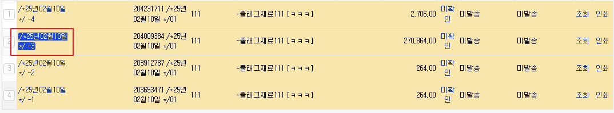

# Daily Retrospective

**작성자**: [황주원]  
**작성일시**: [2025-02-07]

## 1. 오늘 배운 내용 (필수)
### 편집제한일자
`date_limit_date_option_creator` 을 보면, 

```
// 서버에서 편집제한일자 체크 시 편집제한일자 조회
// 1. 브라우저에서 들고있던 제한일자가 서버 동작 시점에 변하거나
// 2. 엑셀 자료올리기, OpenApi 등 브라우저가 없는 서비스로 접근 시 편집제한일자 값이 필요하므로
```

해당 주석이 처리되어 있는 것을 확인할 수 있습니다.

이 의미가 무엇인지 궁금해 성범 책임님께 질문을 드리며 이해할 수 있었습니다.

ex) A는 판매 조회 창을 띄워놨고, B가 제한일자를 편집한 상황 <br />
이때, A가 서버에서 제한일자에 해당된 전표를 클릭하면 해당 유효성 검사를 통해 막을 수 있습니다.

#### `GetInventoryDataAction` 
피들러를 통해 해당 Action에서 편집제한일자를 가져오는 것을 확인할 수 있었습니다.

`data_dt_no` 값으로 가져오고, 전표 하나를 클릭했을 때(조회시) 편집제한일자를 확인하는 것을 알 수 있습니다.



## 2. 동기에게 도움 받은 내용 (필수)
* 수경님께서 제가 드는 의문들에 대해 함께 고민해 주면서 함께 성장할 수 있었습니다. 수경님의 시간을 조금씩 빼앗은 것 같아서 미안하고 감사합니다.

---

## 3. 개발 기술적으로 성장한 점 (선택)

### 1. 교육 과정 상 배운 내용이 아닌 개인적 호기심을 해결하기 위해 추가 공부한 내용
#### Validator 위치
아래와 같이 세 가지 Layer 에 존재합니다. 
- 01.ecount.fundamental
    - define 한 Layer
- 02.ecount.infrastructure
    - browser/@shared_intra_attribute
    - browser/validator
    - server/validator
- 03.ecount.usecase
    - browser/feature
    - server/attr_generator

01, 02 Layer에는 build시 적용할 수 있는 validator 부분입니다. <br />
03 Layer는 비즈니스 로직을 수행하며 진행하는 validator 부분으로 이해했습니다.

### 2. 오늘 직면했던 문제 (개발 환경, 구현)와 해결 방법
#### 버전 체크
A 가 하나의 전표를 조회했을 때, B가 해당 전표를 수정하고 A도 수정하려고 할 때 '동시성 처리' 가 필요합니다.

이카운트에서는 이러한 과정을 버전체크로 제어하고 있습니다. 구현된 부분을 찾아보니 Feature로 만들어진 부분을 확인했습니다.

```ts
// 파일 : BizzVersionCheckFeature  

checkVersion(dto: IVersionCheckRequestDto): IVersionCheckResponseDto {
    // 공통 전표 Version Number 동작 수행
    // 버전 +1 수행 : 동시성 문제 해결로직
    const result: IVersionCheckResponseDto = {
        success: true,
        message: '',
    };

    if (!dto.bizz_sid) return { success: false, message: 'Unknown bizz_sid' };

    this.setTargetDbConn(dto);

    const version_dac = DacCommandBuilder.create(UpdateCommonSingleVersionDac, this.context, this.target_db);
    const update_result = version_dac.execute({
        data: dto,
        target_table: this.target_db_tables,
    });
    if (update_result < 1) {
        // exception 발생 - 버전체크 로직 수행 문제
        result.success = false;
        result.message = _.vFormat($Resx.rex00127, $Resx.rex00004);
    }

    return result;
}
```
해당 Dac을 수행하면서 버전을 확인합니다.
```ts
//  파일 : UpdateCommonSingleVersionDac
const esql = $ESql.update<TData>(data.target_table, undefined, (opt) => {
    opt.alterCheckColumnRule(ENUM_CONDITION_LEVEL.HIGH, (t) => [t.tenant_sid, t.data_sid]);
});
esql.set(
    (t) => t.update_dtm,
    (ef) => ef.datetime.now()
)
    .set(
        (t) => t.version_no,
        (ef, t) => ef.plus(Number(data.data.version_no), 1)
    )
    .set((t) => t.update_sid, this.execution_context.session.user_sid)
    .where((ef, t) => ef._equal(t.tenant_sid, this.execution_context.session.tenant_sid))
    .whereIfNotEmpty(data.data?.bizz_sid, (ef, t) =>
        ef._equal(t.bizz_sid, data.data.bizz_sid ?? this.execution_context.action.bizz_sid)
    )
    .where((ef, t) => ef._equal(t.data_sid, data.data.data_sid))
    .where((ef, t) => ef._equal(t.version_no, data.data.version_no));
```

### 3. 위 두 주제 중 미처 해결 못한 과제. 앞으로 공부해볼 내용.
* validator 구현한 부분들 되는지 확인
