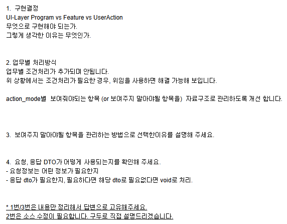

# Daily Retrospective

<br>

**작성자**: 고건호
**작성일시**: 2025-02-10

<br>

## 1. 오늘 업무 내용

- Button Filter Program 소스 리뷰
- Button Filter Program 리팩토링

<br>

### Button Filter Program 소스 리뷰

<br>

지난 주 금요일에 작성했던 Button Filter Program의 소스 리뷰를 요청했고, 성준 팀장님께 아래의 내용을 정리할 것을 전달 받았습니다.

<br>



<br>

이후 1번과 3번 내용에 대한 답변을 작성하는 시간을 가졌습니다.

<br>

#### 1. 구현 결정

```plain
UI-Layer Program vs Feature vs UserAction
무엇으로 구현해야 되는가.
그렇게 생각한 이유는 무엇인가.
```

구현 방법: **UI-Layer Program**

구현 이유:

`Program`으로 구현한 이유는, 원래 기존 `tsx` 파일에 구현된 `_buttonFilter()` 함수가 `Setup API`와 `Data API`를 거쳐 만들어진 `setup.data_model_definitions.footer_toolbar.attributes`에 `attribute`를 추가해주기 때문에 **데이터 핸들링** 관점에서 `Program`을 사용하는 것이 알맞다고 판단했습니다.

`UserAction`은 `setup`이 완성되기 이전에 호출되는 것으로 알고 있기 때문에, `UserAction`에서는 `setup` 기반으로 불필요한 버튼 or 필요한 버튼을 관리하는 것은 불가능하다고 판단했습니다.

<br>

#### 3. 보여주지 말아야 될 항목을 관리하는 방법으로 선택한 이유

```plain
보여주지 말아야 될 항목을 관리하는 방법으로 선택한 이유를 설명해 주세요.
```

이유:

보여주지 않을 항목을 관리한다면 해당 화면에서 보여주고 싶은 버튼이 신규로 생성되어 DB에 저장된다면 따로 코드를 수정할 필요가 없습니다.

<br>

### Button Filter Program 리팩토링

#### 1. `Map` 자료 구조로 표시하지 않을 버튼 관리

```typescript
// 기존 코드
...
private _getTargetReferTypeByBizzSidActionMode(bizz_sid: string, action_mode: EN_ACTION_MODE): string[] {
		switch (bizz_sid) {
			case 'B_000000E201767': // time manage
				switch (action_mode) {
					case EN_ACTION_MODE.GetCreate:
						return ['delete', 'h'];
				}
			case 'B_000000E201770': // time manage history
				switch (action_mode) {
					case EN_ACTION_MODE.GetCreate:
						return ['modify', 'delete', 'prev'];
					case EN_ACTION_MODE.GetModify:
						return ['reset', 'modify'];
				}
		}

		return [];
	}
...
```

<br>

기존 코드는 위와 같이 중첩 `switch-case`문을 통해 `bizz_sid`와 `action_mode`를 기준으로 보여주지 않을 버튼을 배열로 반환했습니다.

하지만, 상기 코드는 이후 공통화에 상당히 큰 장애물이 될 수 있고 현재 `시간 관리 업무`와 `시간 관리 이력 업무`에 공통으로 사용할 수 있는 `ButtonFilterProgram`을 만드는 것이 제 업무였기 때문에 `Map` 자료구조를 통해 구현하는 방식으로 피드백을 받았습니다.

`Map` 자료 구조를 통해 `key` 값으로는 `action_mode`를, `value`에는 해당 `action_mode`에서 표시하지 않을 버튼의 `refer_type`을 추가하는 식으로 코드를 수정했습니다.

<br>

```typescript
// 수정 코드
...
private _getTargetReferTypeByActionMode(action_mode: EN_ACTION_MODE): string[] {
		const _action_mode_map: Map<EN_ACTION_MODE, string[]> = new Map([
			[EN_ACTION_MODE.GetCreate, ['delete', 'h', 'prev', 'next']], // `신규 저장` 시 가릴 버튼: 삭제, H, 이전, 다음
			[EN_ACTION_MODE.GetModify, ['notification', 'modify']], // `수정` 시 가릴 버튼: 알림(비행기)
		]);

		return _action_mode_map.get(action_mode) || [];
	}
...
```

<br>

#### 2. `BaseProgram` 제네릭에 `ISetup` 명시

```typescript
// 기존 코드
...
@program_impl(IButtonFilterProgram)
export class ButtonFilterProgram extends BaseProgram<any, any> implements IButtonFilterProgram {
	constructor(execution_context: IExecutionContext) {
		super(execution_context);
	}
...
```

<br>

기존 코드에서는 `TProgramDto`와 `TProgramResult` 제네릭에 `any`를 할당하였습니다.

하지만 이는 `Typescript`를 사용하면서 타입 안정성을 챙기지 않는 전형적인 안티 패턴 중의 하나이므로, `ButtonFilterProgram`에 `setup` 객체를 직접 넘기기로 한 제 로직에서 `TProgramDto`는 `ISetup`으로 정의해 줄 필요가 있었습니다.

또한 `ButtonFilterProgram` 내부에서 `setup` 객체의 값이 직접 바뀌기에 반환 값은 따로 지정할 필요가 없어 `void`로 정의하는 코드로 수정했습니다.

<br>

```typescript
// 수정 코드
...
@program_impl(IButtonFilterProgram)
export class ButtonFilterProgram extends BaseProgram<ISetup, void> implements IButtonFilterProgram {
	constructor(execution_context: IExecutionContext) {
		super(execution_context);
	}
...
```

<br>

## 2. 동기에게 도움 받은 내용 (필수)

강민 님이 현재 개발된 `시간 관리 업무` 및 `시간 관리 이력 업무`에서 테스트를 하기 위한 환경 설정을 하는 방법을 설명해줬습니다.

현철 님이 제가 궁금해하던 부분을 실제 해당 로직 개발을 담당하고 계신 분께 여쭤본 후 함께 질문을 하러 갈 수 있게 해주셨습니다.

<br>
