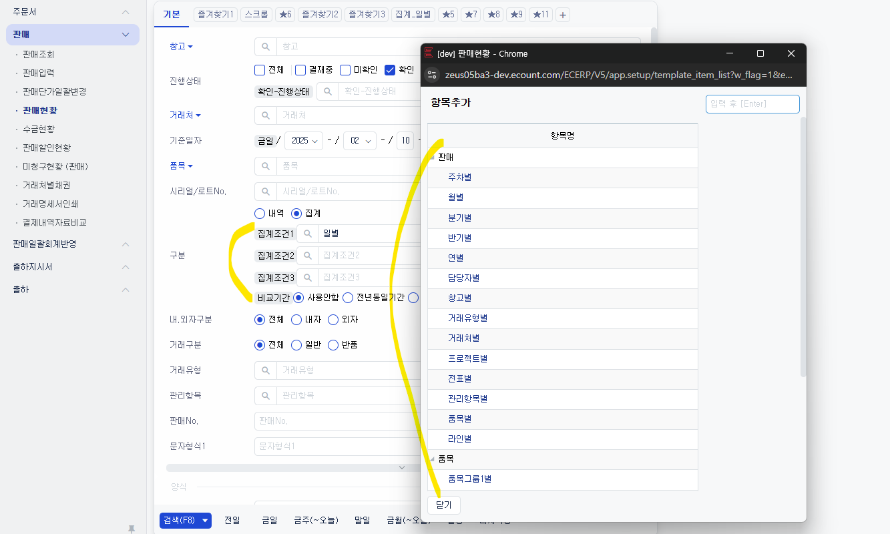
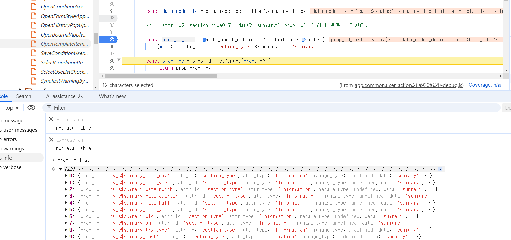
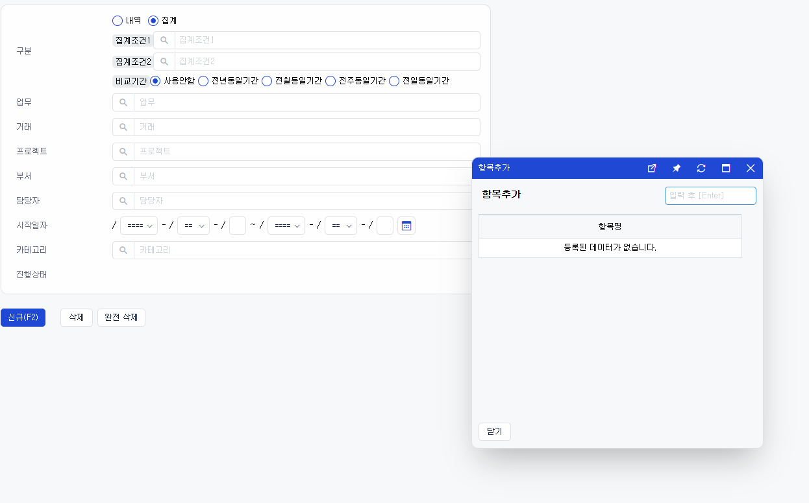
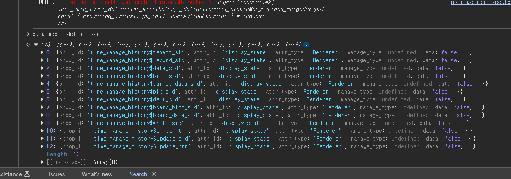
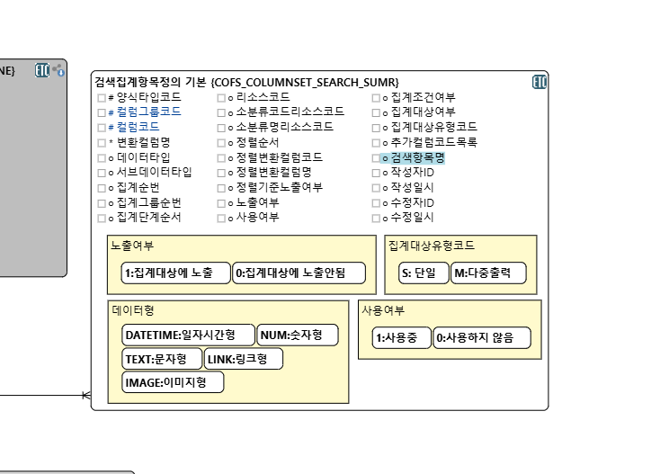

# Daily Retrospective

**작성자**: [박주현]  
**작성일시**: [2025-02-10]

---

# 2. 동기에게 도움 받은 내용

승준님과 setup 관련하여 이야기를 주고 받으면서 도움을 받았습니다.

---

# 3. 개발 기술적으로 성장한 점

## 3-3. 오늘 직면했던 문제 (개발 환경, 구현)와 해결 방법

### 시간관리이력업무 - 현황 검색 - 구분/집계

판매 현황 구분 집계를 했을 때 판매 현황에 따른 집계 항목들이 나와서 집계 조건에 추가할 수 있었습니다. 하지만 현재 SETUP 에서는 동작하지 않았습니다.

판매 현황에의 BIZZ_SID 와 메뉴 타입을 넣어주면 tenant_zid에 판매 bizz_sid의 현황 메뉴에 따른 집계조건은 잘 나오는 걸 확인했습니다.



<br>

이것을 303101 tenant_sid, "시간관리이력" bizz_sid의 현황 메뉴에 따른 집계조건이 나오게 만들어야 했습니다.

집계조건이 나오려면 아래 처럼 `attr_id` 가 `section_type` 이여야하고 `data` 가 `summary` 이어야합니다.



<br>

하지만 제 코드에서 디버깅시 attr 목록들이 생기지 않았습니다.

팀장님과 상의 후 set_up.ts 가 아닌 다른 곳에 하드코딩하여 구현하기로 변경했습니다. 바로 data_model_definition 에 삽입하는 것이었습니다.

기존에 아래와 같이 간단하게 적힌 시간관리이력의 `menus` 의 `status.ts` 파일에 필요한 코드를 하드 코딩했습니다.

```ts
BizzUtil.setMenu(bizz_definition, {
  menu_sid: "M_000000E201772",
  menu_name: "시간관리이력현황",
  menu_type: EN_MENU_TYPE.Status,
  data_model: [
    { object_id: EN_MENU_TYPE.Status, menu_role: EN_MENU_INFO_TYPE.Status },
    {
      object_id: EN_MENU_TYPE.StatusSearch,
      menu_role: EN_MENU_INFO_TYPE.Search,
    } as IMenuDataModelInfo,
  ],
} as IMenuDefinition);
```

<br>
<br>

변경 후

```ts
BizzUtil.setMenu(bizz_definition, {
  menu_sid: "M_000000E201772",
  menu_name: "시간관리이력현황",
  menu_type: EN_MENU_TYPE.Status,
  data_model: [
    { object_id: EN_MENU_TYPE.Status, menu_role: EN_MENU_INFO_TYPE.Status },
    {
      object_id: EN_MENU_TYPE.StatusSearch,
      menu_role: EN_MENU_INFO_TYPE.Search,
    } as IMenuDataModelInfo,
  ],
  attributes: [
    {
      prop_id: "time_manage_history$summary_date_day",
      attr_id: "section_type",
      attr_type: "Information",
      data: "summary",
      data_model_id: "time_manage_historyXstatus",
    },
    {
      prop_id: "time_manage_history$summary_date_week",
      attr_id: "section_type",
      attr_type: "Information",
      data: "summary",
      data_model_id: "time_manage_historyXstatus",
    },
    {
      prop_id: "time_manage_history$summary_date_month",
      attr_id: "section_type",
      attr_type: "Information",
      data: "summary",
      data_model_id: "time_manage_historyXstatus",
    },
  ],
} as IMenuDefinition);
```

테스트 하여 디버깅을 했을 때 아래와 같이 나타났습니다.



<br>

시간관리이력현황에 대한 집계조건에 대한 팝업창은 켜졌는데, 그 안엔 하드코딩으로 넣어준 3개 값은 나오지 않았습니다.
`진행상태`를 한 것처럼 DB 에 데이터를 넣는다면 항목이 나왔을 것입니다. 하지만 알려주신 대로 진행했을 때도 3개 항목이 나오는 걸 기대했지만 그러지 않았습니다.



<br>

위 attr 리스트를 보면 `attr_id` 가 `display_state` 만 해당하는 attr 만 가져온 걸 볼 수 있습니다. 정상적이라면 모든 attr를 가져왔어야합니다. 그래서 배열의 크기가 몇십~ 몇백 크기여야하는데, 현재 `display_state` 이슈가 있습니다.

하드코딩 보다 데이블의 데이터를 조회하고 싶었지만, 테이블이 찾는데에 애로사항이 있었습니다.



<br>

또한 비슷한 테이블을 찾긴 했지만 MYSQL 테이블이라 확인하기 어려움이 있었습니다. 진행상태의 기초 코드 테이블처럼 찾기만 한다면 값을 넣어서 테스트 해볼 수 있을 것 같습니다.

---
