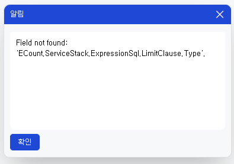

# Daily Retrospective

**작성자**: [허수경]  
**작성일시**: [2025-02-10(월)]

## 1. 오늘 배운 내용 (필수)

- datatype에 따른 유효성 검사

### datatype에 따른 유효성 검사

#### 1️⃣ 제한문자의 차이점
데이터 타입에 따라 적용되는 제한문자는 다음과 같습니다.

- **코드형 항목**: `\\ ' " ∬ — (Em대쉬)`
- **문자형 항목**: `∬ — (Em대쉬)`

이 제한문자는 `special_regex`라는 유효성 검사 항목으로 정의되어 있습니다.  
즉, 새로운 `special_regex`를 생성하거나 특정 제한문자를 추가하는 것은 **동일한 의미**를 가지므로,  
데이터 타입별로 별도의 `validator`를 둘 필요는 없습니다.


#### 2️⃣ 데이터타입별 제한문자 검사는 어떻게 이루어질까?

처음에는 데이터타입에 따라 **selector에서 결정**되고,  
내부적으로 `txt_special_regex`, `code_special_regex`에서 자동 처리되는 줄 알았습니다.  

그래서 동일한 코드를 활용하여 **setup 파일**에 추가했지만,  
예상과 다르게 데이터타입에 따라 유효성 검사가 적용되지 않았습니다.

이를 디버깅하면서 제한문자가 적용되는 로직을 확인한 결과,  
각 파일에서 **직접적으로 제한문자를 설정하는 곳은 없었지만,  
공통적으로 다음과 같은 로직이 존재**하는 것을 발견했습니다.

```ts
const regexpInfo = regexp.getRegexpByType(regexType);
const regexResult = regexpInfo.regexp.test(value);
```

- 즉, regexp.getRegexpByType(regexType)을 통해
데이터 유형에 따라 적절한 정규식을 가져와 검사하는 방식이었습니다.

#### 3️⃣ getRegexpByType 내부 로직 분석

- `regexp`의 `getRegexpByType`메서드는 어떠한 메서드일까 파헤쳐보았습니다.

```ts
//validator.ts
export function getRegexpByType(type?: _regexp.RegexpType): _regexp.RegexpInfo {
	switch (type) {
		case 'limit_code':
			return {
				regexp: limitCodeRegExp,
				target: '\\ \' " ∬ —(RES_Em대쉬) RES_공백',
				conditional_expression_stop_condition: true,
			};
		case 'limit_name':
			return {
				regexp: limitCodeNameRegExp,
				target: '\' " ∬ —(RES_Em대쉬)',
				conditional_expression_stop_condition: true,
			};
		case 'limit_search':
			return {
				regexp: limitSearchRegExp,
				target: '\' " ∬ —(RES_Em대쉬)',
				conditional_expression_stop_condition: true,
			};
    //기타 로직
    default:
			return {
				regexp: limitBasicRegExp,
				target: '∬ —(RES_Em대쉬)',
				conditional_expression_stop_condition: true,
			};
	}
```
- 위 코드에서 확인할 수 있듯이,
어떤 데이터가 들어오느냐에 따라 각기 다른 정규식을 반환하도록 설계되어 있었습니다.

#### 4️⃣ 데이터 속성에 따른 special_regex 처리 방식
데이터 타입별로 special_regex가 설정되는 방식은 다음과 같습니다.
```ts
//코드형
{
  prop_id: 'time_manage_history$pic_sid',
  attr_id: validator_attrs.special_regex,
  attr_type: EN_ATTR_TYPE.Validator,
  data: {
    data: {
      code: 'limit_code',
    },
    caller_type: ['change'],
  },
},
```
- code: 'limit_code' 값을 입력해야 함
- 즉, 코드형 항목은 제한문자를 명시적으로 설정해야 함
```ts
//문자형
{
  prop_id: 'time_manage_history$end_reason',
  attr_id: validator_attrs.special_regex,
  attr_type: EN_ATTR_TYPE.Validator,
  data: {
    data: '',
    caller_type: ['change'],
  },
},
```
- data 값이 비어 있어도 자동으로 기본 제한문자가 적용됨
- 즉, 문자형 항목은 기본값이 자동 선택되므로 따로 설정할 필요 없음


---

## 2. 동기에게 도움 받은 내용 (필수)

- 강민님께서 new Date()가 정상적으로 작동하지 않는 원인이 서버 동기화 문제라는 점을 밝혀주셨고, 해결을 위해 IP를 수동으로 설정해주셨습니다.
- 주현님과 승준님께서 제 에러를 함께 해결하려고 노력해 주셨고, 팀장님의 답장을 기다리는 동안에도 함께 고민해 주셨습니다.
- 건호님께서 ECount Develop Hub 재설치를 도와주셨습니다.
- 주원님께서 점심 후마다 계단을 함께 올라주셔 덕분에 지루하지 않게 계단을 이용할 수 있었습니다.

---

## 3. 개발 기술적으로 성장한 점 (선택)

### 2. 오늘 직면했던 문제 (개발 환경, 구현)와 해결 방법

### `Field not found` 에러 
어제 오후부터 테스트 페이지에 접속할 때 아래와 같은 에러 메시지가 발생했습니다.
- ECount.ServiceStack.ExpressionSql.LimitClause.Type



**원인 분석**
- 크롬 개발자 도구에서 빌드된 소스를 확인해 보니 01, 02 레이어의 필수 모듈들이 로드되지 않는 문제가 있었습니다.
- 하지만 산출물 폴더를 확인해 보면 정상적으로 빌드가 완료된 상태였습니다.
- 만약 01, 02 레이어의 모듈이 정상적으로 로드되고 03, 04 레이어의 모듈이 누락되었다면 개별 파일의 문제일 가능성이 높았습니다.
- 그러나 최상단 모듈부터 로드되지 않았기 때문에 빌드 과정에서 문제가 발생했다고 판단했습니다.

**해결 방법**
- 산출물 폴더의 변경 사항을 Discard 처리하여 기존 빌드 결과물을 제거했습니다.
- 솔루션을 재빌드한 후 테스트 페이지를 다시 확인하니 정상적으로 동작했습니다.


### 3. 위 두 주제 중 미처 해결 못한 과제. 앞으로 공부해볼 내용.

- `new Date()`가 제대로 동작하지 않는 문제
  - `$$date` 컴포넌트에서 년도를 입력하면 선택/입력하지 않는 이상한 값으로 들어가는 문제가 있습니다. 내일 꼭 해결해보고 싶습니다.

---

## 4. 소프트 스킬면에서 성장한 점 (선택)

강민님, 주현님, 승준님 등 많은 동기분들께서 문제 해결에 큰 관심을 가져주고 도와주셨습니다.
처음에는 수정한 소스 파일이 없고 최신 브랜치 상태에서도 문제가 발생하자, 저는 곧바로 책임님께 의존하려는 생각이 들었습니다. 하지만 동기분들은 먼저 스스로 해결할 방법을 찾고자 디버깅과 피들러를 활용하여 문제의 원인을 분석하려 했습니다.

그 과정에서 01, 02 레이어의 모듈이 정상적으로 로드되지 않는다는 점을 확인했고, 이를 해결하기 위해 산출물 폴더의 변경 사항을 제거한 후 재빌드하는 방식으로 접근했습니다.

이러한 모습을 보며, 단순히 문제를 겪었을 때 바로 도움을 요청하는 것이 아니라 주어진 환경에서 먼저 원인을 분석하고 해결하려는 태도가 중요하다는 점을 배웠습니다. 앞으로는 문제 해결 과정에서 더 깊이 고민하고 다양한 방법을 시도해보는 습관을 기르도록 하겠습니다. 깨달음이 많은 하루였습니다.